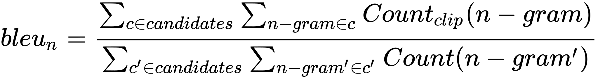

# Transformer

_Click on a tile to change the color scheme_:

  <button data-md-color-scheme="default"><code>default</code></button>
  <button data-md-color-scheme="slate"><code>slate</code></button>

(Ref: [The Illustrated Transformer](https://jalammar.github.io/illustrated-transformer/) [图解 Transformer](https://www.cnblogs.com/d0main/p/10164192.html))

## Seq2seq

Input a sequence, output a sequence.

**The output length is determined by model.**

Applications: too many. Selected:

syntactic parsing, multi-label classification, even object detection

## Encoder

Summary: 

- 输入，进行 positional encoding ；
- 经过多个相同结构的特征提取「模块」，包括：
    - multi-head self-attention
    - residual addition & norm
    - feed forward
    - residual addition & norm
- 最后得到输出

Structure of encoder:

Detail of a **block** in an encoder:

- Self-attention: build connections between input layers
- FC: **increase** the dim and them **decrease** (recover) the dim, to increase the ability of expression
- Better design: change the place of Layer Normalization

## Decoder

Summary:

- 输入是「顺序迭代型」的，即一开始底部输入 \<BOS\> ，输出一个 token ，然后把这个 token 作为第二个输入。
- 输入，首先是 positional encoding 。
- 然后是几层结构相同的「模块」，包括：
    - masked multi-head attention (with residual addition & norm)
    - multi-head **cross**-attention (with residual addition & norm)
    - FFN (with residual addition & norm)
- 最后通过 softmax 输出每个 token 可能性的预测。

### Autoregressive

#### Overall

#### Masked Self-attention

### Non-autoregressive

NAT can control the output length.

Multi-modality:

## Encoder-Decoder

### Cross Attention

## Training

### Teacher Forcing

using the ground truth as input.

- loss: sum of cross entropy

### Copy Mechanism

Copy something from the input to the output.

chat-bot, summarization of articles, ...

### Guided Attention

Guide the way of attention to avoid stupid mistakes.

- Monotonic attention
- Location-aware attention

### Beam Search

**Note**: **Randomness** is needed for **decoder** when generating sequence in some (creative) tasks.

### Optimizing Evaluation Metrics

#### BLEU score

- 分子：在给定的candidate中有多少个n-gram词语出现在reference中。
- 分母：所有的candidate中n-gram的个数

We can use BLEU score in validation stage to select the best model.

**However**, it cannot be used to train because it is not differential so we can't optimize it as a loss function.

Rule: When you don’t know how to optimize, just use reinforcement learning (RL)!

### Scheduled Sampling

#### Exposure Bias

There is a **mismatch** due to the **teacher forcing** mechanism!

Scheduled Sampling: