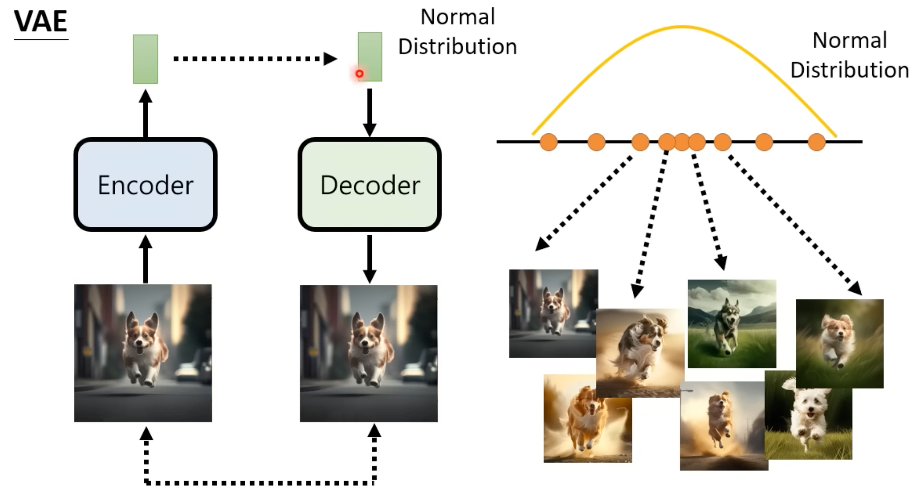
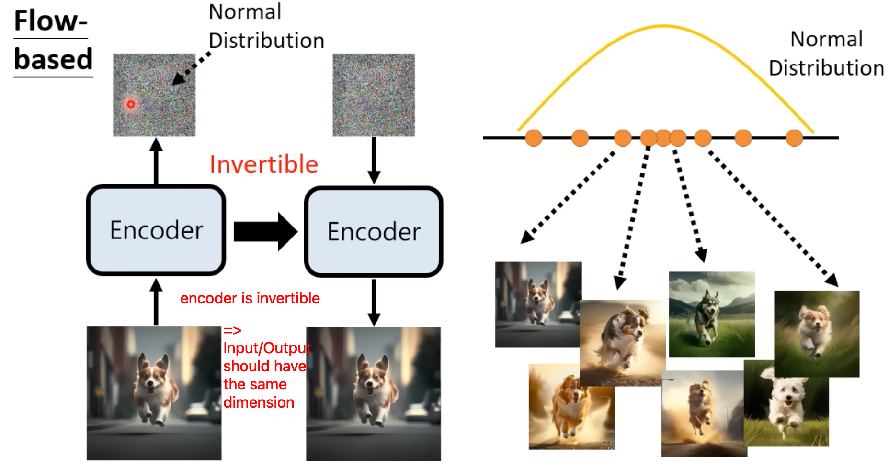
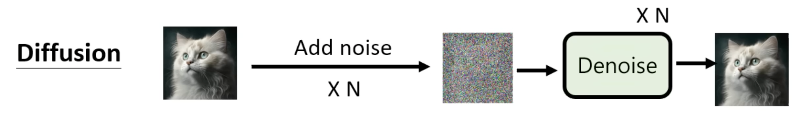
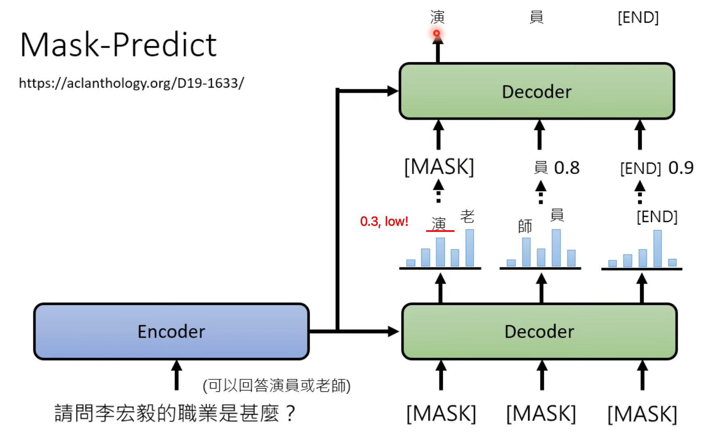
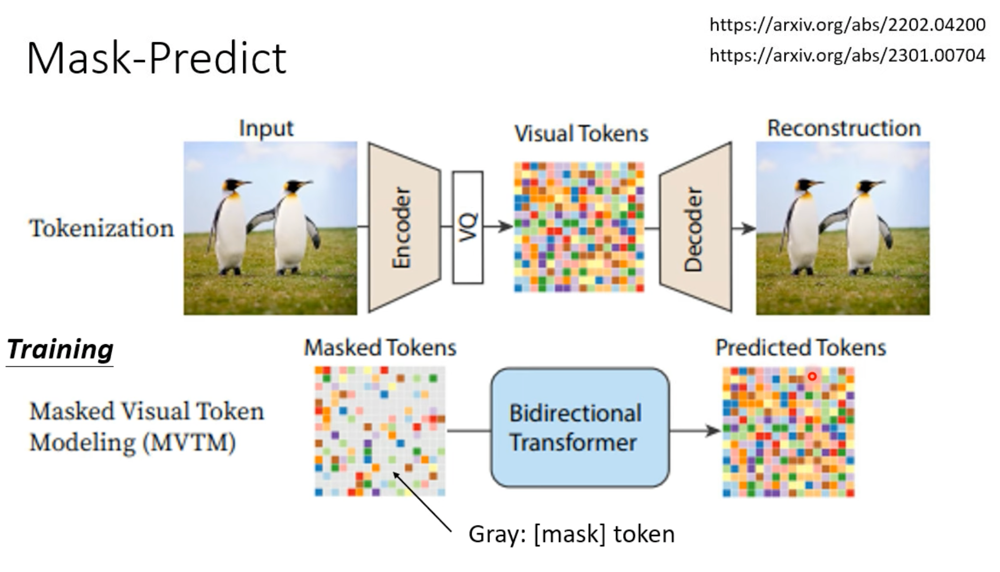
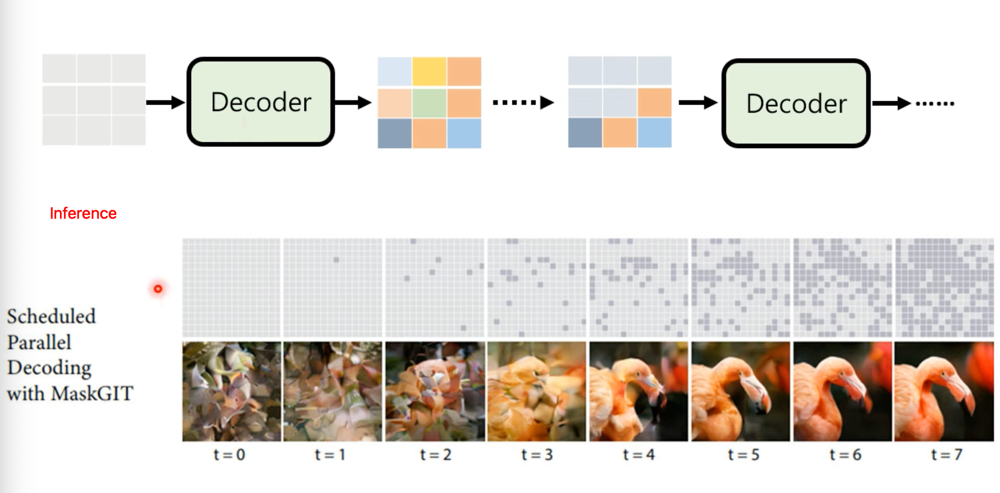
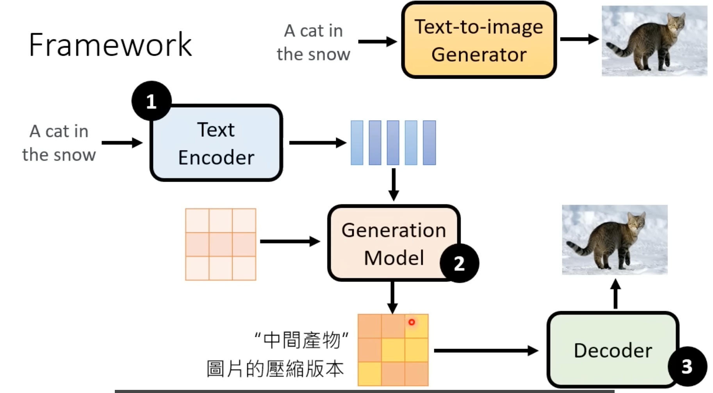
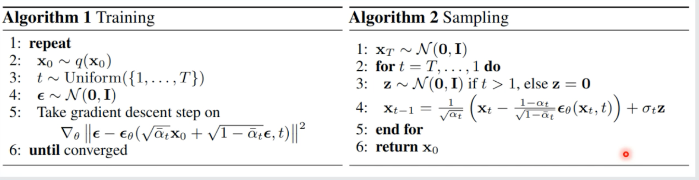

# Generative AI

## ChatGPT

[ChatGPT (可能)是怎麼煉成的 - GPT 社會化的過程](https://youtu.be/e0aKI2GGZNg)

sibling model to InstructGPT

1. 学习文字接龙：自监督学习；于是可以回答问题

2. 人类引导接龙方向

    问题：接龙的方向有很多，到底生成哪个？

    解决：人类提供一些问题的答案

3. 模仿人类的偏好

    人类给不同答案评分

    训练 Teacher Model 给 (question, answer) pair 打分

    

4. RL 向人类学习

    

总结：先训练语言能力，再引导它生成人类期待的内容。

## Basis

[【生成式AI】ChatGPT 原理剖析 (3/3) — ChatGPT 所帶來的研究問題](https://youtu.be/UsaZhQ9bY2k)

ChatGPT 带来的研究问题

- prompt engineering
- neural editing: 修复答案
- AI-generated content detection
- privacy/machine unlearning

[【生成式AI】生成式學習的兩種策略：要各個擊破，還是要一次到位](https://youtu.be/AihBniegMKg)

生成式模型的两种策略：

- Auto-regressive 各个击破
    - 每次依赖于之前的 token 输出一个 token
    - 质量高，速度慢
    - 文字
- Non-auto-regressive 一次到位
    - 同时生成所有的 token
    - 质量低，速度快
        - 质量低的原因的直观理解：前后 sample 的结果「不搭」（不是已有词汇）
    - 图像

结合两种方式的融合方法：

- 先用 AR 生成中间产物决定大方向，再用 NAR 生成最终结果（e.g. 语音合成）
- 用 N 次到位而不是一次到位：每次产生模糊的图片，多次生成，让它变得越来越清楚（diffusion model 的思想）

## Fine-tuning

[【生成式AI】能夠使用工具的AI：New Bing, WebGPT, Toolformer](https://youtu.be/ZID220t_MpI)

Toolformer ：<u>无需大量人力</u>地教 LLM 使用工具

- 使用已有 LLM 产生训练数据（节省人力）：在已有的句子中插入 API 调用语句（利用了 LLM 的 in-context learning 能力）
- 验证上一步插入的调用是否「有助于」预测正确的 token ：比较有无 API 调用预测正确 token 的概率，设定一个阈值进行筛选，保留有提升的；用保留下的数据做 fine-tuning
- Note: 模型参数量较大时，使用工具的 benefits 才能显现
- Note: 推理时，将 API 调用指令和返回结果输入 LLM ，让其基于调用结果来预测之后的 token

[【生成式AI】Finetuning vs. Prompting：對於大型語言模型的不同期待所衍生的兩類使用方式 (1/3)](https://youtu.be/F58vJcGgjt0)

对 LLM 做专门化

- 外挂
- 微调（全部参数）
- adapter 插件模组 adapterhub.ml
    - 只需要存储一份基础 LLM 来应对很多任务
    - LoRA for diffusion: Low-Rank Adaptation https://civitai.com/models/58390/detail-tweaker-lora-lora

## Prompting

[【生成式AI】Finetuning vs. Prompting：對於大型語言模型的不同期待所衍生的兩類使用方式 (2/3)](https://youtu.be/aZ_jXZvxyVg)

In-context learning 并不是真的在 learning ； demonstration 的主要意义是告诉 LLM 现在要做什么

- demonstration 给错误的例子，但是测试时正确率并没有大幅下降
- 但有文章反驳，说 in-context learning 能达到类似 gradient descent 的效果（？
- 越大的模型越有 in-context "learning" 的能力，越会受到 demo 中错例的影响
- classification 实验在某些情况下 LLM 性能接近 SVM
- learning in-context learning

Instruction tuning: 不是从例子获知需要做什么，而是从遵从指令

- T0 (2021, Hugging Face), FLAN (2021)
- 将一些任务转化为让机器根据人类语言描述的指令输出结果，用转化后的数据进行训练；在测试时， LLM 可以展示出在指令上的泛化能力，即可以正确执行训练时未见过的指令。

[【生成式AI】Finetuning vs. Prompting：對於大型語言模型的不同期待所衍生的兩類使用方式 (3/3)](https://youtu.be/HnzDaEiN_eg)

Chain of Thought (CoT) Prompting

- 不让 LLM 直接给出答案，而是在 demo 中呈现分析和推导过程，让 LLM 通过 in-context learning 也先分析推导再给出答案
- zero-shot-CoT: demo 中不给推导过程，而是直接下达 "Let's think step by step" 的指令
- CoT 会使 LLM 输出的 diversity 上升，于是可以做 self-consistency check （多个答案投票）
- Least-to-most prompting: 通过 demo 让 LLM 通过 in-context learning 学习将一个难题拆解为多个子问题逐步回答

自动寻找 Prompt

- Hard Prompt (文字) v.s. Soft Prompt (implicit tensors which can be trained)
- RL: generator LLM is the actor
- 给出 I/O pair ，让 LLM 补全 instruction

[【生成式AI】大模型 + 大資料 = 神奇結果？(1/3)：大模型的頓悟時刻](https://youtu.be/SaZTJJNOCOY)

参数量的影响

- OpenAI 2020, 参数量越大，或者数据集越大，预测下一个 token 的错误率越低
- Emergent Ability: 参数量大到一定程度后，表现才会有明显提升，某些方法（如 CoT）的好处才能显现
- Calibration: 参数量大到一定程度以后， token 的预测概率和 token 的正确率之间才有比较高的相关性；i.e. 大模型才知道自己是不是在瞎说
- Inverse Scaling Prize; U-shaped: 在某些有「陷阱」的任务上，模型参数一开始增大时效果会下降（「一知半解」），但是足够大时效果会回升

[【生成式AI】大模型 + 大資料 = 神奇結果？(2/3)：到底要多少資料才夠](https://youtu.be/qycxA-xX_OY)

数据集大小的影响

- LLM 学会「世界知识」所需的数据大于学会「语言知识」所需要的

- 计算资源一定时，参数量和训练数据大小之间存在 trade-off ； DeepMind 找出了它们之前的大致关系。

    

    （同一条虚线上算力相同；[https://arxiv.org/abs/2203.15556](https://arxiv.org/abs/2203.15556)）

- Instruction-tuning: 改变训练数据，因为最后的任务并非预测下一个 token ；因此可以直接使用一些下游 NLP 任务进行 fine-tune ，然后用未见过的任务进行评测。（否则 LLM 可能不知道要做什么，读不懂 instruction 。）

- Human Teaching: 先 pre-train ，再用人给反馈做 RL ，可以显著提升结果（ChatGPT），可以让小模型达到以前大模型的效果。

    启示：用于训练/fine-tune 的数据很重要。一般的数据集中的任务不接近真实世界中人类的交互行为。

    

[【生成式AI】GPT-4 來了! GPT-4 這次有什麼神奇的能力呢？](https://youtu.be/kslijcrYizE)

GPT-4 Technical report

- diversity 相比 ChatGPT 似乎下降了；对于三种动物的鸡兔同笼问题，可以列出正确的方程，但是解不对。
- 会更多的（小众）语言
- 在「陷阱」题上表现更强
- Calibration: pre-train 之后不错；但是 RLHF 之后失去了很多 calibration 的能力
- 输入图像：可能与 kosmos 有关（by MS）

## Vision

[【生成式AI】速覽圖像生成常見模型](https://youtu.be/z83Edfvgd9g)

根据文字进行图像生成的特点：文字的信息量少，图像的信息量大，因此需要「脑补」；这会影响 model 的设计。

逐个击破 Auto-regressive 做法：逐个 pixel 生成； OpenAI, image GPT

一次到位

- 问题：对一个输入，「正确」输出有很多种，因此各个 pixel 在独立 sample 时可能方向不一致，导致输出混乱。

- 解决：额外增加一个输入：从一个已知分布中 sample 出一个 tensor 。

    输入文字 $y$ ，输出图像 $x$ ，从 $P(x|y)$ 中 sample 可以产生图像。

    图像生成任务需要将 normal distribution 中的点对应到一个个图像上。

常见方法

- VAE (variational autoencoder)

    用一个 encoder 产生 distribution ，再用 decoder 解码，形成 pair 进行训练

    

- Flow-based

    decoder 是 encoder 的逆运算

    

- Diffusion （没有需要学习的 encoder）

    

- GAN

    与上面三种方法正交（是另一种思路），可以与它们结合使用

如何评估图像生成的好坏？

- FID, Frechet Inception Distance

    - 过一个用于图像分类的 CNN 拿到 latent vector

    - 评估生成的和真实的两组 latent vector 是否接近（假设高斯分布，评估二者之间的距离）

    - 问题：需要 sample 很多 image

- CLIP score: 文字和图像分别 encode ，评估是否匹配

### Diffusion

[【生成式AI】Diffusion Model 原理剖析 (4/4) (optional)](https://youtu.be/67_M2qP5ssY)

也可以用于 speech ：WaveGrad

**可能的效果好的核心原因/基本思想**：将 AR 加入到 NAR ，i.e. 「一次到位」改成「 N 次到位」；有很多其它基于相同 idea 的尝试

- mask-predict: 文字生成，将一次 NAR 时 sample 出的概率低的 token mask 住，再进行后续的 NAR ；后续的 NAR 可以看到没 mask 的 context ，因此可以根据它们提供的「方向」生成，解决了方向不一致的问题。

    

- 图片生成：

    训练时，加入一些 mask ，训练一个 token decoder 网络预测被 mask 的 token 。

    推理时，有两个 decoder 。一开始全都是 mask token ，用 token decoder 预测全部 token ，但只保留信心分数高的 token ，不断迭代，每次都会增加一些被保留的 token 。用 image decoder 根据预测的 token 生成图像。

    观察迭代中的输出演变可知， AR 结构的多次 decode 可以不断改善生成质量。

    

    

    

#### Framework

[【生成式AI】淺談圖像生成模型 Diffusion Model 原理](https://youtu.be/azBugJzmz-o)

Reverse Process

- shared denoise module

- step index: noisy 的程度，作为输入的一部分

    

denoise module

- noise predictor: 预测在某一步，图片中的 noise 是什么
- 输出图像是输入图像减去 predicted noise
- 为什么不直接输出图像（end-to-end）？预测 noise 比直接预测图像简单

Forward Process (Diffusion Process)

- 不断地向现有图片添加从某个分布 sample 出的 noise
- 形成了训练 denoise module 的数据

Text-to-Image 如何引入文字？

- denoise module 再额外接收文字描述作为输入
- LAION 数据集：5.85B ，图片和多语言文字的对应

[【生成式AI】Stable Diffusion、DALL-E、Imagen 背後共同的套路](https://youtu.be/JbfcAaBT66U)

从文字到图像的三步：

Text Encoder

- 语言模型的大小会显著影响结果
- Diffusion Model 的大小反而不太重要（增大没有什么帮助）

Generation Model

- 输入文字表示和随机 sample 的 noise ，生成中间产物
- 训练时用 forward process 往中间产物（如 encoder 产生的 latent representation）上加 noise ，产生训练数据
- 用 reverse process 产生中间产物，然后给 decoder 生成最终图片

Decoder

- 文字和图像对应的数据有限；只用图像训练 decoder
- 如果中间产物是小图，可以 downsample 产生输入（Google, Imagent）
- 如果中间产物是 latent representation ，可以用 auto-encoder 的方式训练，使输入输出接近（Stable Diffusion, DALI）

#### Mathematics

[【生成式AI】Diffusion Model 原理剖析 (1/4) (optional)](https://youtu.be/ifCDXFdeaaM)

DDPM: Denoising Diffusion Probabilistic Models

