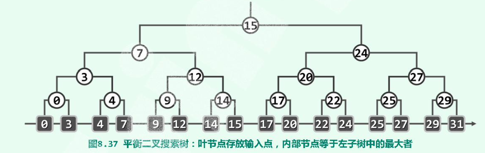
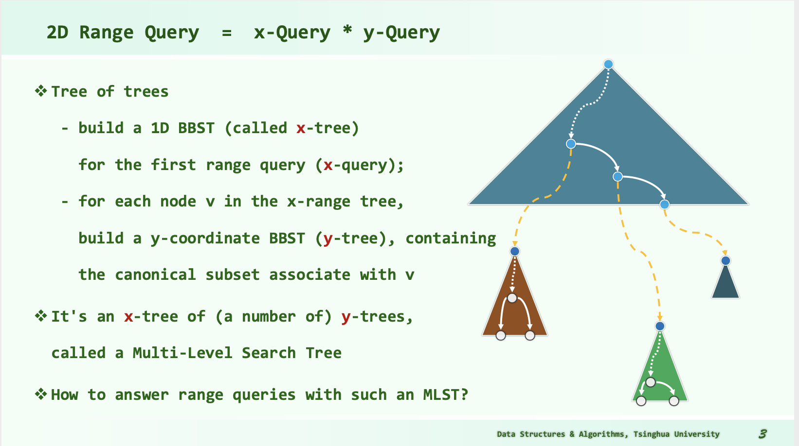

# DSA

## Tricks

### IO

```cpp
inline char nchar()
{   // read a large amount of char to speed up reading
    // the codes below are widely spread and applied so the author is uncertain
    static const int bufl = 1 << 22;
    static char buf[bufl], *a, *b;
    return a == b && (b = (a = buf) + fread(buf, 1, bufl, stdin), a == b) ? EOF : *a++;
}

template<class T> inline T getnum()
{	// read numbers of type T based on nchar()
    T x = 0; bool f = 1; char c = nchar();
    for(; !isdigit(c); c = nchar()) if (c == '-') f = 0;
    for(; isdigit(c); c = nchar()) x = x * 10 + c - 48;
    return f ? x : -x;
}
```

## Data Structure

### Binary Search Tree

left springs <= node <= right springs

inorder tranversal sequence: non-decreasing

### Balanced BST


### KD-Tree

#### Requirements

##### 1D Range Query

Count the number of points belong to I = (x1, x2] among P = { p1, ... pn } (or to report the points of $I \cap P$ ).

We're not satisfied by $O(n)$ !

It can be solved by **binary search** on a sorted ($O(nlogn)$) vector or array.

For each query, the complexity is $O(logn + r)$.

##### 2D Range Query

For higher dimension occasions, the **binary search** doesn't work. Somebody may consider performing binary search on each dimension one by one. **But**, the complexity can be very bad. (You may select nearly **n** points when searching on the first dimension. However, when it comes to the 2nd dimension, the remained points may be **r << n**. But your complexity is $$O(n)$$ .)

So we need an advanced DS, 2D-Tree.

#### 1D-Tree

##### Data Structure

A balanced binary search tree.

Input data are stored in leaves. Inside nodes store the maximum value in the left child tree.



##### Query Algorithm

Search(x): returns the maximum key not greater than x

**Lowest Common Ancestor**: LCA(x, y) = sub_root

Report the points inside [x, y]:

```
Starting from LCA:
Go to x (by turn left as much as possible):
	Ignore turning right;
	For each turning left, report the right subtree;
Go to y (by turn right as much as possible):
	Ignore turning left;ss
	For each turning right, report the left subtree;	
```

##### Complexity

Preprocessing: $O(nlogn)$;

Storage: $O(n)$;

Query: $O(logn)$; 

#### 2D-Tree

##### Data Structure

Balanced Binary Search Tree.

Divide the k-dim space to regions dimension by dimension.

##### Algorithm

###### Build

```
build(set P, depth):
	if P.size == 1:	// base
		return createLeaf(P)
	else:
		root = createKdNode()
		root->splitDirection = dimension[depth % k]
		root->splitLine = FindMedian(root->splitDirection, P)	// nth_element; Complexity: O(n)
		P1, P2 = Divide(P, root->splitDirection, root->splitLine)
		root->lChild = buildKdTree(P1, d + 1)
		root->rChild = buildKdTree(P2, d + 1)
		return root
```

Time: $T(n) = 2*T(\frac{n}{2}) + O(n) \Rightarrow T(n) = O(nlogn)$

Storage: $1 + 2 + ... + O(2^{logn}) = O(n)$

**Bounding box Optimization**:


###### Query - KdSearch(v, R)

Search starts at v; query range is R

Key idea: Recurse in when there's intersection. Report it when it is enclosed.

```
kdSearch(v, R):
  if v is leaf:
    if v in R:
      report(v)

  if v->lChild in R:
    reportSubtree(v->lChild)
  else if v->lChild have intersection with R:
    kdSearch(v->lChild, R)

  if v->rChild in R:
    reportSubtree(v->lChild)
  else if v->rChild have intersection with R:
    kdSearch(v->rChild, R)
```

Time: No more than 2 of the 4 grandchildren of each node will recurse!

$Q(n) = 2 + 2Q(n/4), Q(1) = O(1) \Rightarrow Q(n) = O(\sqrt{n})$

Report + Search: $O(r + \sqrt{n})$

### Multi-Level Search Tree

#### Data Structure



#### Algorithm


### Range Tree


## Algorithms

### ToLeft

Use **cross product** to judge whether a point is located at the left of a line.

Line: A(x1, y1) -> B(x2, y2)

Point: C(x3, y3)

Calculate $\overrightarrow{AB} \times \overrightarrow{AC}$

```cpp
// Cross product on two vectors
long long crossProduct(const long long& x1, const long long& y1, const long long& x2, const long long& y2)
{
    // (x1, y1) X (x2, y2)
    return x1 * y2 - y1 * x2;
}
```

The codes above are based on the following theorem:

$$(x_1, y_1, z_1) \times (x_2, y_2, z_2)
=\begin{vmatrix}
\boldsymbol{i} & \boldsymbol{j} & \boldsymbol{k} \\ 
x_1 & y_1 & z_1 \\ 
x_2 & y_2 & z_2 
\end{vmatrix}
= (y_1 z_2 - y_2 z_1)\boldsymbol{i} - (x_1 z_2 - x_2 z_1)\boldsymbol{j} + (x_1 y_2 - x_2 y_1)\boldsymbol{k}$$

