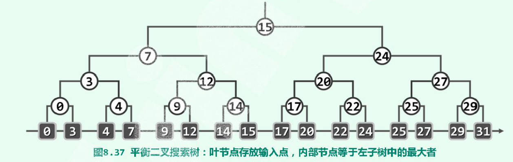
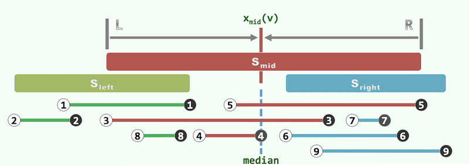
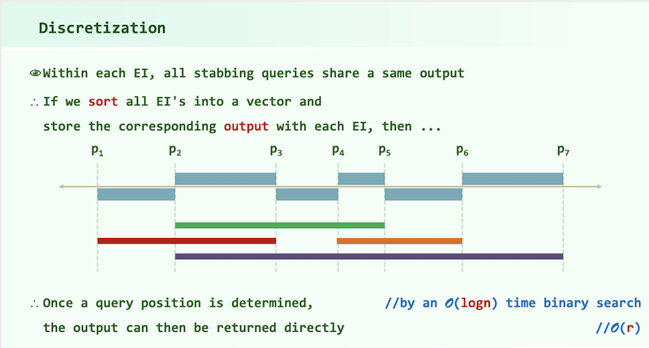

# DSA01

## Tricks

### IO

```c++
inline char nchar()
{   // read a large amount of char to speed up reading
    // the codes below are widely spread and applied so the author is uncertain
    static const int bufl = 1 << 22;
    static char buf[bufl], *a, *b;
    return a == b && (b = (a = buf) + fread(buf, 1, bufl, stdin), a == b) ? EOF : *a++;
}

template<class T> inline T getnum()
{	// read numbers of type T based on nchar()
    T x = 0; bool f = 1; char c = nchar();
    for(; !isdigit(c); c = nchar()) if (c == '-') f = 0;
    for(; isdigit(c); c = nchar()) x = x * 10 + c - 48;
    return f ? x : -x;
}
```

Disable the synchronization between C++ streams and standard C stream to speed up C++ streams.

```c++
std::ios::sync_with_stdio(false);
```

### Gprof - Performance Analysis Tool

```shell
g++ main.cpp -o main -pg	# use "-pg" compiler options
./main
gprof ./main > report.txt
```

P.S.

```shell
clang: error: the clang compiler does not support -pg option on versions of OS X 10.9 and later
```

### Timespec

```c++
timespec start, end;
clock_gettime(CLOCK_MONOTONIC, &start);
// ...
clock_gettime(CLOCK_MONOTONIC, &end);
double deltaT = (end.tv_sec - start.tv_sec) * 1e3 + (end.tv_nsec - start.tv_nsec) * 1e-6;	//计算程序执行时间，单位为ms
```

## Data Structure

### Complete Binary Tree

Complete binary tree can be stored as an array.

#### Construction

**CAUTION**: A complete tree with **n leaves** need an array with "_size" to store.

$\_size = 2 * bottomSize - 1, bottomSize = 2^{min(k)}$ where $2^k \geq n, k \in N$.

#### Visit

Given a node with index i, leftChild = 2 * i + 1, rightChild = 2 * i + 2.

### Binary Search Tree

left springs <= node <= right springs

inorder tranversal sequence: non-decreasing

### Balanced BST


### KD-Tree

#### Requirements

##### 1D Range Query

Count the number of points belong to I = (x1, x2] among P = { p1, ... pn } (or to report the points of $I \cap P$ ).

We're not satisfied by $O(n)$ !

It can be solved by **binary search** on a sorted ($O(nlogn)$) vector or array.

For each query, the complexity is $O(logn + r)$.

##### 2D Range Query

For higher dimension occasions, the **binary search** doesn't work. Somebody may consider performing binary search on each dimension one by one. **But**, the complexity can be very bad. (You may select nearly **n** points when searching on the first dimension. However, when it comes to the 2nd dimension, the remained points may be **r << n**. But your complexity is $O(n)$ , which is expensive for r.)

So we need an advanced DS, 2D-Tree.

#### 1D-Tree

##### Data Structure

A balanced binary search tree.

Input data are stored in leaves. Inside nodes store the maximum value in the left child tree.



##### Query Algorithm

Search(x): returns the maximum key not greater than x

**Lowest Common Ancestor**: LCA(x, y) = sub_root

Report the points inside [x, y]:

```c++
Starting from LCA:
Go to x (by turn left as much as possible):
	Ignore turning right;
	For each turning left, report the right subtree;
Go to y (by turn right as much as possible):
	Ignore turning left;ss
	For each turning right, report the left subtree;	
```

##### Complexity

Preprocessing: $O(nlogn)$;

Storage: $O(n)$;

Query: $O(logn)$; 

#### 2D-Tree

##### Data Structure

Balanced Binary Search Tree.

Divide the k-dim space to regions dimension by dimension.

##### Algorithm

###### Build

```c++
build(set P, depth):
	if P.size == 1:	// base
		return createLeaf(P)
	else:
		root = createKdNode()
		root->splitDirection = dimension[depth % k]
		root->splitLine = FindMedian(root->splitDirection, P)	// nth_element; Complexity: O(n)
		P1, P2 = Divide(P, root->splitDirection, root->splitLine)
		root->lChild = buildKdTree(P1, d + 1)
		root->rChild = buildKdTree(P2, d + 1)
		return root
```

Time: $T(n) = 2*T(\frac{n}{2}) + O(n) \Rightarrow T(n) = O(nlogn)$

Storage: $1 + 2 + ... + O(2^{logn}) = O(n)$

**Bounding box Optimization**:


###### Query - KdSearch(v, R)

Search starts at v; query range is R

Key idea: Recurse in when there's intersection. Report it when it is enclosed.

```c++
kdSearch(v, R):
  if v is leaf:
    if v in R:
      report(v)

  if v->lChild in R:
    reportSubtree(v->lChild)
  else if v->lChild have intersection with R:
    kdSearch(v->lChild, R)

  if v->rChild in R:
    reportSubtree(v->lChild)
  else if v->rChild have intersection with R:
    kdSearch(v->rChild, R)
```

Time: No more than 2 of the 4 grandchildren of each node will recurse!

$Q(n) = 2 + 2Q(n/4), Q(1) = O(1) \Rightarrow Q(n) = O(\sqrt{n})$

Report + Search: $O(r + \sqrt{n})$

### Multi-Level Search Tree

#### Data Structure


#### Construct


#### Query


### Range Tree


### Interval Tree

Application: Stabbing Query. Which intervals enclose the given point?


#### Data Structure




#### Construction

$O(nlogn)$

```c++
Node
{
    Node* leftChild
    Node* rightChild
    mid_point
    starts = list of intervals overlapping mid_point sorted by left endpoints
    ends = list of intervals overlapping mid_point sorted by right endpoints
}

Sort the intervals by two approaches:
		begin points increasing
    end points decreasing

ConstructIntervalTree(vector<Interval> intervals):
    if intervals.size == 0:
        return nullptr
    Node node
    vector<Num> P = endpoints of intervals	// P.size = 2 * intervals.size
    node.mid_point = median in P
    left_intervals, right_intervals
    for interval in intervals:
        if interval is on the left of mid_point:
            left_intervals += interval
        else if interval is on the right of mid_point:
            right_intervals += interval
        else:		// overlapping
            node.starts += interval, node.ends += interval
    sort node.starts increasingly by left endpoints
    sort node.ends decreasingly by right endpoints
    node.leftChild = ConstructIntervalTree(left_intervals)
    node.rightChild = ConstructIntervalTree(right_intervals)
    return node
```

#### Query

$O(r+logn)$

```c++
queryIntervalTree(Node v, Num q):
		if (!v)		return
		if q < v.mid_point:
				// report intervals in v.intervals overlapping q
				for interval in v.starts:
						if interval.start <= q:	report interval
						else:	break
				queryIntervalTree(v.leftChild, q)
		else if v.mid_point < q:
				// report intervals in v.intervals overlapping q
				for interval in v.ends:
						if q <= interval.end:	report interval
						else:	break
				queryIntervalTree(v.rightChild, q)
		else:
				report v.intervals
```

### Segment Tree

#### Data Structure

#### 

#### Construction

Segment tree can be derived from complete binary tree.

##### Determine the Elementary Intervals

Given some intervals, we use **"cursors"** or partitions to determine the elementary intervals(EI). A cursor can be regarded as a partition which splits a pair of continuous number, like: $5 | 6$.

**From an interval $[x_1, y_1]$, we get a pair of cursors $c_1 = x_1 - 1, c_2 = y_1$.** Compared to endpoints of an interval, cursors can be placed at the left or the right of a number, which distinguishes whether a number is used as a beginning points or an ending points. That's the advantage that matters!

Then, we use sorted and deduplicated cursors to construct EIs.

```c++
PreProcessing:
		get the cursors from intervals	// the number of cursors: O(2n)
		sort the cursors	// O(nlogn)
		deduplicate the cursors	// O(n)
		for each cursor c[i] (0 <= i <= number of cursors - 1):		// the number of EIs: O(2n) = O(n)
				get an EI = [ c[i] + 1, c[i + 1] ]
```

##### Build the Segment Tree

```c++
BuildSegmentTree(current node, subset of sorted EIs):	// O(n)
		range of current node = range of EIs
		if EIs.size == 1:
				return
		else:
				BuildSegmentTree(left child of current node, EIs[0: medians])
				BuildSegmentTree(right child of current node, EIs[medians : ])
```

Total costs of building: $O(nlogn)$

#### Insert Intervals

````c++
InsertSegmentTree(current node, interval):
		if interval encloses range of the node:
				store the interval at current node
    else:
				if interval have intersection with range of the left child of current node:
				InsertSegmentTree(left child, interval)
        if interval have intersection with range of the right child of current node:
				InsertSegmentTree(right child, interval)
````

When running InsertSegmentTree, at each level, less than 4 nodes are visited (2 stores + 2 recursions). $\Rightarrow O(logn)$

#### Query

```c++
QuerySegmentTree(current node, interval):
		if interval have no intersections with range of current node:
				return
    if interval encloses range of current node:
				report all intervals stored in the current node
    if current node is a leaf:
				return
    if interval have intersection with range of the left child of current node:
				QuerySegmentTree(left child, interval)
    if interval have intersection with range of the right child of current node:
      	QuerySegmentTree(right child, interval)
```

When querying a point (degraded interval), only 1 node is visited per level, altogether $O(logn)$ nodes.

Total: $O(r + logn)$

### Dictionary - Unordered Map - Hash Map

#### Hash Function

##### From Mod to MAD

`hash(key) = (a * key + b) % M`, where M is prime.

##### Polynomial: string -> int


## Algorithms

### ToLeft

Use **cross product** to judge whether a point is located at the left of a line.

Line: A(x1, y1) -> B(x2, y2)

Point: C(x3, y3)

Calculate $\overrightarrow{AB} \times \overrightarrow{AC}$

```cpp
// Cross product on two vectors
long long crossProduct(const long long& x1, const long long& y1, const long long& x2, const long long& y2)
{
    // (x1, y1) X (x2, y2)
    return x1 * y2 - y1 * x2;
}
```

The codes above are based on the following theorem:

$$(x_1, y_1, z_1) \times (x_2, y_2, z_2)
=\begin{vmatrix}
\boldsymbol{i} & \boldsymbol{j} & \boldsymbol{k} \\ 
x_1 & y_1 & z_1 \\ 
x_2 & y_2 & z_2 
\end{vmatrix}
= (y_1 z_2 - y_2 z_1)\boldsymbol{i} - (x_1 z_2 - x_2 z_1)\boldsymbol{j} + (x_1 y_2 - x_2 y_1)\boldsymbol{k}$$

### Bi-Connected Components

Articulation Point: cut-vertex

Bi-connected graph: graph without any Articulation Point $\Rightarrow$ at least two ways between any two points ???

Bi-connected components: maximal bi-connected graph;  Any connected graph **decomposes** into a tree of **biconnected components**.

#### Algorithm via DFS


## Complexity Analysis


### Lower Bound

#### Algebratic Decision Tree

##### Comparison Tree

