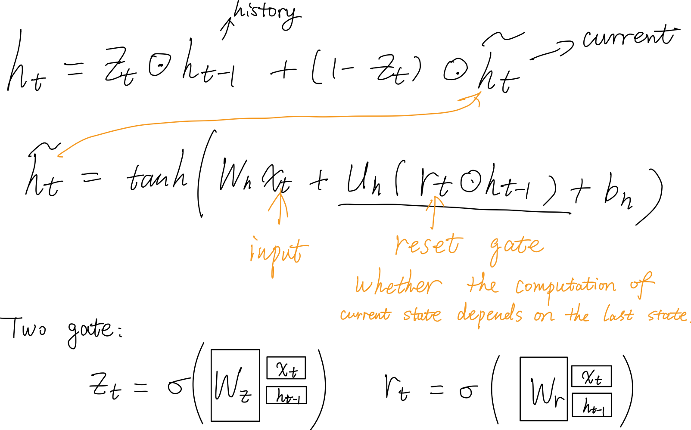

# RNN

_Click on a tile to change the color scheme_:

  <button data-md-color-scheme="default"><code>default</code></button>
  <button data-md-color-scheme="slate"><code>slate</code></button>

Process sequences and build models with various inputs or outputs:

- 1 to many
- many to 1
- many to many (e.g. translation; seq2seq)

## Basis

- Process entries of vector x as a sequence
- Add dense layer taking all of the h as input to yield an output

## vanilla RNN

### Character-level Language Model

During tests:

Question:

- Why <u>sampling according to the probability distribution given by softmax</u>, instead of taking the letter with the highest score?
  - Softmax sampling increases the diversity of the outputs

### Truncated BP through time

This is like a sliding window mechanism. We only focus on the data in a window during an iteration.

## Case study

We want the model to learn to predict the following characters, but it also learns many things about the **structural** features of the input data.

### Image to description

- Input: image
- Output: description of the image
- image -> CNN -> summary vector (4096 dim vector $\vec{v}$, instead of softmax) -> RNN -> words
- add image info by adding v and a 3rd weight matrix into the RNN model

- Get a distribution of every words in the vocabulary, and sample from it.
  - The input of the 1st step is a START token.
  - The sample result serves as the input at the next step.
  - Once sampling a END token, stop generation.
- Available dataset: COCO from Microsoft

### Attention

RNN focuses its attention at a **different** spatial location when generating **each** word.

- Input: Weighted features & sampled word
- Output: distribution over locations & distribution over vocab
- $a_i$: **vectors of attention**, telling the model where to focus (generating weighted features)
- Soft attention: weighted distribution over all locations
- Hard attention: force the model to select exactly **one** location
  - Problem: **NOT a differentiable function**
  - <u>Solution</u>: (see below)
- Pros: the model can focus on the meaningful part in the image

Notes for [Soft & hard attention](https://jhui.github.io/2017/03/15/Soft-and-hard-attention/) as a complement:

- 

- The attention module has 2 inputs:

  - a **context**: we use the hidden state $h_{t - 1}$ from the previous time step
  - image features in each localized areas: one of the fully connected layer output $x$ from CNN
    - **Nevertheless, we need to keep the spatial information**:
    - Use the feature maps of one of the convolution layer which spatial information is still preserved
    - 

- Soft attention
  - input **weighted image features** accounted for attention
  
  - 

    - $s_i$ is jointly decided by context and the image
  
    - same number for $s_i$ and $x_i$
    - The accuracy is subject to <u>the assumption</u> that the <u>weighted average is a good representation for the area of attention</u>
  
- Hard attention

  - Instead of a weighted average, hard attention uses $\alpha_i$ as a **sample** rate to pick one $x_i$ as the input to the LSTM.
  - So finally we only choose (by sampling!) **one** part of the image, $x_i$, instead of a weighted average.
  - **How to calculate the gradient descent correctly?**
    - Perform samplings and average our results using the **Monte Carlo method**
    - The accuracy is subject to <u>how many samplings are performed</u> and <u>how well it is sampled</u>
    - Related to RL; Estimate the gradient by Monte Carlo method
    - 

### Visual Question Answering: RNN with attention

[Visual7W: Grounded Question Answering in Images](http://vision.stanford.edu/pdf/zhu2016cvpr.pdf)

- How to combine the encoded image vector with encoded question vector?
  - Most common: Connect / concatenate them together directly and feed them into fully connected layers
  - Sometimes: Vector multiplication
- Input and encoding: Image $I$ and Question sequence $Q$ consists of words $t_i$
  - 
  - F(·) transforms an image I from pixel space to a 4096-dimensional feature representation (extract the activations from the <u>last fully connected layer</u> (fc7) of a pre-trained CNN model VGG-16)
  - OH(·) transforms a word token to its one-hot representation
  - $W_i$ and $W_w$ transform the representations of image and words <u>**into embedding spaces with the same dimension**</u>. (Finally they are vectors in the same dimensional space: $v_0, \dots v_m$.)
  -  Feed the vectors into the LSTM model one by one.
- LSTM with attention
- Output and decoding:
  - At the decoding stage, it computes the **log-likelihood of **<u>**an answer**</u> (while in the encoding stage we feed the question in the model) by a **dot product** (which can reflect the similarity of two vectors) between its transformed visual feature (fc7 from CNN) and <u>the last LSTM hidden state</u>.

## Multilayer RNN

Usually 2~4 layers for RNN is good enough.

## Gradient flow

Problem: too many W in the gradient! (especially for $h_0$)

### Gradient explosion and vanishing gradient

### LSTM (Long Short Term Memory)

Four gates:

$c_t$: Cell state

$h_t$: Hidden state

Pros compared with vanilla RNN:

- Forget gate can vary from each time step, unlike the W is consistent in the vanilla RNN. So the model can avoid gradient explosion or vanishing.
- Sigmoid for f, so the output falls in $(0, 1)$.

[Why LSTMs Stop Your Gradients From Vanishing: A View from the Backwards Pass](https://weberna.github.io/blog/2017/11/15/LSTM-Vanishing-Gradients.html)

[漫谈LSTM系列的梯度问题](https://zhuanlan.zhihu.com/p/36101196)

[LSTM单元梯度的详细的数学推导](https://blog.csdn.net/deephub/article/details/107033684)

### GRU

Use only one gate to balance the history and the new data.

Performs similarly to LSTM but is computationally cheaper.

