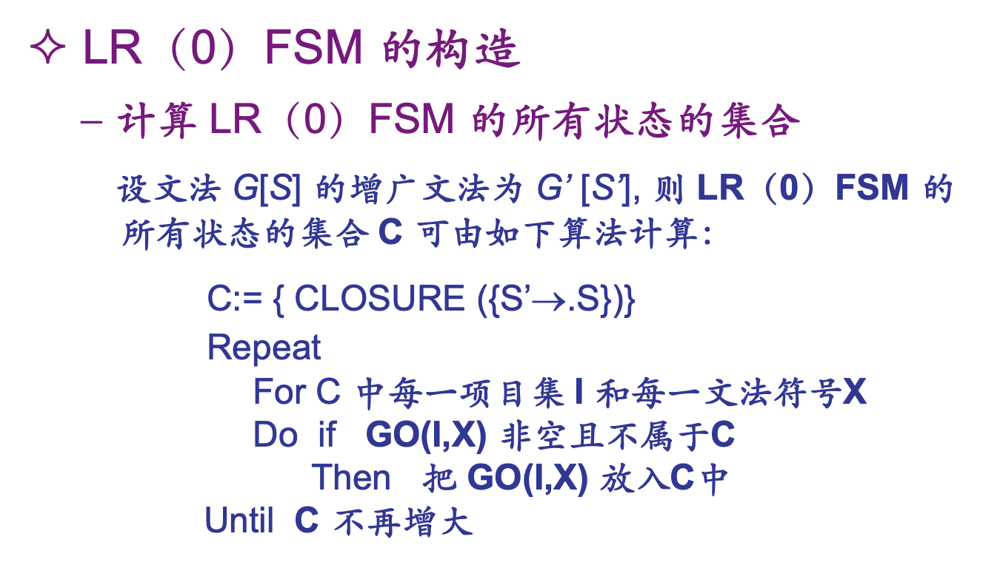

# Bottom-up Semantic Analysis

## 短语和句柄

短语：

- 终结符组成的句子对应一些短语
- 短语是由终结符组成的
- 句子对应的语法分析树上，每个非叶节点对应一个短语：由它推出的终结符串

直接短语：非叶节点一步就能推出的终结符串

句柄：上述树上最左的直接短语

**活前缀**：<u>句柄以及句柄左边的</u>非终结符构成的子串的任意前缀都是文法的活前缀

## Shift-Reduce Analysis

- 一个下推栈
- 基于有限状态控制的分析引擎

e.g. 

分析过程如何「确定化」？解决：

1. 移进-归约冲突：当前栈顶的串，既可以直接规约，也可以移进一些输入串后再规约。
2. 归约-归约：当前栈顶的串，有不同的产生式规则可供归约。

## LR

Left: 从左至右扫描输入序列

Rightmost: 产生的是最右推导

- ACTION 中： ACTION(i, a) 状态为 i ，当前输入符为 a
    - s? 表示把第 ? 个状态移入栈
    - r? 表示按第 ? 个产生式归约
- GOTO 中：
    - GOTO(i, A) = j : 按左边是 A 的产生式归约（归约时弹出产生式右边）**之后**，栈顶状态为 i 时，需将状态 j 移入栈顶

### FR(0) FSM

- 先将文法扩充为增广文法

- FSM 的一个状态的项目集是由少数已知的带点号的产生式通过闭包扩充而来的

    

- FSM 中的转移边构造：对状态项目集中的产生式尝试通过输入文法符号使点号右移

    

### LR(0) 分析表

从 FSM 构造分析表。

若每一项都无多重定义，则为 LR(0) 文法。

判断某个状态是否存在冲突：

- 点号在产生式最右侧意味着可以归约
- 某个状态有终结符标记的出边，以及点号在此终结符左侧的产生式，意味着可以移进
- 两个可以归约的产生式便产生归约-归约冲突
- 既有能归约的，也有能移进的，便构成移进-归约冲突

## SLR(1)

Simple LR(1)

向前查看一个输入符号，改善冲突

- 若下一个符号 ∈ 要归约的非终结符的 Follow 集合，则归约
- 要归约的非终结符的 Follow 集合之间无交集，则无归约-归约冲突
- 要归约的非终结符的 Follow 集合和可以归约的项无交集，则无移进-归约冲突

局限性：

- 用 Follow 集合判断不够准确：可能既属于某非终结符 Follow 集合，也属于待移进项

