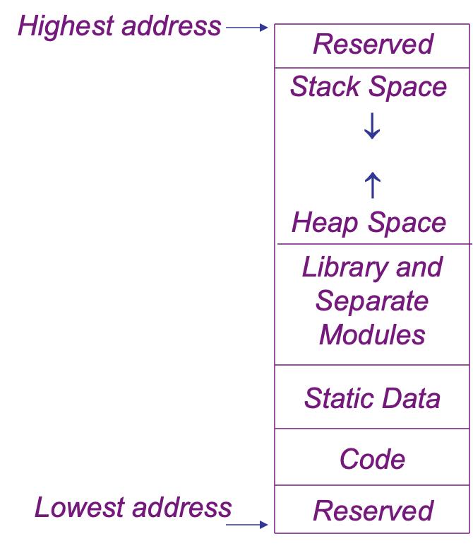
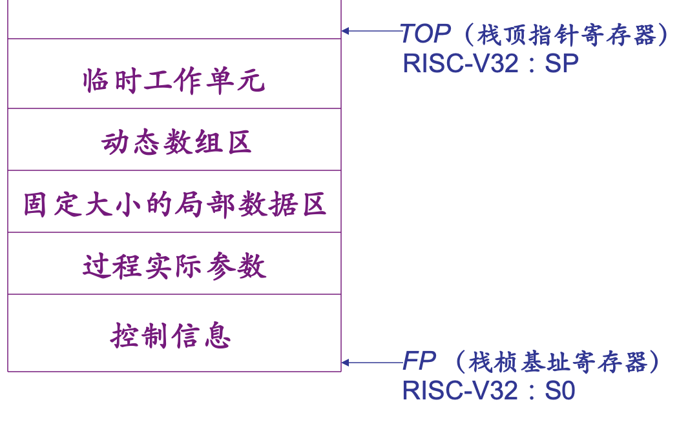
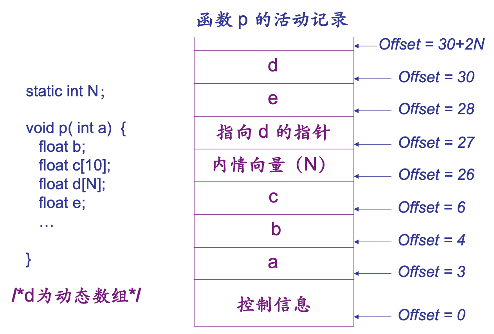

# Memory Layout

内存布局：上高下低

## Activation Record

过程活动记录：函数调用/返回时，在运行栈上创建/消去的栈帧

### 静态链与动态链

DL: 指向调用该过程前的最新活动记录地址的指针

SL: 指向静态*直接外层（代码结构上即可看出）*最新活动记录地址的指针，**用来访问非局部数据**

### 静态与动态作用域规则

静态规则：大部分现有语言采用，访问变量沿着静态链查找；

动态规则：访问变量沿着动态链查找；

