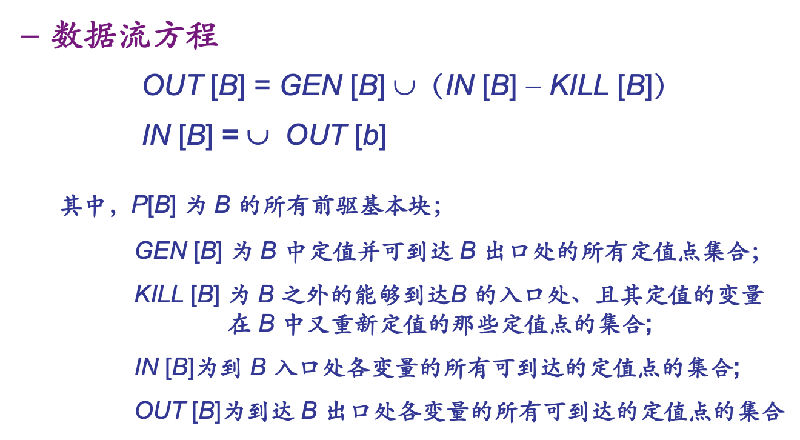
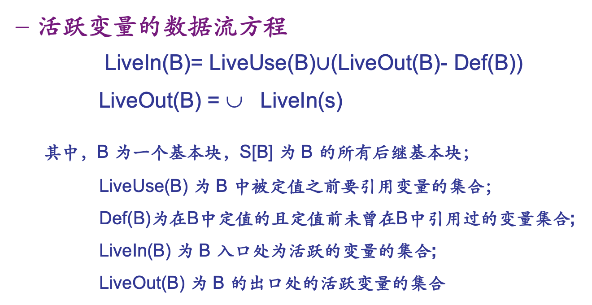
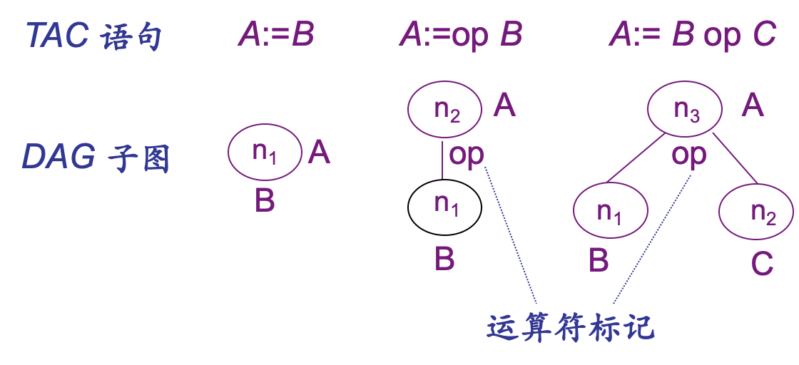

# Object Code Generation

## 流图

### 基本块

根据 TAC 划分流图：

- 只有一个入口语句
- 只有一个出口语句
- 除了入口语句外，没有其它的 tag 供跳进
- 除了出口语句，没有其它的转移或停止语句

### 流图

根据基本块可以构建一个有向图

### 循环

dominators 支配节点：

- m DOM n ：从流图的首节点出发，任意到达 n 的路径都经过 m
- D(n) ：支配 n 的所有节点的集合
    - a ∈ D(a)
    - 首节点 ∈ D(a)

back edge 回边： d DOM n ，则有向边 n → d 为一条回边

natural loop 自然循环：

- 回边 n → d 对应一个自然循环：由 d 、 n 、从之出发能到 n 但是该通路不经过 d 的所有节点组成；此时 d 是该循环的唯一入口

## 数据流分析

数据流方程： `        out [S] = gen [S] \cup（in [S] - kill[S]`

### 到达-定值分析

reaching definition

**定值**：一个给 A 赋值的 TAC 语句

定值点：给 A 定值的语句的位置

**到达**：定值点 d 到达 p ：有路径从紧跟 d 的点到达 p ，且这条路径上 A 没有被重新定值

求定值点集合：

- 顺着流图求解；向前流
- 迭代求解，直至不变化
- 初始时，每个基本块的 GEN 和 KILL 是已知的
- 迭代求解 IN 和 OUT

### 活跃变量分析

变量 A 在点 p 处**活跃**：存在从 p 出发的通路，其中引用了 A 在 p 的值。

i.e. A 在 p 处的值后续会被用到

- 逆着流图求解；向后流
- 初始时，每个基本块的 Def 和 LiveUse （被定值之前就被引用）集合是已知的
- 迭代求解 LiveOut 和 LiveIn

### Use-Definition Chaining

变量 A 在引用点 u 的 UD 链： u 处引用了变量 A ，能**到达** u 处的所有 A 的**定值点的全体**

注意： A 在 u 处的 UD 链可能包含 u 本身！ i.e. 流图中，定值点可以**到达**自己。

### Definition-Use Chaining

变量 A 在定值点 u 的 DU 链：从 u 出发，能到达的全体 A 的引用点 s

注意： A 在 u 处的 DU 链可能包含 u 本身！

**Next Use 待用信息**：某定值点的 DU 链在基本块内最近的引用点

活跃信息链

从基本块出口到入口扫描 TAC 语句

## DAG

*Directed Acyclic Graph*

三种 TAC ：

注意点：

- 合并已知量（计算出常量结果）
- 删除多余运算
- 删除无用赋值

## Optimization

代码优化

### Peephole Optimization

窥孔优化

### 基本块内优化

### Global Optimization

全局优化

全局公共表达式删除

全局死代码删除（从流图不可达的基本块）

