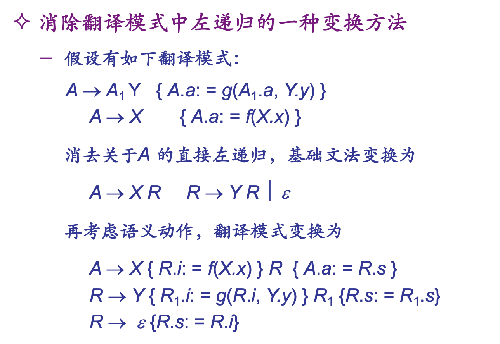

# Syntax-Directed Semantic Computing

## 属性文法

### 综合属性与继承属性

继承属性：从上至下传递的属性

综合属性：（后序遍历）从下至上传递的属性

遍历分析树可以计算二者的值

### S-属性文法

只包含综合属性；

利用 LR ，维护一个属性值栈，即可自底向上计算。

### L-属性文法

自上而下计算， DFS ：计算 children 的继承属性，访问 children ，最后计算自己的综合属性

## 翻译模式

### 消除左递归

### 去掉嵌在产生式中间的语义规则集

使所有嵌入的、除复写规则外的语义规则，都出现在产生式的末端，以便自下而上计算综合属性。

### 复写规则距离一致化

- 某非终结符的继承属性等于它前面某个非终结符的综合属性；

- 相同的非终结符，要保证其距离复写的综合属性的“距离”一致，即访问栈中的确定位置

分析过程是按照语法分析树进行**先序遍历**。

