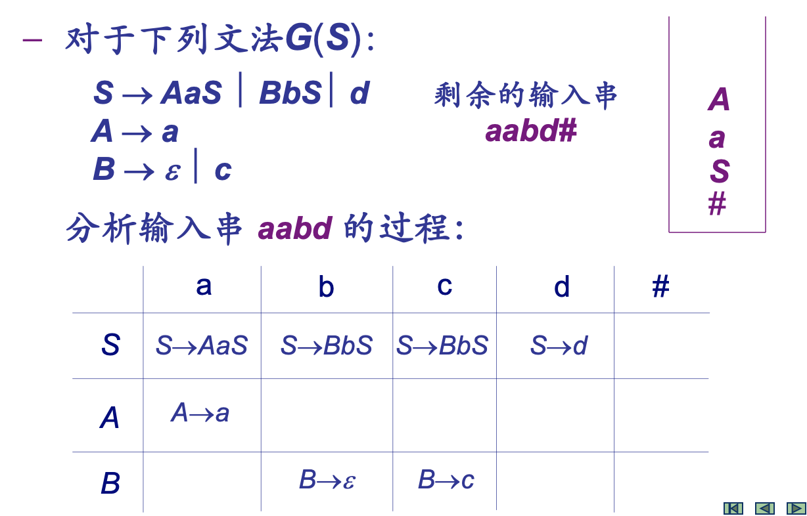

# Top-down Semantic Analysis

语法分析：词法分析给出的单词符号序列是否正确

自顶向下：从**文法**的**开始符号**出发，试图推导出与输入串完全匹配的句子

## 确定的自顶向下分析

问题：如何根据当前输入符号**唯一确定**选用哪个产生式往下推导

First 集合：开始（终结）符号集

Follow 集合：后面跟着的（终结）符号（包括结束符 `#`）集合

## LL(1) 文法

LL(1) 文法需满足：对于产生式 $A \rightarrow \alpha | \beta$

- $\alpha$, $\beta$ 的 First 集合相交为空

- $\alpha$, $\beta$ 最多有一个能推出空串

- $\alpha$, $\beta$ 中假设只有后者能推出空串，则 $\alpha$ 的 First 集合交【$\beta$ 的 First 集合 ∪ A 的 Follow 集合】为空

    即：$\beta$ 可能推出空，此时跟着 $A$ 后面的符号的集合不能与 $\alpha$ 的开始符（也跟着 $A$）相同

### 判定非终结符是否可推出空

1. 全部非终结符「未定」

2. 扫描产生式

    1. 删去右部为终结符的产生式
    2. 右部含有「空」的非终结符标记为 1

3. Repeat: 扫描产生式右部符号

    1. 若非终结符标记为 1 ，删去此非终结符；若此时右部为空，则左部非终结符为 1

        若非终结符标记为 0 ，则删去此产生式

### 求 First 集合

关系图法：

1. 终结符、非终结符对应的 First 集合各对应一个节点；建图（**注意没有 $\epsilon$ 节点**）
2. 若有 $A \rightarrow \alpha X \beta, ~ \alpha \Rightarrow^* \epsilon$ ，则 A 到 X 有一条有向边

从 A 的 First 集合对应的节点到某终结符有路，则此终结符加入 A 的 First 集合。

根据上小节，能推出「空」的把「空」加入 First 集合。

### 求 Follow 集合

关系图法：

1. 由文法中每个符号和结束符 # 生成节点。对于非终结符，用 First 和 Follow 标记（对应两个节点）
2. 连接 Follow(S) 到结束符 #
3. 若有 $A \rightarrow \alpha B \beta, ~ \beta \Rightarrow^* \epsilon$ ，则连接 **Follow(B) 到 Follow(A) （左边是右边的子集，右边连左边！）**
4. 若有 $A \rightarrow \alpha B \beta X, ~ \beta \Rightarrow^* \epsilon$ ，则连接 Follow(B) 到 **First(X)** 
5. 若有 $A \rightarrow \alpha X \beta, ~ \alpha \Rightarrow^* \epsilon$ ，则 First(A) 到 First(X) 有一条有向边（是上小节的子图？）

从 Follow(A) 出发能到达的终结符或结束符 # ，是其成员。

Follow 集合中没有「空」！

### 求 Predictive 集合

Predictive Set 定义：对于产生式 $A \rightarrow \alpha$ ，

1. 若「空」不在 $\alpha$ 的 First 中，则此产生式的 PS 为  $\alpha$ 的 First 
2. 否则，产生式的 PS 为 【 $\alpha$ 的 First - 「空」】**∪** A 的 Follow

即， PS 中的终结符表示：若当前输入符号正是这个终结符，那么就选择这个产生式进行推导

### LL(1) 的判定

文法是 LL(1) $\Leftrightarrow$ 对于每个非终结符，其产生式的 PS 交集为空。

1. 判定非终结符是否可推出空
2. 画关系图，求 First 和 Follow
3. 扫描各产生式，求 PS

## LL(1) 分析实现

### 递归下降

### 表驱动

分析表、下推栈

分析表表项：栈顶为 A ，下一个输入符为 a 时，可选的产生式

下推栈：应用产生式时，将产生式右侧的符号从后到前依次进栈

e.g.

## 文法变换

LL(1) 通常不含左递归 or 左公因子

一些文法消除左递归 and 左公因子可变为 LL(1)

