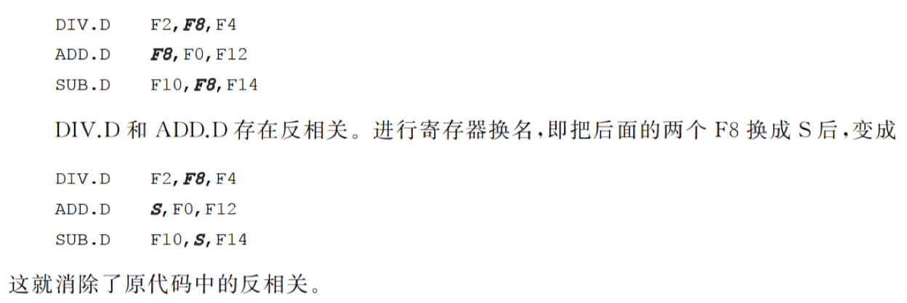
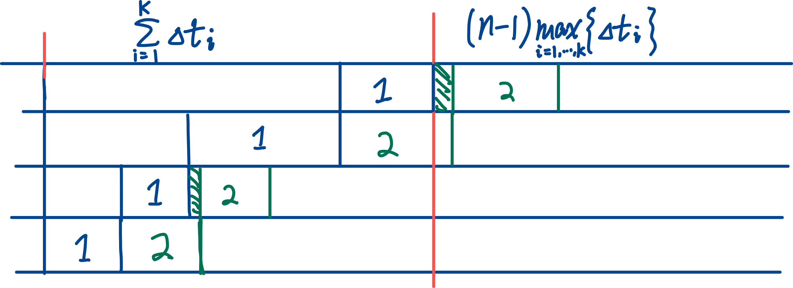
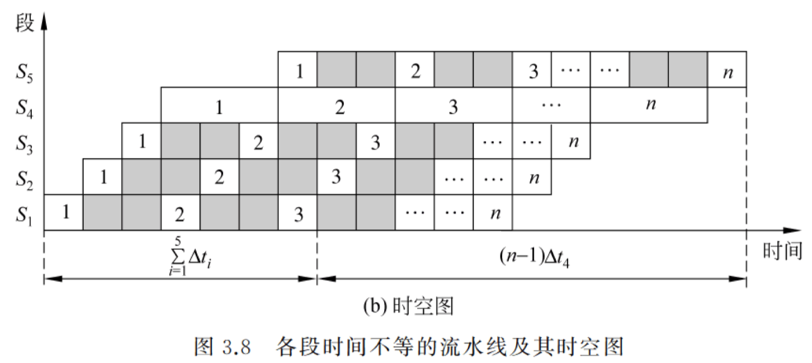

# Pipeline

## Dependence 相关

Data Dependence （真数据相关）

- 指令 i 在 j 前面
- 指令 j 使用 i 产生的结果
- 相关具有传递性

Name Dependence 名相关：寄存器名字相同，但是没有产生数据流动；**将其中一条指令所用的「名」换为别的，不影响另一指令的执行**。

- Anti-Dependence 反相关：后面的指令 j 所写的与前面的 i 所读的相同（WAR），此时需要确保前面的 i 所读的是 j 写之前的数据。

- Output Dependence 输出相关：i 和 j 的输出寄存器相同（WAW），需要确保最后寄存器中的值是 j 写入的。

- 与真数据相关不同的是，名相关可以通过 renaming 解决。

    

## Hazard 冲突

流水线冲突：

- 结构冲突：硬件资源冲突
- 数据冲突：需要用前面指令的结果
- 控制冲突：遇到分支/跳转指令

## Performance Analysis

### Throughput

Throughput 吞吐率: 单位时间内流水线所完成的任务数量：任务数量 / 完成时间

各段时间相等： k 为流水线段数， $\Delta t$ 为时钟周期：

各段时间不等：

时间最长的一段称为「瓶颈段」，限制了最大吞吐率。

解决方法：

- 细分瓶颈段：将瓶颈段分为几个独立的功能段。
- 重复设置瓶颈段：将瓶颈段「复制」几份，增加了硬件。

### Speedup

流水线相对于顺序处理的加速度。

### Efficiency

流水线中设备的利用率：设备的实际使用时间 / 整个运行时间

各段时间相等时：

效率的通用计算法：

## Scheduling of Non-linear Pipeline

Initiation Interval 启动距离：向非线性流水线输入端连续输入两个任务之间的时间间隔。

禁用启动距离：引起非线性流水线功能段使用冲突的启动距离

Reservation Table: 

Forbidden List $F$ : 在预约表中，对于每一行的*任何*一对✅，将它们所在的列号相减；所有结果组成的集合。

Collision Vector: N 位二进制串 $\mathbf{C}_0 = (c_N c_{N-1} \cdots c_1) ~,~ \text{where } c_i = \mathbf 1(i \in F)$ （注意最低位下标为 1 ！）

根据 Collision Vector ，可得任务可用的时间间隔（为 0 的位置的下标）。对于每个这样的间隔 $j$ ，计算 `(C_0 >> j) | C_0` 得到 $C_k$ （$k > 0$），即新的冲突向量。

计算 `(C_k >> j | C_0)` ，得到更多的新的冲突向量。

所有冲突向量可以组织成一个状态转移图，任一「闭合回路」（不一定回到起点，只要数字上构成循环即可）为一调度方案。

计算所有调度方案的平均时间间隔，最小者为最佳调度方案。

n 个任务花费的总时间 = 第 n 个任务放入流水线之前的等待时间 + 第 n 个任务在流水线中运行的时间

