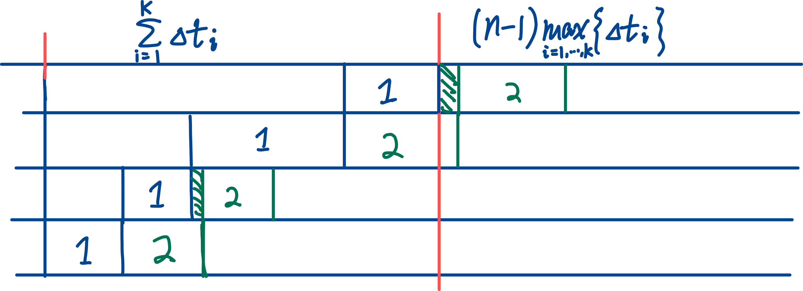

# Pipeline

## Performance Analysis

### Throughput

Throughput: 单位时间内流水线所完成的任务数量：任务数量 / 完成时间

各段时间相等： k 为流水线段数， $\Delta t$ 为时钟周期：

各段时间不等：

时间最长的一段称为「瓶颈段」，限制了最大吞吐率。

解决方法：

- 细分瓶颈段：将瓶颈段分为几个独立的功能段。
- 重复设置瓶颈段：将瓶颈段「复制」几份，增加了硬件。

### Speedup

流水线相对于顺序处理的加速度。

### Efficiency

流水线中设备的利用率：设备的实际使用时间 / 整个运行时间

各段时间相等时：

效率的通用计算法：

## Scheduling of Non-linear Pipeline

Initiation Interval 启动距离：向非线性流水线输入端连续输入两个任务之间的时间间隔。

禁用启动距离：引起非线性流水线功能段使用冲突的启动距离

Reservation Table: 

Forbidden List $F$ : 在预约表中，对于每一行的*任何*一对✅，将它们所在的列号相减；所有结果组成的集合。

Collision Vector: N 位二进制串 $\mathbf{C}_0 = (c_N c_{N-1} \cdots c_1) ~,~ \text{where } c_i = \mathbf 1(i \in F)$ 

