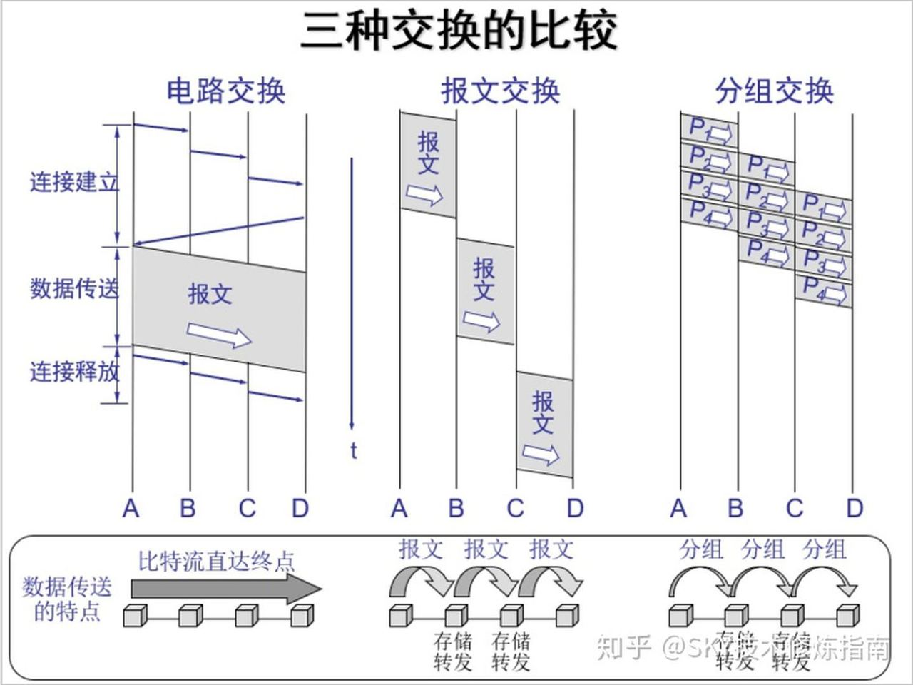

# 1 Introduction

## 交换方式及其优劣

## 协议分层结构

**协议数据单元 Protocol Data Unit**

Ref: [PDU](http://baike.eepw.com.cn/baike/show/word/%E5%8D%8F%E8%AE%AE%E6%95%B0%E6%8D%AE%E5%8D%95%E5%85%83)

指某一层，或者对等层之间，数据进行传递的数据单位。

比如：物理层的PDU是数据位（bit），数据链路层的PDU是数据帧（frame）……

## 服务原语

两种服务：面向连接、无连接

## Reference Models

### OSI

Open Systems Interconnection

自下而上：

#### Physical Layer

如何在信道上传输bits stream（bits on the wire）

#### Data Link Layer

Neighbouring: 相邻网络实体（？）间的数据传输

Framing: 从bits stream提取出frame（帧）

#### Network Layer

host to host: 将packet跨越网络，从源设备发送到目的设备（**定位到主机**）

Routing: 路由，选取转发路径

#### Transport Layer

port to port: 从源端口发送到目的端口（**进程到进程**）（定位到进程）

#### Session Layer

#### Presentation Layer

#### Application Layer

### TCP/IP

Transmission Control Protocol / Internet Protocol

Adopted by ARPANET(Advanced Research Projects Agency Network).

**Named by two main protocols.**

Concept: Smart host & Simple Network.

**自上而下：**

Ref: [TCP/IP Model](https://www.geeksforgeeks.org/tcp-ip-model/)

#### Process/Application Layer

应用层

上面的高层协议：DNS, HTTP, FTP, SMTP, ...

#### Host-to-Host/Transport Layer

端到端传输：TCP, UDP

#### Internet Layer

host将packet注入网络，packet独立传输至目的地

定义了packet的格式与协议： IPv4 and IPv6

#### Network Access/Link Layer

This layer corresponds to the combination of **Data Link Layer and Physical Layer** of the OSI model. It looks out for **hardware** addressing and the protocols present in this layer allows for the **physical transmission** of data.

### Comparison

Data Link Layer: frame

Network Layer: packet

Transport Layer: segment

Application Layer: message

## International Organizations

ISO: International Organization for Standardization

IETF: Internet Engineering Task Force 互联网工程任务组（每人都可以是IETFer。）

Internet 标准以RFC (Request for Comments) 的形式公开。成为了事实标准。

## Unit of measurement

PPS: Packet Per Sec.

Delay: 从一端传输至另一端所需的时间

RTT: Round-Trip TIme 往返时延（e.g. `ping`）

时延带宽积

Throughput 吞吐量

goodput 有效吞吐量（目的地正确接受到的有用信息）

Jitter 时延抖动

## Network Security

Virus: 需要用户交互不断传播（e.g. 打开email后里面的可执行代码给所有通信录再次发送）

Worm: 蠕虫。无需明显交互；不断扫描网络中存在漏洞的host。

DoS: Denial-of_Service Attack

Botnet: 僵尸网络。感染bot程序。

密码泄露：拖库、洗库、撞库

Packet Sniffing: 嗅探

IP spoofing: 欺骗；伪造源IP

防御手段：身份验证；保密（加密技术）；完整性检查（数字签名）；访问限制（VPN）；防火墙