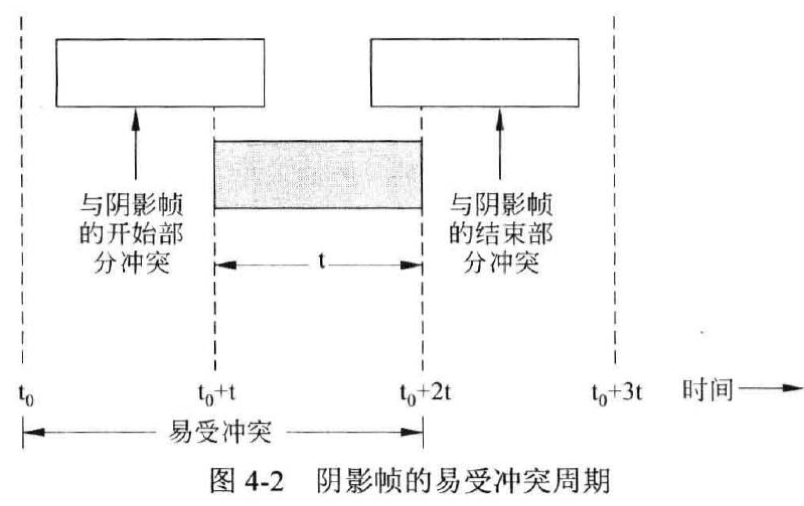
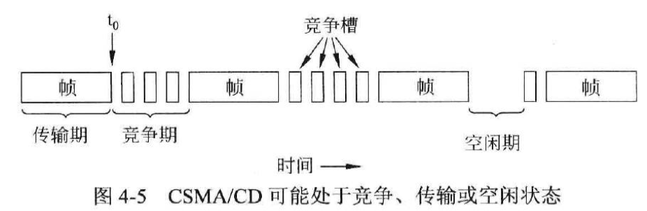
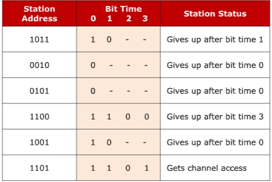
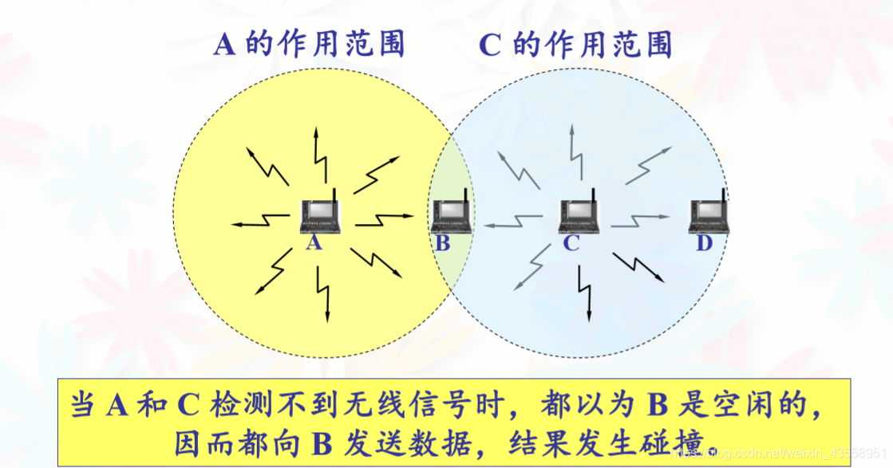
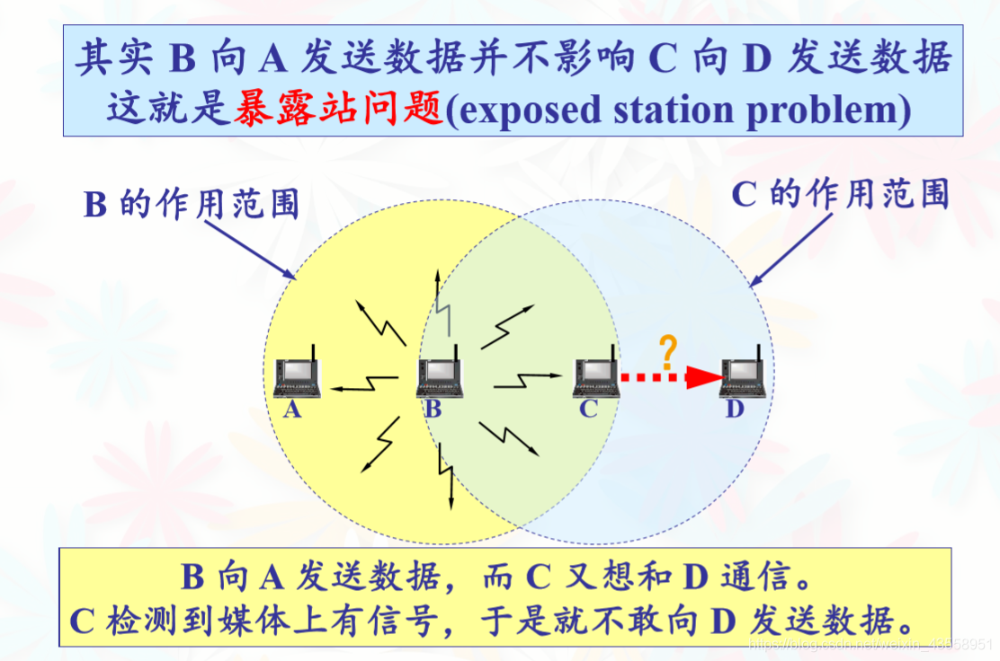

# MAC

## 信道划分


### 静态划分

#### 频分复用 FDM

在同一时间，划分带宽（频率意义），每个用户占用一个频带

#### 时分复用 TDM

在同一频段，划分时间为一个个 TDM 帧，每个用户占固定序号的时隙

#### 统计时分复用 STDM

提高利用率！**按需分配**！


- 每个 STDM 帧中有几个时隙，时隙的数量小于用户数
- 用户有了数据先给集中器，存入缓存
- 集中器扫描缓存，依次把数据放入 STDM 帧中
- 一个 STDM 帧满了就发出去

#### 码分复用 CDM

- 每个发送方分配一个「码片」（±1组成），或者称芯片序列
- 每个发送方的码片相互正交（规格化内积为0）
- 数据编码：1换成码片，0换成码片的反
- 多路复用：各个发送方发送数据编码后直接相加！
- 接收分离：收到的（合并的）数据和源发送方的码片做规格化内积，即可复原

优点：

- 各用户使用经过特殊挑选的不同码型，因此彼此不会造成干扰
- 有很强的抗干扰能力，其频谱类似于白噪声，不易被敌人发现

#### 波分复用 WDM

光的频分多路复用

在一根光纤中传输不同波长的光信号，最后再用波长分解复用器分解开。

### 动态划分

动态 MAC / 多点接入

信道并非在用户通信时固定分配给用户。

#### 随机访问 MAC

冲突无法避免

##### Pure ALOHA

想发就发！随时发。

当同一信道上有多个发送方发送数据时，它们的数据就会被损坏。

冲突的解决：没收到确认，超时，**随机等待**（“掷硬币”决定发还是不发），重传

> 冲突的一种检测方式：

> - 每个站在给中央计算机发送帧之后，该计算机把该帧重新广播给所有站。因此，那个发送站可以侦听来自集线器的广播，以此确定它的帧是否发送成功。
> - 类比：SSH终端输入，看到的是远程反馈回来的接收的结果。

信道效率评估：

- 假设新生成的帧加上需要重发的老帧的数量符合Poisson Distribution，每帧时**平均帧数为G**。

- 吞吐量 S 就是负载 G 乘以成功传输的概率：$S = GP_0$ （$P_0$是这一帧没有遭受冲突的概率）。

- 给定的帧时内生成了k帧的概率：$Pr[k] = {G^k e^{-G} \over k!}$。不冲突即为k=0，概率为$e^{-G}$。

- 考虑某一帧（图中阴影），其可能与前面的或者后面的帧时中发出的帧冲突。前后两帧加起来生成0帧的概率为$e^{-2G}$。

  

- 吞吐量：$S=Ge^{-2G}$。最大值：$S = {1 \over 2e} \approx 0.184$, where $G = 0.5$。

##### Slotted ALOHA

把时间分成若干相同的 slots ，只能在 slot 起始时发送。


（在测试帧所在的同一个时间槽中没有其他流量的概率是$e^{-G}$，$S = G e^{-G}$。）

!!! tip "优点"

    比 Pure ALOHA 吞吐量更大，效率更高。因为 Pure ALOHA 太容易碰撞了！

##### Carrier Sense Protocol - CSMA 载波侦听

先听再发！视信道空闲与否决定发不发。



###### 1-persistent Carrier Sense Multiple Access

发之前先侦听信号

- 信道忙：持续侦听（直到信道空闲）
- 信道空闲：立即发一帧（1-persistent：发现信道空闲时发送的概率为1）
- 遇到冲突：等待一段随机的时间，然后再从头开始上述过程（i.e. 开始侦听）

优点：只要空闲，就立即发送，提高利用率。

缺点：多个站点要发送数据，冲突不可避免！

###### Non-persistent Carrier Sense Multiple Access

发之前先侦听信号

- 信道忙：**等待一段随机时间**，然后再监听
- 信道空闲：立即发一帧
- 遇到冲突：等待一段随机的时间，然后再从头开始上述过程（i.e. 开始侦听）

优点：随机等待，减少冲突

缺点：延时++；使用率降低

###### p-persistent Carrier Sense Multiple Access


发之前先侦听信号

- 信道忙：**持续侦听**（直到信道空闲）
- 信道空闲：以概率 p 立即发送；概率 1-p 等到下一个 **slot** 发送
- 遇到冲突：等待一段随机的时间，然后再从头开始上述过程（i.e. 开始侦听）

优点：同时考虑减少冲突与减少空闲（浪费）

!!! danger "以上 CSMA 的共同缺点"

    发送完成之后，看反馈才知道是不是冲突了。也就是冲突之后不知道，把数据发完了才知道，那么冲突之后发的数据其实是浪费。

##### CSMA with Collision Detection (CSMA/CD)

先听再说，**边听边说**

**及时检测冲突！**

- 被 Ethernet 采用
- 如果一个站检测到冲突，它立即中止自己的传送，**等待一段随机时间**，然后再重新尝试传送。

###### 冲突

如何确定竞争周期的长度？（发了多久能知道发生了冲突？）

- 假设两个相距最远的站传播信号所需要的时间为$\tau$。
- $t_0$ 时一个站开始发
- $t_0 + \tau - \epsilon$，即信号到达最远那个站之前的一刹那， 那个站也开始传输
- 最远的那个站立即检测到冲突，停止
- 冲突引起的微小噪声尖峰要到 $ t_0 + 2\tau - \epsilon$ 才能回到原来那个站

综上，一个站传输了 $2\tau$ 之后还没有监听到冲突，它才可以确保自已经 seize 了信道（即知道其他站知道自己在传因此不会干扰自己）。

**自发送开始，发送方能知道冲突发生的时间区间为 $[0, 2\tau]$ 。**

###### 重传 - Truncated Binary Exponential Backoff

TBEB:

- 基本退避时间为争用期 $2\tau$ 。
- 定义**截断的重传次数** $k = \min\{\text{resend time}, 10\}$ 。
- 定义基本退避时间的**倍数** $r = \text{rand} \{ 0, 1, \dots, 2^k-1 \}$ 。
- 计算退避时间 $t = r \cdot 2\tau$ 。
- 重传 **16** 次仍失败，说明网络太拥挤，放弃并向高层报错。

!!! tip "Advantages"

    多次发生冲突 → 
    
    有较多发送方参与争用信道 → 
    
    重传的推迟时间（期望）增大 → 
    
    减小冲突概率 → 
    
    利于系统稳定

###### 最小帧长

需要解决的问题：

- 发送方发了一个很短的帧，发生了碰撞
- 但由于帧太短了，发送完毕之后才能检测到碰撞，这时候停止已经没有意义了……

解决方案：根据能够得知冲突的最长时间 $2 \tau$ ，规定一个最小帧长，使得在一定的发送速率下，合法帧的发送时间一定大于 $2 \tau$ 。

以太网规定，**最小有效帧长度：64 Bytes。**凡是低于此值的，均视为因冲突而异常中止的帧。

IEEE 802.3规范中的 10Mbps 以太网，长度 2500m，在 $2 \tau \approx 50 \mu s$ 的时间内能发送500bits，加上安全余量增加至512bits = 64Bytes。

缺点：

- 无法做到碰撞的全面检测（比如无线网）
- 隐蔽站：A、C 都给 B 发数据，但是 A、C 互相不知道对方要给 B 发数据
- 电缆很长而帧的长度又很短时，冲突不仅降低了带宽，而且使得发送一个帧的时间变得<u>动荡不定</u>。?

##### CSMA with Collision Avoidance (CSMA/CA)

用于**无线网**！

避免碰撞而不是检测碰撞

先听再说；“**有礼貌**”！

- RTS / CTS 帧（optional）
    - Request to send: 发送方检测信道是否空闲。空闲则发送 RTS （包括发送方地址、接收方地址、持续时间等）；忙则等待。
    - Clear to send: 接收端收到 RTS 后**响应** CTS 。
    - 该机制解决了“隐蔽站”的问题！A、C 都想给 B 发时，B只会给其中一个发送 CTS 。
- 发送端收到 CTS ，开始发；同时**预约信道**，告诉其它站自己要发多久。
- ACK ：发送方收到每一帧的 ACK 才发下一帧。
- 超时应对：用 TBEB 机制重发
- 其他站收到 RTS 、 CTS ，保持一段时间静默。

#### 受控/无冲突 MAC

受控访问；避免冲突；

特点：

- 重负载下效率高
- 发送延迟大

之前协议的劣势分析：

- 静态划分：网络负载轻时，信道效率低
- 随机 MAC ：网络负载重时，冲突产生开销

##### 轮询 / 位图

- 主站点「轮流邀请」从节点发送数据

问题：

- 轮询的开销：发送数据帧来做轮询
- 等待的延迟
- 单点故障：一个主节点

##### 令牌传递

（IEEE 802.5 令牌环）

令牌：不含数据信息的 MAC 控制帧

步骤：

- 建立逻辑上的环形拓扑（物理上仍为星形）
- 每个节点在限定的「令牌持有时间内」持有令牌，可以将数据接在令牌上发送
- 令牌沿逻辑上的环形拓扑依次传输

特点：

- 同一时刻只有一个节点独占信道（只有一方掌握令牌） → 令牌环网无碰撞
- 适用于负载重，通信量大的网络

##### 二进制倒计数

给站点编二进制序号（位宽相同）

高序号站点优先制度；竞争过程：

- 所有想发送的站点广播自己的地址
- 发现优先级比自己大的站也要发，就放弃
- 一个站发完之后，下一竞争周期开始



#### 有限竞争

**Adaptive Tree Walk Protocol 适应树搜索协议**

- 站点组织成二叉树
- 第一个时间槽，即<u>0号槽</u>，允许所有的站尝试获取信道
    - 如果某个站获得了信道，则传输；
    - 如果冲突，那么<u>1号槽</u>中，只有节点2下面的站可以参与竞争
        - 某个站获得信道，传输。下一槽留给节点3下面的站
        - 冲突，节点4下面的站竞争


存在优化空间：

- 已知负载较重时，（比如）第一次在节点1的竞争就没有必要。
- 节点下方的站都空闲（不想发），竞争无意义。

## 局域网

三要素：拓扑、传输介质、MAC

拓扑：星型；环形；**总线型**；树型

MAC：

- CSMA/CD
- 令牌总线（各站排序形成逻辑环；令牌持有者才能控制总线）
- 令牌环

### Ethernet 以太网

IEEE 802.3

Manchester 编码

CSMA/CD

逻辑拓扑：总线型

物理拓扑：星型

<u>无连接、不可靠服务</u>

10Base5：半双工；同轴电缆

10BaseT：全双工；双绞线

“Base”指基带传输，未对载波调制的待传信号称为基带信号，其所占频带为基带。（直接传矩形数字信号）

宽带信号：基带信号调制后形成 FDM 模拟信号。

#### MAC 地址

每个适配器有一个全球唯一的 **48 位二进制**地址

常用 **6 个（2位）十六进制数**表示（**6 Bytes**）

- 02-60-8C-E4-B1-21
- 前 24 位代表厂家（IEEE规定）；后 24 位厂家自己指定

#### 以太网 MAC 帧（v2）


- 前导码：同步
- 目的地址：unicast（单播）、broadcast（广播；全F）、multicast（组播）
- 类型：IP 层的协议类型?
- 数据：根据最小帧长 64B 有大小范围：**46 \~ 1500**
- Frame Check Sequence：CRC 校验

### WLAN 无线局域网

IEEE 802.11

#### 帧结构  

考虑如下传输链路：

```
HostA ---> AP1 ---> AP2 ---> HostB
```

- Address 1: **R**eceiver **A**ddress; **MAC(AP2)**
- Address 2: **T**ransmitter **A**ddress; **MAC(AP1)**
- Address 3: **D**estination **A**ddress; **MAC(HostB)**
- Address 4: **S**ource **A**ddress; **MAC(HostA)**

#### 分类

##### 有固定基础设施


##### 自组织

没有路由器等网络设备，只有主机

#### Multiple Access with Collision Avoidance (MACA)

无线局域网不适用载波监听的方式：

隐蔽站问题：



暴露站问题：



CSMA/CA 不能解决暴露站问题。

而 MACA 可以。因为 MACA 中只有收到接收方发出的 CTS 帧的站需要静默，即离接收站“近”的站静默，里发送方“近”的站不静默。

## WAN 广域网

分组交换

目的：资源共享

Internet 是世界范围内最大的广域网

### PPP

全双工通信

三部分：

- IP 数据报封装到串行链路（**面向字节**的成帧）
- LCP 链路控制：建立、维护数据链路连接（身份验证）
- NCP 网络控制：为不同的网络层协议建立、配置逻辑连接

!!! tips "功能&要求"
    
    **不需**满足的：
    
    - 纠错
    - 流控
    - 序号
    - 多点线路
    
    满足：
    
    - 简单
    - 成帧（有帧定界符）（透明；**面向字节！**）
    - 支持多种网络层协议（对上）、多种链路（对下）
    - 检错（错了就扔）
    - 检测连接状态
    - 网络层地址协商（通信双方的网络层地址?）

（P.S. 可以动态分配 IP 地址。）

#### 状态转移


#### 帧格式


### HDLC

High-Level Data Link Control；ISO开发

