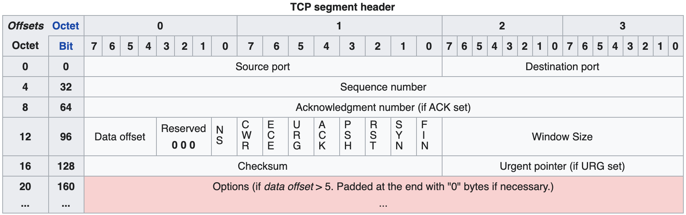

# Transport Layer

功能：

- 进程之间的逻辑通信
- 复用、分用（多个应用程序的数据通时传输；先聚后分）
- 差错检测

## 端口

端口对应进程

**16 bits**

## UDP

### 基本特点

不可靠，无连接，时延小，适用小文件

**面向报文**：

- 应用层给 UDP 多少，UDP 就照样发送完整的；不管大小不切分
- 可能会造成网络层分片带来的效率下降

无拥塞控制：适合实时应用

### 首部格式

- 如果不想收到回复，源端口号可以不填

#### Pseudo Header 伪首部

只有计算校验和时，伪首部才出现

（伪首部不向下向上传送）

- 一共 12 Bytes
- 17 是 IP 数据报的 header 中 UDP 的协议编号

#### Checksum 校验和

16 bits **wrap around** 求和，最后再求反（one's complement）

- 对于不满 16 bits 的字段要 padding 0

## TCP

<u>可靠有序，不丢不重</u>，面向连接（虚连接），点对点，时延大，适用大文件

**面向字节流**：

### 首部格式

- Sequence number 序号：TCP 中，字节流中的的每个字节都按顺序编号；序号指本报文段发送数据的第1个字节的序号。
- ACK number 确认号：期望收到的下一个序号；确认号 N 代表 N-1 及之前的都正确收到。
- Data offset 数据偏移：即首部长度；数据从哪开始；**以 4B 为单位**！

控制位：

- URG 紧急位：为1时表示此报文段中的数据优先级最高，应尽快传送，不在缓存里排队。
    - 配合：紧急指针：指出本报文段中紧急数据的字节数
- PSH 推送位：为1时表示应尽快交付上层，不再等到缓存满了才交付
- ACK 确认位：为1时表示 ACK number 确认号有效；建立连接之后所有报文的 ACK 位均为1。
- RST 复位位：为1时表示 TCP 连接出了严重差错，必须释放连接再重新建立连接
- SYN 同步位：为1时表示“连接请求/接受报文”
- FIN 终止位：为1时表示发送方数据已发完，要求<u>释放连接</u>

Window size 窗口大小：表明自己的**接收窗口**，即允许对方发送的数据量

Pseudo header 伪首部：12B，类似 UDP ，协议编号为 **6** 。

### 连接管理

C/S 模式；主动建立连接的是客户。

#### 建立连接（三次握手）

!!! danger "三次握手中的序号以及段长度问题"
    
    第一步， C 发给 S SYN=1 ，此时 seq=x ， ack （确认序号）无。此 segment 有 1B 的数据。
    
    第二步， S 发给 C SYN=1 、 ACK=1 ，此时 seq=y ， ack=x+1 。此 segment 有 1B 的数据。
    
    第三步， C 发给 S ACK=1 ，此时 seq=x+1 ， ack=y+1 。此 segment 可以无数据。
    
    之后开始传送数据： 
    
    C 发给 S ， seq=x+1 ， ack=y+1 。此 segment 数据大小为 MSS 。（MSS 只包括 TCP 的数据长度，不包括首部。）
    
    S 回复 C ， seq=y+1 ， ack=x+1+MSS 。此 segment 数据大小可为 0 。
    
    可以看到，不是每次传输数据部分大小都大于 0 。但是，从 ack 值可以看出， SYN=1 的前两次握手，数据大小都为 1B （消耗一个 seq ）；此外，释放连接时的 FIN 也会消耗一个 seq 。这两个和不消耗 seq 的 ACK 是不同的！

#### SYN 洪泛攻击

攻击者：发送大量建立连接的第一个 SYN ，而不响应任何服务器的 ACK 。

服务器：收到 SYN 后分配资源，但连接一直未建立，累积了大量挂起的连接，最后死机。

解决方法：SYN Cookie

#### 释放连接（四次挥手）

- 先关闭 Client → Server 的连接
- 再关闭 Server → Client 的连接
- **Maximum Segment Lifetime** 最长报文段寿命：等到 2MSL ，避免 Client 最后一个 ACK 丢失，Server 没收到 ACK 而不停地发。Server 没收到就会重传 FIN ，Client 在等待期收到之后就能继续重发 ACK 。否则，若直接关闭，就没法重发了。

### 可靠传输

四个机制：

- 校验：带着 Pseudo header 算 checksum
- 序号
- 累积确认：含冗余确认
- 超时重传
    - 自适应算法调整重传时间 RTTs （加权平均往返时间）；**Jacobson Algorithm**
        - $RTT_{\text{new}} \leftarrow \alpha RTT_{\text{old}} + (1-\alpha)RTT_{\text{sample}}$
    - **快速重传**：结合冗余确认，收到 **3 个对某报文段的冗余 ACK** （加上 1 个不冗余的，一共 4 个），就认为其丢失，重传

### 流量控制

基于滑动窗口机制

- Receiver：告知 Sender 接收窗口的大小（通过确认报文段的窗口字段）
- Sender：发送方取<u>接收窗口与拥塞窗口的最小值</u>

**死锁**情况：

- B 上一次告诉 A 接收窗口大小为 0 。
- 现在，B 告诉 A ，它的窗口大小为 X ；但该报文丢失！A 没收到，就一直等待，不发；而 B 不知道丢了，一直等 A 发；于是死锁！

利用**计时器 + 零窗口探测报文**避免死锁：

- TCP 的一方<u>收到零窗口通知时，启动计时器</u>。
- 计时器到期，发送零窗口探测报文段；收到以后，响应中给出当前的接收窗口大小。
- 若窗口大小仍为 0 ，就重新开始计时器；否则就能发了。

### 拥塞控制

假定：数据单向传送，另一方只传确认

拥塞窗口：发送方估算拥塞程度，设置窗口值

#### 慢开始和拥塞避免

传输轮次：打包一次发送几个报文段的数据算一个轮次。

**（慢开始）指数增长**：

- 拥塞窗口大小从 1 个报文段开始按传输轮次“指数增长”；
- 按发送的报文段的数量来看，其实是线性：每收到一个 ACK 拥塞窗口++。注意，需要考虑累计确认，即收到一个 ACK 可能增加多次 cnwd ，而不是每个 ACK 增加一次。

**（冲突避免）加法增大**：

- 拥塞窗口大小到 ssthresh (slow start thresh) 门限值之后，开始线性增长（每轮次++）。
- 实际上是：每收到一轮次里面所有段的 ACK 后（每收到拥塞窗口个包），拥塞窗口大小才++。

**乘（除）法减小**：遇到丢包，说明网络拥塞，做两件事情：

- 拥塞窗口重置为 1

- ssthresh 更新为<u>拥塞时窗口大小的一半</u>

（指数开始，加法增大；阈值成（窗口的）半，窗口归一。）

#### 快重传和快恢复

遇到 3 个冗余 ACK ，快速重传。

这种情况下，拥塞窗口不回到 1 ，而是减半（i.e. 减到新的 ssthresh 门限值），然后线性增长。

