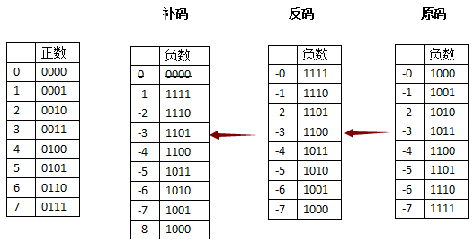

# Data

## Data Types

ASCII

- 7 bits, 1 byte, 128 西文字符

Universal Multiple-Octet Coded Character Set

- UNICODE **字符集**； UCS

- 16 bits / character

- UTF-8 **编码规则**

    - | 字符位数 | 字节1    | 字节2    | 字节3    | 字节4    | 字节5    | 字节6    |
        | -------- | -------- | -------- | -------- | -------- | -------- | -------- |
        | 7        | 0ddddddd |          |          |          |          |          |
        | 11       | 110ddddd | 10dddddd |          |          |          |          |
        | 16       | 1110dddd | 10dddddd | 10dddddd |          |          |          |
        | 21       | 11110ddd | 10dddddd | 10dddddd | 10dddddd |          |          |
        | 26       | 111110dd | 10dddddd | 10dddddd | 10dddddd | 10dddddd |          |
        | 31       | 1111110d | 10dddddd | 10dddddd | 10dddddd | 10dddddd | 10dddddd |

    - 变长，提高利用率

    - 除了占 1 个字节的开头只有 0 ，其余的，占用 n 个字节，第一个字节就以 n 个 1 加 1 个 0 开头

    - 后续字节以 10 开头（可自同步）

    - 剩下的用 Unicode 填充

True Type 矢量字体

- 存储关键点，用平滑曲线连接，再填充闭合空间

原码、反码、补码

- 
- **移码：符号位与补码相反，剩下的位与补码相同**
- 由 $[X]_{补}$ 求 $[-X]_{补}$ ：按位取反 + 1

浮点数表示：

浮点数运算：

加法：

1. 对阶：阶码小的右移，阶码取大的（右移出去的放在保护区）
2. 尾数加减
3. 规格化处理（最后尾数部分第一位， i.e. 权为 “1/2” 的位应该为 1）
4. 舍入处理： 0 舍 1 入
5. 检查溢出：检查阶码是否超过范围

## Erasure Code

奇偶校验：

- k 个数据码， 1 个校验码
- 使总体中，取值为 1 的位数为奇/偶数

### Hamming Code

（一般）校验位 = 对应数据位的异或（默认偶校验）

**总校验位** = 其他各校验位及各数据位的异或：用于区分无错、奇数位错、偶数位错

特例：

-  k 位数据位， r 位数据位，发现并改正 1 位，需满足 $2^r = k + r + 1$
- 增加一位全局奇偶校验，可以做到：发现并改正 1 位错、发现 2 位错；需满足： $2^{r-1} \ge k + r$

#### 设计目标

<u>纠正单比特错</u>；令 $d = 1$ 代入上式有：

校验位的个数 $r$ 需满足： $2^r \ge r + m + 1 ~ (= n + 1)$ 。

#### 编码

- 校验位放在 $2^i$ 的位置；
- 其余数据位顺次填充；
- 如何求校验位？（默认为**偶校验**）
    - 根据校验位位置编号（从 1 开始）的二进制中1的位置确定其校验的数据位；
    - 校验位 + 数据位一起使 1 的个数为偶数个。

#### 检错 & 纠错

- 每个校验位加上对应的数据位，看是不是偶数个 1 ；是的话记为 0 ，否则记为 1
- 其实相当于异或运算的结果！
- 倒序写各个异或运算的结果，即得到出错的1比特的序号！（原理就是每个校验位对应了比特位序号的二进制中的 1 位。）

