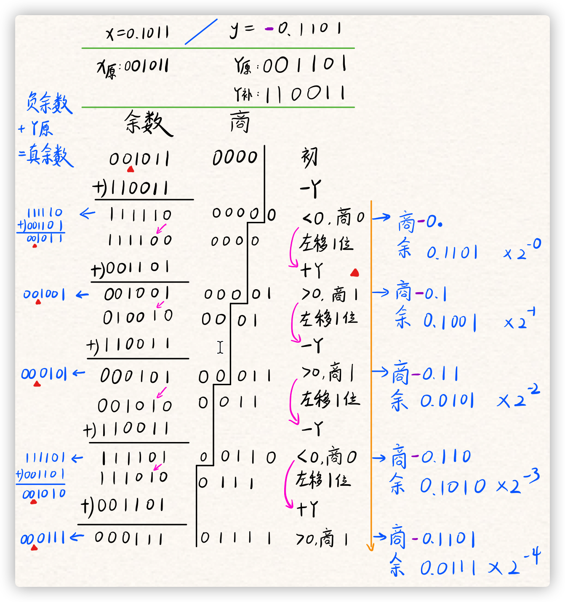

# ALU

## 乘法

### 原码乘法

结果 = 被乘数 × 乘数

基本算法：

- 若乘数的当前位为 1 ，将被乘数和部分积求和
- 若乘数的当前位为 0 ， skip
- 部分积左移
- 循环 32 次

### 补码乘法

布斯算法：

原理推导：

操作过程：

### 除法

#### 原码一位除

#### 加减交替除法

原理：

具体操作（by Acha）：

若求中间某一步的余数，则看其正负；若为负，则需加上除数 Y （带符号的补码形式）。

