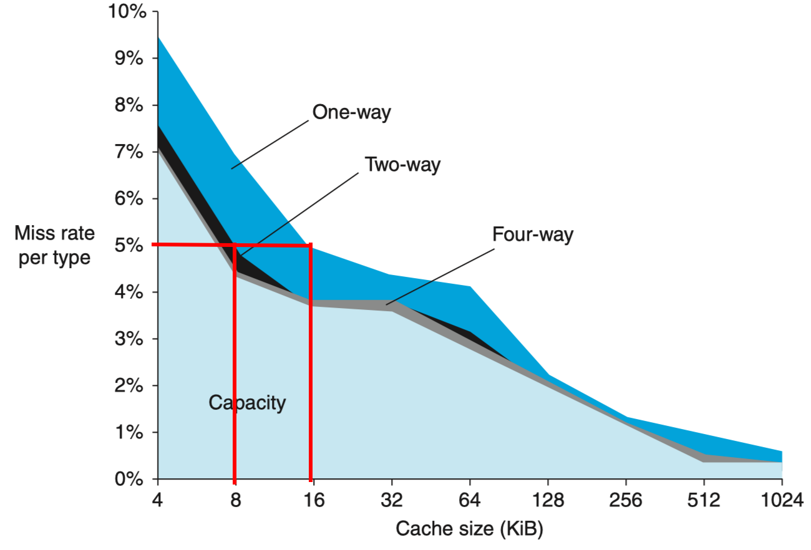

# RAM

局部性原理：

- 时间局部性：一小段时间内，最近被访问过的程序和数据很可 能再次被访问
- 空间局部性：在空间上这些被访问的程序和数据往往集中 片存储区
- 顺序性：指令顺序执行比转移执行的可能性大（大约 5:1 ）

数据总线：数据总线宽度 × 总线时钟频率 ∝ 总线最高数据吞吐能力

## DRAM

MOS 管、电容存储二进制数据

特点：集成度高、容量**大**、能耗**低**、速度**慢**

- 破坏性读出：读出时被强制清零，必须把读出内容再写回去，产生**预充电延迟**；（结束预充电前不能开始下一次读）
- 需定期刷新：电容漏电，须定时补充能量，按行刷新
    - 集中刷新：停止内存读写，逐行刷新所有行
    - 分散刷新：每次内存读写后刷新一行，各行轮流刷新
- 快速分页组织：连续读写相同行地址，将行地址锁存，后续只送列地址

## SRAM

D flip-flop

特点：速度**快**，存储密度**低**（单位面积容量**小**），输入输出共用管脚，能耗**高**，成本**高**

行列地址同时送

## Cache

### 相联度

Block/Line 块：数据交换的最小单位；典型值： 4 ~ 128 Bytes

Hit 命中： Hit rate 命中率，命中时间

Miss 缺失： Miss Rate 缺失率， Miss Penalty 缺失损失

命中时间 << 缺失损失

平均访问时间 = 命中率 × 命中时间 + (1 – 命中率) × 缺失损失

**Fully Associative 全相联**：主存字块可以和任意 cache 字块对应，灵活；成本太高

- 主存地址 = 块号 || 块内地址
- entry 包含 valid, tag, line data
- 块号和 tag 比较

**Direct Mapped 直接映射**：

- 主存地址 = tag 标记 || index 索引 || 块内地址
- 内存中的每个单元在 cache 中只会有唯一的一个位置（取决于 index）和它对应
    - 利用率低、命中率低、效率低

**N-way Set Associative 组相联**：

### 命中与缺失

**一致性保证**：

- Write Through 写直达
    - 强一致性，效率低
    - 命中 cache ：同时修改 cache 和主存
    - Miss cache ：
        - 写分配 Write Allocate
        - 非写分配 not Write Allocate
- Write Back
    - 弱一致性， cache 替换时才往主存写

**the three Cs 缺失原因**：

- Compulsory Miss 必然：访问没有在 cache 中出现过的块（第一次访问它）
    - 开机 or 进程切换
    - 解决：增加块大小、预取（提前取未来可能访问的）
- Capacity Miss 容量：活动数据集超出 cache 大小
    - 解决：增大容量，但同时会增大访问时间
- Conflict Miss 冲突：多个内存块竞争同一 cache
    - 解决：提高相联度（路数），但同时会增大访问时间
- （附加：）无效：其它进程修改了主存数据

缺失率与相联度、容量的关系：

命中率与容量：边际效益递减

缺失率与 cache 总大小、块大小的关系：

- cache 总大小一定
    - 刚开始块大小 ↑ ，缺失率 ↓ 
    - 当块大小相对于总大小太大时， cache 块数太少，缺失率反而 ↑
- 数据块 ↑ ，需要更多时间装入数据块，缺失损失 ↑

### Others

多级 cache

指令 cache 与数据 cache

cache 的接入方式：

| 侧接                                                         | 隔断                                                         |
| ------------------------------------------------------------ | ------------------------------------------------------------ |
|  |  |

一致性保证策略

