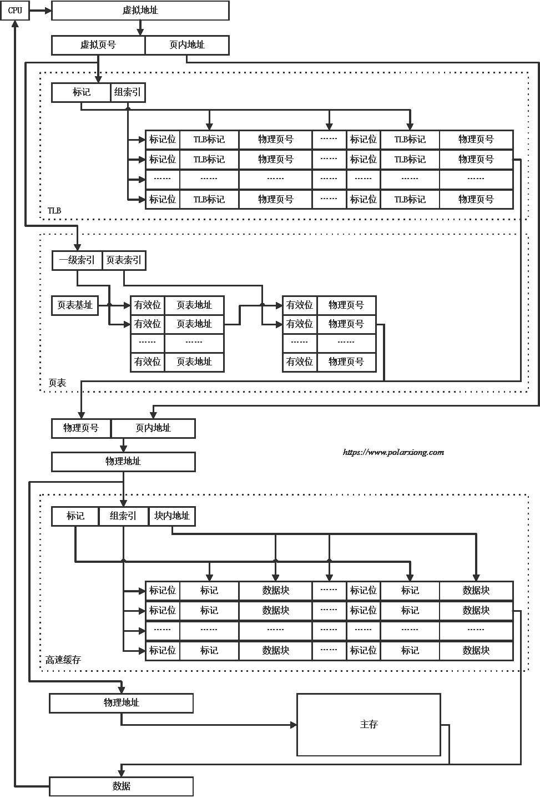

# Virtual Address

注意子集关系

## Page Table

1. 程序给出：虚地址 = 虚页号 || 页内地址
2. 读页表：实页号 = 页表基地址 + 虚页号
3. 实地址 = 实页号 || 页内地址

## Translation Lookaside Buffer

`sfence.vma` : 通知处理器，软件可能已经修改了页表， 处理器可以刷新 TLB

- rs1 指示哪个虚拟地址对应的转换被修改了
- rs2 指示被修改页表的地址空间标识符（一般相当于进程） ASID
- 如果两者都是 x0 ，整个 TLB 会被刷新

## Segment

1. 段始地址 = 段表基地址 + 段号
2. 主存实际地址 = 段始地址 + 段内地址

段页式虚拟存储管理

- 先把程序按逻辑单位分为段
- 再把每段分成固定大小的页

