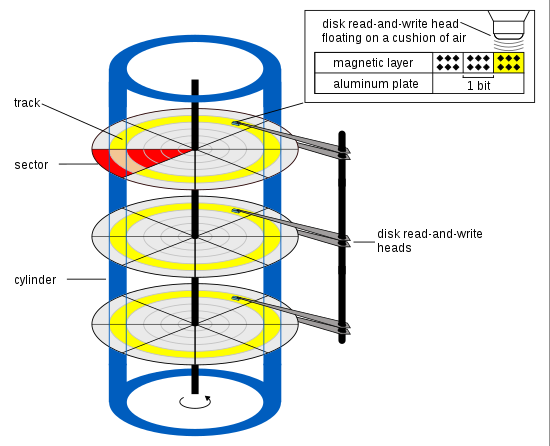

# External Disk

易失性存储： SRAM, DRAM, Cache (Registers)

非易失性存储： 磁盘，光盘， SSD

它们被用作辅助存储器，存放CPU不立即使用的信息，需要时再调入主存中

## 磁盘

磁道 track ：每个磁盘表面被分为若干同心圆；寻道时间 seek time

扇区 sector ：

- 每条磁道被按序划分为很多条扇区， i.e. 磁道上的一小段；一般 512~4096 Bytes
- 扇区小，为了可用性：物理损坏时不用；检错纠错码分布在每个扇区，扇区小检错快；灵活性：不同 OS 不同 Page size

块/簇 cluster （D）：好几个扇区

柱面 cylinder ：所有盘面上的同一磁道构成的圆柱；定位时，先确定柱面，再确定盘面，然后确定扇区

随机访问和顺序访问

R/W 的三个步骤：

1. 寻道时间：磁头移动到正确的磁道上 8~12ms
2. 旋转延迟：等待扇区旋转到磁头下 4~8ms
3. 传输时间：数据 R/W 时间

磁盘访问时间 = 寻道时间+旋转延时+传输时间+磁盘控制器延迟

旋转延迟：平均旋转延迟为：磁盘旋转半周的时间

提高速度：

- 一次传输大量数据（减小额外开销占比）
- 页面 page 存在相邻扇区避免寻道开销

## RAID

可靠性： 设备出现故障的几率

可用性：系统能正常运行的几率（增加硬件冗余来提高）

设备故障并不一定导致系统不能正常运行

Redundant Arrays of Inexpensive Disks

N 个低价磁盘构成一个统一管理的阵列，以取代单一的很贵的磁盘

### RAID 0

并行 I/O ，无冗余

分带：多个驱动器上分布数据

### RAID 1

全量复制；

每次写两次；读可以任意读其中一个（性能 × 2）

### RAID 2

将整个海明码字（4+3=7 bit）写在七个驱动器上，每个驱动器 1 bit （每个字被分到了多个驱动器中）

七个驱动器的磁头和旋转同步

### RAID 3

RAID 2 的简化；每个字 1 个校验位

### RAID 4

类似 RAID 0 ；将对带的校验写在额外的驱动器上：

带长度为 k Bytes ，所有带异或到一起，产生 k Bytes 的校验带；

可以防止其中一块盘崩溃

校验盘负载重！

### RAID 5

为减少校验盘负载，将校验位循环均匀分布到所有的驱动器上

修复过程复杂

### RAID 6

可防两块盘错误：**Any** form of RAID that can continue to execute read and write requests to all of a RAID array's virtual disks **in the presence of any two concurrent disk failures**.

layout 有很多种

## Solid State Drives

### 基本单元

组成部分：控制单元、存储单元（Flash & DRAM）

有限擦除次数：擦除次数增加，存储单元不能可靠地保持状态

Single-level Cell: 1 bit per cell

Multi-level Cell

- Double-level Cell (also known as MLC): 2 bits per cell
- Triple-level Cell
- Quad-level Cell
- Penta-level Cell: 5 bits per cell

擦除次数 SLC > MLC > TLC > QLC

### 介质组织

从大到小：

- Package （一个存储芯片）：包含几个（1, 2, 4） Die
- Die ：包含一两个 plane ，可并行操作
- Plane
- Block ：最小的<u>擦除</u>单位（2, 4, 8 MB; ms latency）
- Page ：最小的<u>读写</u>单位（4, 8, 16 KB; us latency）

SSD 写入：不会写入到原来的 Page ，而是在写之前擦除之（使之失效），然后写到一个新的 Page 中

Flash Translation Layer

- 逻辑地址到物理地址的翻译
- 磨损均衡：写入时挑选位于擦除次数最少的 block 块中的 page 页面，完成磨损均衡

SSD 垃圾搜集

