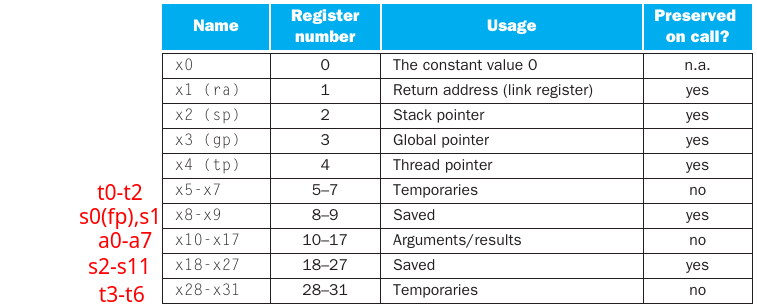

# RISC-V

## Registers



Program Counter: hold the address of **the current instruction being executed**.


## Instructions

### Table of Instructions


Jump-and-link instruction: simultaneously saves the address of the following instruction to the destination register `rd` .

### Variable instruction formats


```asm
# R Type 寄存器之间的操作， 3 个操作数均为寄存器
ADD   0000000SSSSSsssss000ddddd0110011
AND   0000000SSSSSsssss111ddddd0110011
OR    0000000SSSSSsssss110ddddd0110011
XOR   0000000SSSSSsssss100ddddd0110011

# I Type 1 个短立即数，两个寄存器
ADDI  iiiiiiiiiiiisssss000ddddd0010011
ANDI  iiiiiiiiiiiisssss111ddddd0010011
JALR  iiiiiiiiiiiisssss000ddddd1100111
LB    iiiiiiiiiiiisssss000ddddd0000011
LW    iiiiiiiiiiiisssss010ddddd0000011
ORI   iiiiiiiiiiiisssss110ddddd0010011
SLLI  0000000iiiiisssss001ddddd0010011
SRLI  0000000iiiiisssss101ddddd0010011

# S Type store 操作
SB    iiiiiiiSSSSSsssss000iiiii0100011
SW    iiiiiiiSSSSSsssss010iiiii0100011

# B Type 条件跳转
BEQ   iiiiiiiSSSSSsssss000iiiii1100011
BNE   iiiiiiiSSSSSsssss001iiiii1100011

# U Type 1 个长立即数， 1 个寄存器
AUIPC iiiiiiiiiiiiiiiiiiiiddddd0010111
LUI   iiiiiiiiiiiiiiiiiiiiddddd0110111

# J Type 无条件操作
JAL   iiiiiiiiiiiiiiiiiiiiddddd1101111
```


