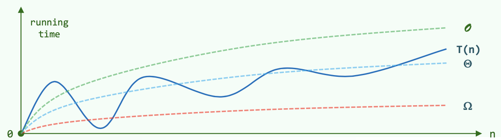
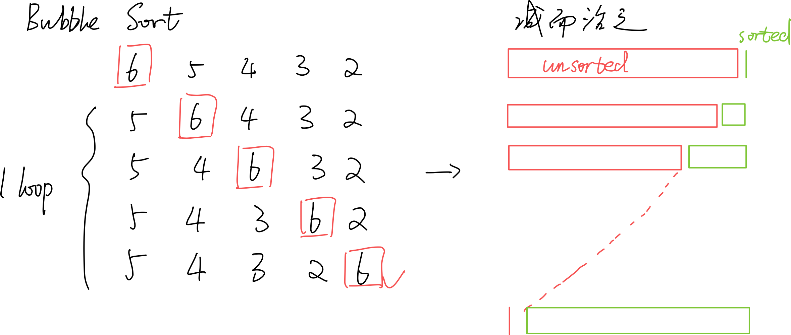
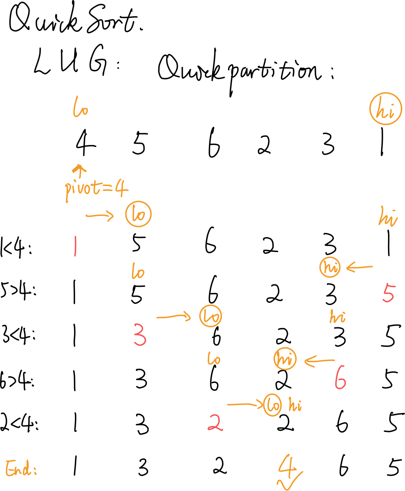
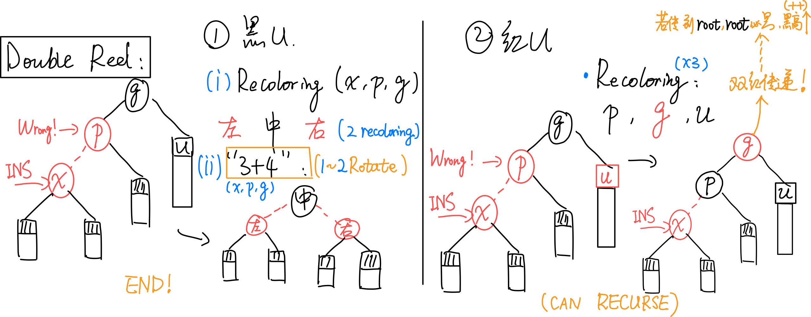
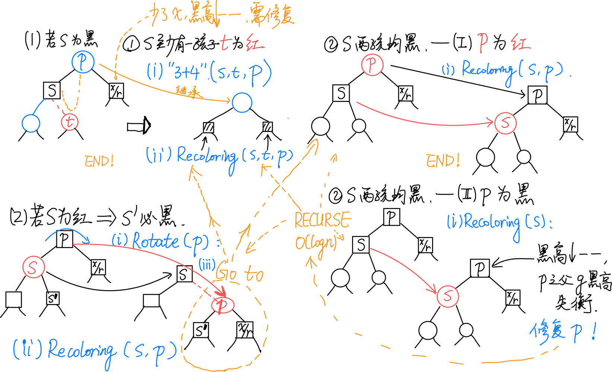
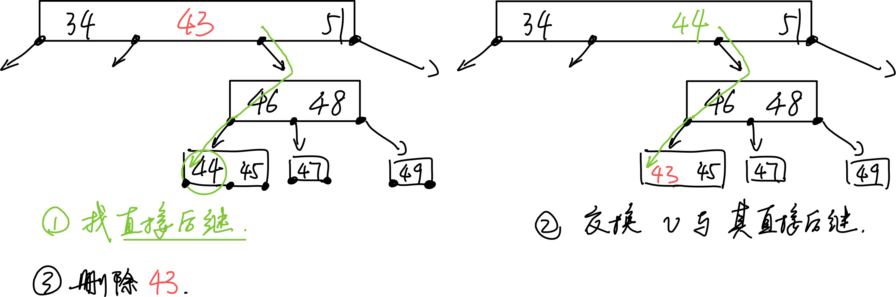
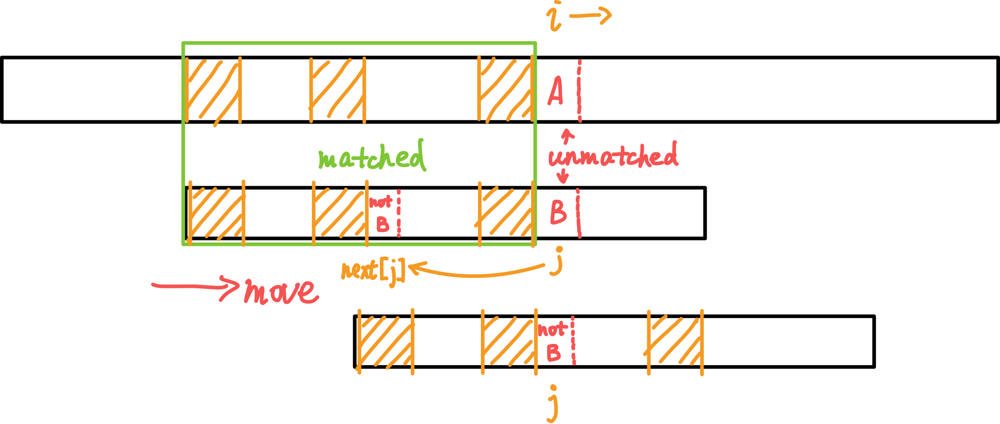

# DSA

_Note that in this document there are some images with transparent backgound, so a bright theme may be more suitable to read them._

_Click on a tile to change the color scheme_:

<div class="tx-switch">
  <button data-md-color-scheme="default"><code>default</code></button>
  <button data-md-color-scheme="slate"><code>slate</code></button>
</div>

<script>
  var buttons = document.querySelectorAll("button[data-md-color-scheme]")
  buttons.forEach(function(button) {
    button.addEventListener("click", function() {
      var attr = this.getAttribute("data-md-color-scheme")
      document.body.setAttribute("data-md-color-scheme", attr)
      var name = document.querySelector("#__code_0 code span:nth-child(7)")
      name.textContent = attr
    })
  })
</script>
## Acknowledgement

Thanks for Data Structure and Algorithm Course of CST, THU. Most of the content are extracted from the course material.

Also thanks for my friends for their sincere help and ideas or images.

## Basis of Performance Analysis

### Notation

$T(n)$：为求解规模为n的问题，所需执行的基本操作的次数。

$O(f(n))$：$T(n) = O(f(n)) ~ \Leftrightarrow T(n) < c \cdot f(n)$，i.e. $f(n)$是上界。

$\Omega(f(n))$：$T(n) = \Omega(f(n)) ~ \Leftrightarrow T(n) > c \cdot f(n)$，i.e. $f(n)$是下界。

$\Theta(f(n))$：$T(n) = \Theta(f(n)) ~ \Leftrightarrow c_1 \cdot f(n)> T(n) > c_2 \cdot f(n)$，i.e. $f(n)$与$T(n)$同阶。



### NP = P ?

P问题：可以在多项式时间内求解。

NP问题：能在多项式时间内验证得出正确解的问题。

### Series and Corresponding Complexity

#### 常用级数：算术、幂、几何、对数等


#### 不常见的分数级数


### Master Thm.

不同分治对应的复杂度：

分治通常递推形式：$T(n) = a \cdot T(\frac{n}{b}) + O(f(n))$

即：原问题被分为a个规模均为$n/b$的子任务；（每一层）任务的划分、解的合并耗时$f(n)$。

[1] $f(n) = O(n^{log_b a - \epsilon}) ~ \Rightarrow T(n) = \Theta(n^{log_b a})$ （$f(n)$要小于O中的表达式，因为O是其上界）

   e.g. kd-search: $T(n) = 2T(n/4)+O(1) = O(\sqrt{n})$

[2] $f(n) = O(n^{log_b a} \cdot log^k n) ~ \Rightarrow T(n) = \Theta(n^{log_b a} \cdot log^{k+1}n)$ 

   e.g. Binary search: $T(n) = 1T(n/2)+O(1) = O(nlogn)$

   e.g. Merge Sort: $T(n) = 2T(n/2)+O(n) = O(nlogn)$

[3] $f(n) = \Omega(n^{log_b a + \epsilon}) ~ \Rightarrow T(n) = \Theta(f(n))$ 

   e.g. quickSelect: $T(n) = 1T(n/2)+O(n) = O(n)$

## Binary Search

Optimization:

1. Only one comparison in each loop.
2. Return the maximum element that is not greater than e.

```c++
BinarySearch(data, e, lo, hi):	// [lo, hi)
{
	while (lo < hi)
	{
		median = (lo + hi) / 2
		if (e < data[median])
			hi = mi	// [lo, mi)
		else // (data[median] <= e)
			lo = mi + 1	// [mi + 1, hi) = (mi, hi)
	}	// break when (lo == hi)
	return (lo - 1)
}
```

Correctness:

以下陈述在算法执行全过程中总是对的：

1. `A[lo - 1]`是已知的小于等于e的数（`A[0] ~ A[lo - 1]`）中最大的
2. `A[hi]`是已知的大于e的数（`A[hi] ~ A[n]`）中最小的

据此，可以以初始状态成立为基，进行数学归纳；按照循环中的两个分支分别归纳，发现无论哪个分支，两个条件仍然是对的。因此最后`A[lo - 1]`是已知的小于等于e的数中最大的。


## Sort Algorithms

### BubbleSort

$O(n^2)$。严格不等关系才交换（相等不交换）就是稳定的。



#### Improvement

若某一趟扫描未发现逆序对，则说明已经都有序排列了，可以提前终止。

进一步改进：虽然红色unsorted部分未有序，但是它的某个后缀可能有序。维护一个last值，初始值为lo，每次发现逆序对i，i+1时，就令`last=i`。如此从前向后扫描一趟之后，last记录的就是最后一个逆序对的位置。如此，逆序对只可能存在于`[lo, last)`中。特殊地，如果整趟扫描没有发现逆序对，则last仍然为lo值。之后的`hi=last`操作会使`hi == lo`，从而终止循环。


### MergeSort

$O(nlogn)$。优先左边的元素进入归并，稳定。

### QuickSort

Expected - $O(nlogn)$。**不稳定！**

```c++
QuickSort(lo, hi):
{	// [lo, hi)
	if (hi - lo >= 2)
	{
		mi = partition(lo, hi - 1)
		QuickSort(lo, mi)
		QuickSort(mi + 1, hi)
	}
}
```

#### Partition

随机选择一点作为pivot（轴点），让其就位。

LUG版的Partition如图所示。始终有：L = [start, lo)，U = [lo, hi]，G = (hi, end]。



```pseudocode
Partition(lo, hi):
{	// [lo, hi]
	swap(data[lo], data[randint(lo, hi)])
  pivot = data[lo]	// 随机选取轴点
  
  while (lo < hi)
  {
  	while (lo < hi && pivot < data[hi])	// pivot小于G区间左边待拓展节点时
  		hi--	// 向左拓展G
  	if (lo < hi)	// 这个判断可以删掉
  		data[lo++] = data[hi]	// 把G区间左边小于等于pivot的数放在L右端（相当于拓展L）
  	
  	while (lo < hi && data[lo] < pivot)	// pivot大于L区间右边待拓展节点时
  		lo++	// 向右拓展L
  	if (lo < hi)	// 这个判断可以删掉
  		data[hi--] = data[lo]	// 把L区间右边大于等于pivot的数放在G左端（相当于拓展G）
  }	// 继续循环拓展G、L
  // assert: lo == hi
  return lo
}
```

### Quick Selection

```pseudocode
QuickSelect(lo, hi, k):
{
	while (lo < hi)
	{
		// perform quick partition on [lo, hi]
		swap(data[lo], data[randint(lo, hi)])
		i = lo, j = hi, pivot = data[lo]
		// ... quick partition on [i, j]
		// finish with i == j; data[i] is the pivot
		// shrink [lo, hi] which contains k_th element
		if (k <= i)
			hi = i - 1
		if (i <= k)
			lo = i + 1
	}
}
```


### HeapSort


总复杂度$(n + nlogn) = O(nlogn)$。**不稳定！**

1. 【$O(n)$】就地 Floyd Heapify；堆区间（前面）为整个数组；已排序区间（后面）为空。
2. 将第0个元素（堆顶元素；top()）与堆区间的末尾元素swap，堆的区间--，已排序区间++。
3. 【$O(logn)$】在新的堆区间，将刚换到顶的元素shift down，得到合法的堆。
4. 将堆顶元素与堆区间的末尾元素swap，......

### RadixSort

<u>低位优先</u>的基数排序。

数据规模为n，数字位数为t，每一位的范围为$(0, M]$。

**复杂度$O(t*(n+M))$。（一般优于$O(nlogn)$。）稳定！**

### SelectionSort

$O(n^2)$。如果用swap模式，**不稳定**！如果用“滚动”模式，稳定。

前k个元素已经有序；考查第k+1个位置；遍历k+1往后的所有元素，选择最小的与当前第k+1个位置的元素交换（swap）。

### InsertionSort

$O(n^2)$。稳定。

类似于将手中的扑克牌进行排序。

前k个元素已经有序；考查第k+1个元素，从第k个元素向前遍历，寻找合适位置，将其插入其中，使得有序区间成为前k+1个元素。

### ShellSort

```pseudocode
ShellSort(data):
{
	// 取某递增序列H
	H = { w_1 = 1, w_2, w_3, ... }
	// 选H序列中小于n的最后一项
	k = max{i | w_i < n}
	// 从H序列第k项往前...
	for (t = k; t > 0; t--)
	{
		将data视作宽度为w_t的矩阵B_t
		对B_t的每一列分别插入排序：B_t[i], i = 0, 1, ..., w_t - 1
		// 排完后重新组成成一位的data形式
	} // 最后一次循环 w_t == 1 , 意味着一维排序完成
}
```
e.g. 
组织成宽度为3的矩阵的一次排序：


#### Complexity

$H_{shell}={1,2,4,8,...}$ : $O(n^2)$ （构造奇偶分别有序但所有奇均大于偶。）

$H_{ps}=\{ 2^k-1 \}$ : $O(n^{3/2})$ 

$H_{pratt}=\{ 2^p3^q \} = 1,2,3,4,6,8,9,12$ : $O(nlog^{2}n)$

$H_{sedgewick}=\{ 9\cdot4^k - 9\cdot2^k + 1 ~|~ 4^k - 3\cdot2^k + 1 \}$ : $O(n^{4/3})$ ; Average - $O(n^{7/6})$

#### Correctness

Knuth's Thm. A g-ordered sequence REMAINS g-ordered after being h-sorted.

Thm. A sequence is g-ordered and h-ordered $\Rightarrow$ It is $ng+mh$ - ordered. (Linear Combination)

Thm. The numbers  $\ge ((g-1)(h-1) - 1)$  must be linear combinations of g and h.


$\Rightarrow$ The numbers that can form inversion pairs with the i-th number are limited to a decreasing interval as $h$ decrease.

$\Rightarrow$ The number of inversion pairs will always keep or decrease.(?)

## Tree

深度$depth(v)=|path(v)|$，到根节点的路径的**边的数目**。$depth(root)=0$。

高度$height(T)$：树T的所有节点深度的最大值。只有根的树：0；空树：-1。

度$degree$：children的个数。

## BST

### DS

左-中-右：小-中-大。

中序遍历为单调不下降序列。

Property: **Catalan Number**

n个互异节点随机组成的二叉树，记共有$S(n)$棵不同的情况，则：

$S(n) = Catalan(n) = \sum_{k=1}^n S(k-1)S(n-k) = {(2n)! \over (n+1)!n!}$。

若各种BST等概率出现，则平均高度$\Theta(\sqrt{n})$。

若n个互异词条按各种排列次序（各种排列等概率）插入，平均高度$\Theta(logn)$。

### Algorithm

#### Insert

插入的节点必为叶节点。

#### Delete

如果是叶节点，直接删除。

如果不是叶节点，找到其（x）「直接后继」（w），交换两者；让w的右子树代替w，完成删除。


## k-D Tree

### Algorithm

#### Query - KdSearch(v, R)

Search starts at v; query range is R

Key idea: Recurse in when there's intersection. Report it when it is enclosed.

```c++
kdSearch(v, R):
  if v is leaf:
    if v in R:
      report(v)

  if v->lChild in R:
    reportSubtree(v->lChild)
  else if v->lChild have intersection with R:
    kdSearch(v->lChild, R)

  if v->rChild in R:
    reportSubtree(v->lChild)
  else if v->rChild have intersection with R:
    kdSearch(v->rChild, R)
```

**Complexity:** For each edge of R, no more than <u>2 out of the 4</u> grandchildren of each node will intersect with it, which means recursing. R has 4 edges, so multiply 4 for the upper bound complexity.

Using the Master Thm.,

$Q(n) = 2 + 2Q(n/4), Q(1) = O(1) \Rightarrow Q(n) = O(\sqrt{n})$

Report + Search: $O(r + \sqrt{n})$

总结：

Query: $O(r + n^{1-1/d})$

Construct: $O(nlogn)$

## AVL Tree

### Definition

平衡因子=左子树高度-右子树高度，绝对值在1内

### Algorithm

#### Insert

从插入节点（叶子）的parent（hot）开始网上走，维护高度，直到第一个失衡节点g；通过`tallerChild(tallerChild(g))`确定p，v，然后用一次3+4重构重平衡。

由于**“高度复原”**性质，整个insert最多1次3+4重构（2次rotate）。

$O(logn)$。

#### Delete

**用BST的删除**，删除x，记录hot。

从hot向上，一旦发现g失衡，通过`tallerChild(tallerChild(g))`确定p，v，然后用一次3+4重构重平衡。

失衡可能传播，需要一直向上，执行多次3+4重构。

$O(logn)$。

#### 3+4 Reconstruction

各种不平衡的情况都可以按照“中序”统一平衡。


## Splay Tree

### Splay

双层旋转之“顺向情况”：

双层旋转之“反向情况”：


单层旋转：当待splay至根的节点的parent为root时：


### Search

为保证性能，需将最后访问的节点旋转至root。

```c++
search(value):
{
	p = searchIn(root, value, hot)
	root = splay(p ? p : hot)
	return root
}
```

（hot记录了search中最后到达的节点）

### Insert


1. 调用Splay的search算法，待插入节点不在树中，查找失败。
2. 但“待插入位置”的父节点hot，记为t，已经被旋转至根。
3. 根据t与要插入的数值的大小关系，将t及其子树与v重组为新的树。最后新插入的v作为root。

**Corner Case:** 当<u>连续插入有序序列</u>时，Splay会呈现链状。当然，不一定完全有序，如：3，2，1，4，5，6，7，……也可以形成链状。

### Delete


1. 查找（search）待删除值v，v会被Splay至root。
2. 删除v，剩下它的两个子树$T_L$、$T_R$。
3. 在$T_R$中查找v；这一查找必定失败，但会将$T_R$中的最小值m，即v的直接后继，旋转至子树$T_R$的根。
4. 由于m是v的直接后继，因此$T_R$中m的左子树必为空。直接将$T_L$作为m的左子树。完成。

## Red Black Tree

### Definition

0. 为所有有需要的节点引入**n+1**个外部节点，使得所有节点的左右孩子非空。
1. 树根root：黑色
2. 外部节点：黑色
3. 其余节点：若为红，则只能有黑孩子（红之子，之父必为黑）
4. 外部节点向上到根：途中黑节点数目相等（所有外部节点的**黑深度**相等）

### DS

**Lifting**: 将每个红节点提升，使之与其parent（必为黑）“等高”；或说，将黑节点与其红孩子视作一个大的节点。如此，将红黑树变换为了**4阶B树（(2, 4)-Tree）**。

可以验证，Lifting之后的B树中，同一节点不会包含紧邻的红色key。

### Algorithm

#### Insert

1. 调用BST的标准search；待插入key不存在；search过程中记录了hot。
2. 创建**红节点**x，以hot为parent，黑高度-1。
3. 若x的parent p为红，则双红修正。

#### Double Red Issue

插入x后，依次确认其祖先p，g。若p为红，则需双红修正。

总图：



考查u：

[1] u为black：


（1）recolor（重新染色）：无论顺向（a）还是反向（b），按中序遍历，让x，p，g中，在<u>中间的为black，两侧的为red</u>；

（2）用<u>“3+4重构”</u>调整其拓扑结构。

调整完即结束，无缺陷传递。

[2] u为red：


（借助B树的理解，即节点发生了上溢。）

recolor：无论是顺向还是反向，均只需：将p，u由红转黑（p、u黑高度++），将g由黑转红。

<u>（拓扑结构不变）</u>

双红**传递**：由于g的变红，可能导致双红向上传递，因此需要递归地修复。有可能上溯至root，但由于规定root必为黑，故此处会发生<u>全树黑高度增加</u>。

总结：时间$O(logn)$。拓扑结构改变$O(1)$。


#### Delete

1. 调用BST常规remove算法。实际删除者为x。x可能有右孩子，会“接替”x。

2. 
   
   

   若x和r同时为黑（c），则需双黑修正。若不是，分情况：

   （a）x为红，r为黑，无需调整。

   （b）x为黑，r为红，r接替x后变黑。

#### Double Black Issue

总图：



若x和r同时为黑，考查r的兄弟s（即p的另一孩子）的颜色及s的孩子的颜色：

[1] 若s为black：

（1）s至少有一孩子c为red：


（对应B树下溢。）

采用“3+4重构”调整拓扑结构，p、s、c三者中居中者继承p原先的颜色，其余染黑。

调整立即结束，无传递！

（2）s两孩子均为black：

（i）p为red：


（对应B树下溢。）

令s为red，p为black（a→b）。无需调整拓扑结构。

调整立即结束，无传递！

（ii）p为black


（对应B树，下溢引发了上层下溢，需继续递归调整。）

令s为red。

然后以p为根的整棵子树黑高度--。若p有parent g，则g的黑高度失衡。因此需递归地<u>于p处</u>进行双黑修正。

向上递归。但从红黑树来看拓扑结构不变。

[2] 若s为red：


（则s‘必然是黑的）

此时，观察以p为根的子树：s‘必为黑，即情况1；而p为red，因此不会是「情况[1]-（2）（ii）」。于x/r处继续递归地双黑修正即可。

递归一层便结束，不会传递！

删除总结：


总结：对任何操作，拓扑结构的改变$O(1)$。


## B Tree

### Definition

m阶B-Tree，每个节点有$ceil(m/2) - 1 \le n \le m-1$个key，$ceil(m/2) \le n+1 \le m$个分支。（$m \ge 3$）

需满足$m\ge n+1 \ge ceil(m/2)$。（**除了根节点**不能少于一半）

也称 (ceil(m/2), m)-Tree。

### DS

每个节点两个Vector，分别存储key，指针。

某node中，两key之间的下级指针指向的node中的key介于两key之间。

#### Limited maximum height

$\Omega(log_m N) \le h \le O(log_m N)$。

### Algorithm

#### Find

每一层内部顺序查找。但因为顺序局部访问很快，时间可以忽略。

当找不到时，转入下一层查找。

$O(logn)$。n为key的个数。

#### Insert

先插入v：

1. 寻找v，确认其不存在，寻找过程中记录了hot（查找失败的最后一个node的parent）。

2. 在hot里插入v。

视情况做**分裂**。

#### 上溢与split


0. 上溢节点恰好有m个key。
1. 找到上溢节点中居中的key，以之为界将节点一分为二。
2. 将居中的key提升至原节点的parent中。

上溢传递：最多传到根。如果根满了，就上溢一个元素作为新的根。

显然上溢传递次数是有界的。

$O(h) = O(log_mN)$。

#### 删除



1. 找直接后继的数：对于非叶节点需先找直接后继节点：先往右下一次，然后一路向左，直到叶节点。
2. 交换
3. 删除交换后的，需要删除的，已经在叶节点中的数

删除后需要处理下溢。

#### 下溢

下溢节点恰好有$O(ceil(m/2) - 2)$个key。

分情况：

（1）（Rotate $O(1)$）左兄弟（同parent）存在，且其key个数-1仍满足条件：


（2）（Rotate $O(1)$）右兄弟（同parent）存在，且其key个数-1仍满足条件：


（3）（Combine  $O(log_mN)$）L或R不存在（不可能同时不存在，因为一个node至少两个分支），或key的个数已达下限不能再给出：


合并出来的节点一定满足key个数的范围条件。

父节点P少了一个key，可能下溢。因此下溢会传递。

## Heap (min) (Priority Queue)

上大下小，或上小下大。

### Shift Up

$O(logn)$。

```pseudocode
shift_up(i):	// shift up the node with index i
{
	while (i > 0):	// i is  not root
	{
		if (data[i] < data[ parent_of[i] ]):
			break	// satisfied
		else:	// if the parent has lower priority than data[i]
			swap(data[i], data[ parent_of[i] ])	// shift data[i] to the upper layer
			i = parent_of[i]	// examine the upper layer
	}
	return i
}
```

### Shift Down

$O(logn)$。

```pseudocode
shift_down(i):	// shift down the node with index i
{
	while (i != proper_parent_at(i)):
	{
		swap(i, proper_parent)
		i = proper_parent
	}
	return i
}

proper_parent_at(i):
// gives the maximum value among data[i], data[ left_child[i]] or data[ right_child[i] ]
// gives parent i first if i == left_child[i] or i == right_child[i]
```

Expected - $O(1)$。

### Pop

1. Delete the value at the top and replace it with the last value.
2. Shift the current value at the top down.

### Push

1. Append the value to the last of the array.
2. Shift the last value up.

### Floyd Heapify

$O(n)$。

#### Combine

Given two heaps and a node p. How to **combine** them to a new heap?

Take the two heaps as childrens of p. Then **shift p down**.


#### Heapify

For complete binary heap, shift the internel nodes down, which generates "sub-heap" start at the bottom. Finally a heap is constructed.

```pseudocode
heapify(size n):
{
	for (i = n / 2 - 1; i >= 0; i--)
		shift_down(i)
}
```

## d-Heap

多叉堆的复杂度：“上山容易下山难”。


## Leftlist Heap

### Definition

Null path length: 

若x为外部节点，则$npl(x) = 0$；否则，$npl(x) = 1 + min(~npl(~lc(x)~), npl(~rc(x)~)~)$

$npl$的意义：**x到外部节点的最短距离**。

**左式堆**：$\forall x, npl(~lc(x)~) \ge npl(~rc(x)~)$。

即，对npl值，任意内部节点的左孩子不小于右孩子。

（然而如图，左子树的高度并不一定不小于右子树。）


于是有性质：$npl(x) = 1 + npl(rc(x))$，也等于**最右侧通路的长度d**。$d = O(logn)$。

### Algorithm

merge(a,b)：

1. 通过swap确保a>b。
2. 将$a_R$与$b$合并成新的$a_{R'}$，若新的$a_{R'}$与$a_{L}$不满足npl关系，则交换之。
3. 维护a的npl。

## Hash Function

评价标准与设计原则：

1. 确定：同一关键码总是被映射到同一地址
2. 快速：计算$O(1)$
3. 满射：尽可能充分地覆盖整个散列空间
4. 均匀：映射到各位置的概率尽量接近，避免聚集

## Closed Hash Table

Suggested Load Factor: $\lambda < 0.5$.

Open Addressing Strategies:

### Linear Probing

`ht[ hash(key) % M ]` is occupied → try `ht[ (hash(key) + 1) % M ]`

#### Search

依次向后找，对应一个查找链。<u>当遇到空桶（且后述lazy tag为false）时，查找失败。</u>

#### Delete with lazy tag

删除时，如果仅仅将桶清空，则会造成查找链断裂。为此给每个桶引入lazy tag，记录这里曾经是否有过元素。

#### Rehasing

When the load factor is relatively large, we can rebuild the hashtable.

1. **Double** the capacity of hashtable.
2. Create new lay tags.
3. For every item in the old table, insert it into the new hashtable.

### Undirectional Quadratic Probing

`ht[ hash(key) % M ]` is occupied → try `ht[ (hash(key) + j) % M ]` ($j = 0, 1, 2, ...$, which means the j-th trial)

优势：试探位置的「间距」以线性速度增长；一旦发生冲突，可以尽快跳离聚集区段。

#### Avoid infinite Probing

一种无限循环无法找到空桶的情况（hashtable M=11, a prime number; load factor = 6/11 > 0.5）：


**Thm.** M is a prime **and** the load factor $\lambda \le 0.5 ~ \Rightarrow$ Can find an available bucket.

Reason:

(M is not a prime $\Rightarrow$ The number of possible values of $n^2 ~ \% ~ M$ <= $ceil(M/2)$.)

M is a prime $\Rightarrow$ Number of possible values of $n^2 ~ \% ~ M$ **==** $ceil(M/2)$, and they are **exactly** the first $ceil(M/2)$ values.

### Bidirectional Quadratic Probing

`ht[ hash(key) % M ]` is occupied → try `ht[ (hash(key) + j * (-1)^(j-1)) % M ]` ($j = 0, 1, 2, ...$, which means the j-th trial)


**Thm.** 表长取形如$M = 4k+3$的素数，则必然可以保证查找链的前M项互异，即正向与反向的查找链无公共的桶。

## Skip List

### DS


1. 对每个数，它<u>继续在下一层存在的概率</u>$p = 0.5$。于是各纵向塔的高度服从几何分布$P(h = k) = p^{k-1}(1-p)$。因此**期望高度**不过$E(h) = {1 \over 1-p} = 2$。由此导出Skip List的**期望空间复杂度**：$expected-O(n)$。
2. 左右为哨兵节点，方便实现。
3. 每个节点存储了上下左右四个指针。
4. 对内部，同层节点关键码有序；对外部，无需有序，只需判等。

### Algorithm

#### Search

1. 从顶层的第一个节点出发。
2. 向右下方向前进：在每一层向右查找；若遇到相等的key则成功；若遇到key值大于查找key的节点，或碰到哨兵，则转入下一层。若穿到了-1层，则失败。
3. 返回值总为不大于查找值的最大者。

复杂度：$expected-O(logn)$：

1）纵向跳转：

考查某一座塔的高度：$P(h \ge k) = p^k$。

考虑第k层List $S_k$，它非空，即n个可能节点中至少有一个节点存在的概率$P(|S_k| > 0) \le n \cdot p^k$。（某key值在第k层存在的概率为$p^k$。）

得出：塔高度控制在$O(logn)$的概率极大，接近于1。

因此，纵向跳转次数$expected-O(logn)$。

2）~~横向跳转~~总体：


（教材上先分析纵向跳转，再分析横向跳转。个人认为横向部分的分析不够好。下面按照原始论文的思路理解。原始论文总体计算包括横向、纵向在内的总时间复杂度。）

对某一搜索路径，进行**反向**考察，即从目标节点向左上前进返回起始节点。记一个需要向上爬k层的反向搜索路径需要的操作次数为$C(k)$。


设当前在某节点x，还需向上爬k层。有两种可能：

i）x是塔顶，概率为$1-p$。此时反向走搜索路径，必然是向左移动一次；移动后还需要向上爬k层。

ii）x不是塔顶，概率为p。此时反向走搜索路径，必然是向上爬一层；爬完还需要向上爬k-1层。

综上有：

$C(0)=0$

$C(k)=(1-p)(1+C(k))+p(1+C(k-1))$

于是 $C(k)=1/p+C(k-1) ~ \Rightarrow ~ C(k)=k/p$。

对于任意反向搜索路径，可以拆为两部分：从0层爬到$O(logn)$层（塔高度控制在$O(logn)$的概率极大）、爬完剩下的层。粗略考虑前者，时间为$C(O(logn))=O(logn)/p$。

## KMP



总：$O(n+m)$。

（上面为一长字符串；下面为需要在上面的串中查找的模式串。黄色阴影区域表示相同的子串。）

当失败时，`j`（向前）跳转至`next[j]`继续尝试匹配。而`i`始终向后，保证了**复杂度为$O(n)$**。

若匹配成功，会有`j == m`跳出循环。返回值`i - j == i - m`就是匹配上的模式串在主串中的起始位置。

扫描一趟$O(n)$。

### Build Next Array

$O(m)$。

$next[j]$表示模式串pattern的$[0, j - 1]$区间内，最大公共前缀后缀的长度。


（画圈的j代表在相应位置更新了next数组。）

## BM

Complexity comparison:


(Brutal Force; KMP; BM with BC; BM with BC & GS)

(Pr: The probability that the two characters you randomly picked from the character set are the same.)


### Bad Character Shift


（仅有BC策略复杂度为$O(nm)$）。

若某处（主串字符为X，模式串为Y）匹配失败，则用BC表找到模式串P中最后一个X字符出现的位置，将这个位置对准主串进行匹配。

如果P中最后一个X出现的位置在Y之前，则相当于P右移。

若P中最后一个X出现的位置在Y之后，其实**无需也不能左移**。（保持P一直右移的单调性。）此时直接将P右移一个位置即可。

#### Build BC Array

1. BC表长度为字符集的大小。
2. BC表初始化为每一项为-1，对应字符未出现在P中。
3. 从左向右扫描P，令`BC[ P[i] ] = i`即可记录每个字符在P中出现的最后位置。

### Good Suffix Shift


（利用GS表优化可使BM算法达到$O(n+m)$。）

对每个后缀U，找前面出现过的与U相同的子串V。若不存在完全相同，则找能与U的后缀匹配的最长者。

于是当匹配失败时，右移P，将V与U对齐。


#### Build GS Array

GS表给出在某处失配时，P的**右移量**。

（具体的构建过程略。）

