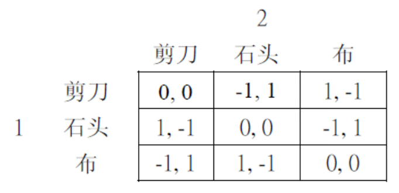
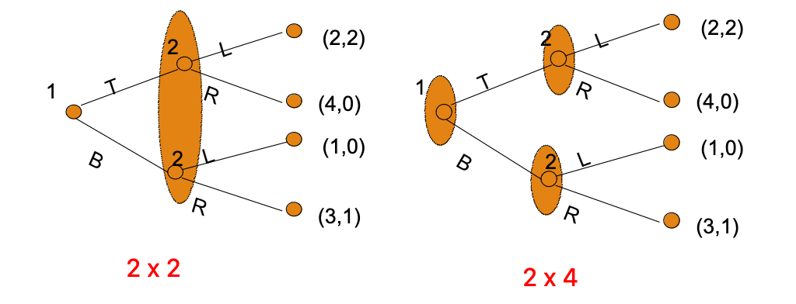

# 博弈格局的分析与描述

## 博弈格局的分析

### Players 局中人

人的特点

- 效用和追求（名【零和】、利【正和】、情【负和】）
- 耐心程度
- 面相？

人的 strategies and moves 策略和行动

人之间的关系： alliance/coalition, hostility

### 博弈格局的性质

正和、零和、负和

大部分博弈具有双重性；可以互相转变

### 博弈的规则 rules of game

博弈规则：固定不变；操纵

- 司法管辖权

协议是否具有强制力

- 老赖

一次性 or 重复博弈

- 远亲不如近邻

### 信息与判断

信息完全与不完全

- 不完美信息 imperfect information 与道德风险
- 不完全信息（incomplete/asymmetric）与逆向选择

先验认识与后验判断

- 偏见执拗（bios confirmation）；行为经济学
- 博弈论需要假设大家拥有相同的世界观：判断一致性假设

### 制定策略 strategy

a complete contingent plan of action

一套行动计划，而非某个具体行动

完备性，相机性

## 博弈的策略式描述

策略式博弈：标准式博弈、静态博弈：所有玩家在同一时间做出决策
$$
G = (S_1, \cdots, S_n; u_1, \cdots, u_n)
$$
三个要素：

- players: $i \in {1, 2, \cdots, n}$
- strategies: $S_i$ 为 player i 的策略集合
- payoffs: $u_i: S_1 \times \cdots \times S_n \rightarrow \mathbf{R}$ 为 player i 的报酬函数

### 支付矩阵

刻画只有两个局中人的博弈：

- 左边是 player 1 ，上边是 player 2
- 左边是 player 1 的策略集合，上边同理
- player 1 的报酬在前

## 博弈的扩展式描述

扩展式博弈 Extensive Game ：动态博弈：玩家轮流做决策

博弈树

### 构成扩展式的要素

- 局中人集合
- 行动顺序
- 依赖行动的报酬
- 采取行动时掌握的信息
- 外生事件的概率分布

### 信息集

描述局中人所掌握的信息状况

方法：集合及其划分 partition

把博弈树上的某局中人不能区分的决策节点形成一个集合，则为信息集

信息集包含的节点越多，说明局中人掌握的信息越少

### 完美信息博弈

如果博弈树上所有局中人的所有信息集都是单节点的，则该博弈为完美信息博弈；否则，为不完美信息博弈

完美信息博弈 implies

- 没有任何两个人同时行动
- 顺序行动时，后行动者能观察到先行动者的选择
- 所有局中人都可以观察自然的行动？？

### 扩展式博弈中的策略

为局中人的每一个信息集决定行动的规则：信息集集合 $\rightarrow$ 行动集合的映射

## 两种表述方式的转换

## 知识阶次与共同知识

因果推理与循环推理

### 知识阶次

zero-order, first-order, ..., n-th order

$n \rightarrow +\infty$, common knowledge, 共同知识假设；否则博弈的胜负结果由局中人推理能力/智力的差异决定，不能反映策略的优劣
