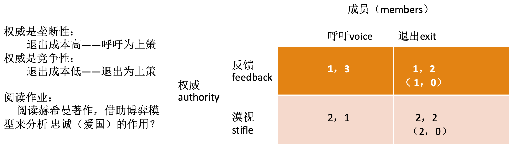
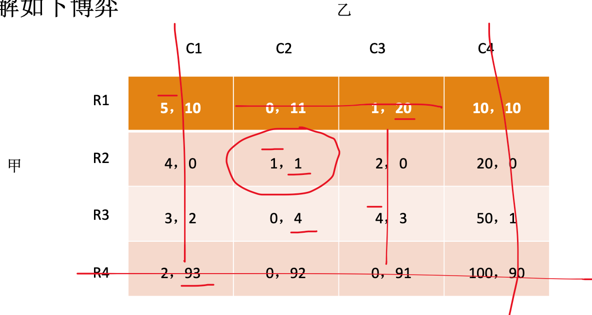
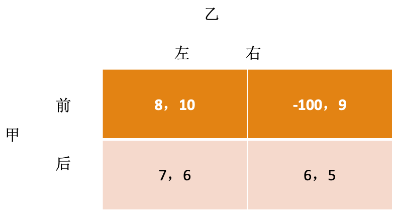

# Strategy

## 上策 Dominant Strategy

无论对手采取什么策略，都能给自己最大回报

- 严格占优（上上策/严格上策）：都严格大于
- 弱占优（上策）：大于等于，存在大于

结论：

- 局中人是理性的 $\Rightarrow$ 首先考虑使用上策 $\Rightarrow$ 应该给定对手的上策，考虑自己的上策
- 每个人都理性，都选择自己的上策，博弈均衡为所有人的上策组合：「上策均衡」（每一个局中人都有上策时形成的均衡）
- 上策均衡中，每个局中人都是无论对方怎么选自己都选上策，不需要知道对方是理性的，也不需要知道对方选什么，是特殊的纳什均衡（比 NE 更严格）。

例子：

- 田忌赛马：田忌是否有上策？

- 囚徒困境：局中人都有上策

- 密封二级价格拍卖：两人各自把报价写在纸上，密封之后交给拍卖者。出价高者拍成，但是支付价格为出价中的第二高价格。

    - 该博弈的上策均衡为每一方都出自己的最高估价（完全估价；真实估价；诚实）
    - 出价超过真实估价：对手的出价可能在真实估价和自己的出价之间，高于真实估价，可能在得拍后以高于真实估价的价格购入物品
    - 出价低于真实估价：降低了得拍的概率

- 智猪博弈：猪圈的两头分别是踏板和食槽。踩下踏板以后跑到食槽消耗为 2 。大小猪一起吃，分别吃到 5 、 3 ；大猪踩踏板，小猪抢先吃，都吃到 4 ；小猪踩踏板，大猪抢先吃，大小猪分别吃到 9 、 1 。

    - 只有一个局中人有上策：小猪一定选择上策「等待」；因此大猪一定会去踩踏板，形成 NE 。
    - 企业竞争：大企业研发新产品，小企业搭便车模仿大企业的创新，然后销售廉价产品占据市场份额
    - 国际关系：亚太：中美共治 or 美日共治
    - 组织治理：一把手、二把手

- Hirschman gate 赫希曼博弈

    

## 重复剔除下策

无论对手采取什么策略，总是无法带来最大报酬的策略

理性局中人不会使用下策 $\Rightarrow$ 去掉（严格）下策不会影响博弈结果

剔除下策均衡 iterated dominance equilibrium

注意：

- 去掉弱下策，最终的均衡结果依赖于去除顺序
- 重复剔除下策蕴含的前提：知识阶次需要增高
    - 乙是理性的，会剔除下策
    - 甲知道乙是理性的，因此会在乙剔除下策之后的情况中剔除自己的下策
    - 乙知道甲知道乙是理性的，因此会在上一步甲剔除下策之后剔除自己的下策
    - 反复剔除下策后得到剔除下策均衡
- 纳什均衡策略中一定没有严格劣势策略， i.e. 重复剔除严格下策不会剔除纳什均衡； NE 更严格。

例子：

- 「傻人有傻福」：显得不那么精明反而让双方获得更大收益

    

- 「小心使得万年船」：实际中，甲为了规避（乙不理性的）风险，可能会选择「后」

    

