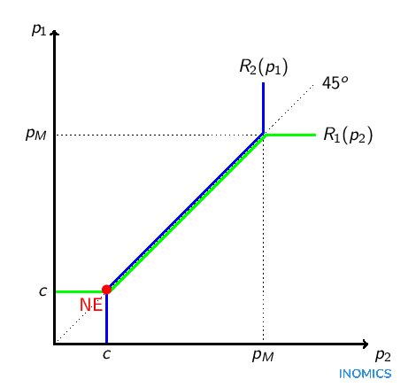
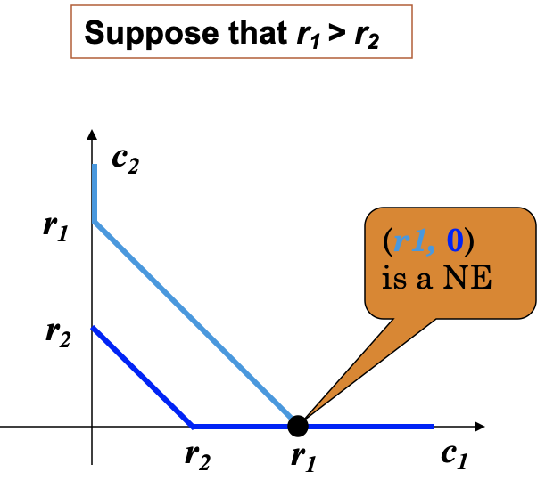

# Nash Equilibrium

## Concepts

合理化策略 Rationalizable strategy: 可以被合理的判断（belief）所支持的策略

判断的吻合性 Consistently aligned beliefs: 每个人对别人行为的判断（预期）是正确的：即不仅合理而且一致。

- 合理化策略仅要求局中人的判断具有合理性，但不要求该判断和对方策略选择的一致性；这导致可以选用的策略太多，没有办法预测博弈的结果。

最优反应 the best response: 

- 给定对手的某一策略，最优的策略

纳什均衡 Nash equilibrium: 策略组合使所有局中人的最优反应互为最优反应

- 策略组合 $s^* = \{s_i^*\}$ 为 NE $\Leftrightarrow$ 对任意参与人 $i$ , $u_i(s_i^*, s_{-i}^*) \ge u_i(s_i, s_{-i}^*), \forall s_i \in S_i$
- 是一种局部最优：给定对手的某一策略，是最优的
- 另一种定义：任何局中人在此策略组合下单方面改变自己的策略（其他局中人策略不变）都不会提高自身的收益
- 静态均衡：NE 是某一时刻下各个局中人选择行动的稳定状态，没有人有动机单方面改变选择，是一种静止状态
- 1994 年，约翰·纳什和海萨尼、泽尔腾共同获得诺贝尔经济学奖

要求：

- 参与人理性
- 博弈结构为共同知识
- 参与人根据「正确」的判断来选择最优反应策略
    - 给定对方的选择确定自己的最佳选择
    - 自己的选择是最佳的，并且对方也这么认为
    - 每个参与人关于对方的信念必须是正确的

协议的自我实施 self-forcing

- 局中人事前达成一个协议
- 不存在外部强制，但所有人都积极遵守
- 则该协议为 NE ，可以 self-forcing

例子：

- 婚姻制度：事前优势与事后优势
    - 传统：利于男方的事后优势，利于女方的事前优势
    - 现代：限制男方的事后优势，降低女方的事前优势

- 商业合同
    - 企业（事后优势）和银行（构建事前优势：抵押、担保）
    - 股权融资：投资方用投资换股权，企业的事后优势更大，

- 资产专用性 Asset Specificity
    - 大众：上游企业；大连大众：下游企业；由于下游企业生产的产品只能用于当地发行的产品，便可以向上游压价，导致上游企业为降低成本降低产品质量
    - 资产专用性造成上下游企业事前、事后优势不匹配；上下游合作不畅；解决：参股

## Computation

### 划线法

如果一个策略组合有两个划线，则为一个 NE 。

例子：两个人分别出整数价格，和为 5 时得到各自出价的收益，否则收益为 0 。共有 4 个 NE 。

### 最优反应函数

#### Cournot 古诺竞争

- 前提假设：产品同质，单个厂商可以覆盖市场；无法控制价格，双方进行产量博弈

    价格与产量的关系：$P(Q) = \alpha - \beta Q$ （市场中只有一个价格） 

    成本： $c_i(q_i) = c_i q_i$

- 相关变量：

    - 策略集合 $q_i \in [0, +\infty]$
    - 报酬函数 $u_i (q_1, q_2) = \pi_i (q_1, q_2)$ （等于利润函数）

- 最优反应：

    $$
    \begin{aligned}
    q_1^* &= \arg\max_{q_1} (p - c_1)q_1 \\
    &= \arg\max_{q_1} (\alpha - \beta q_1 - \beta q_2^* - c_1)q_1 \\
    &= \arg\max_{q_1} - \beta(q_1 - \alpha / \beta + q_2^* + c_1 / \beta)q_1 \\
    &= {(\alpha - c_1) / \beta - q_2^* \over 2} \\
    q_2^* &= {(\alpha - c_2) / \beta - q_1^* \over 2} \\
    \Rightarrow q_1^* &= {\alpha - 2c_1 + c_2 \over 3\beta},~ q_2^* = {\alpha - 2c_2 + c_1 \over 3\beta} \\
    \Rightarrow q_1^* - q_2^* &= {c_2 - c_1 \over \beta}
    \end{aligned}
    $$
    
    据此可以求解总产量/需求与价格：
    
    $$
    \begin{aligned}
    Q^* &= q_1^* + q_2^* = {2\alpha - c_1 - c_2 \over 3\beta} \\
    p^* &= {\alpha + c_1 + c_2 \over 3}
    \end{aligned}
    $$

- 如果成本相同，则产量相同

    成本小的一方（更高效的一方）占据更大的市场份额 $c_1 < c_2 \Rightarrow q_1^* > q_2^*$

- Externality [[ref (p23)]](https://www.eco.uc3m.es/~mmachado/teaching/oi-i-mei/slides/3.2.Cournot%20Model.pdf):

    - 如果一方 cost 上升，则自己的产量下降，另一方的产量上升， i.e. negative externality
    
    - Firms only take into account the effect of the price change in their own output. Then their output is higher than what would be optimal from the industry’s point of view.
      
        $$
        % \begin{a}
        \pi_i = q_i P(Q) - C_i(q_i) \\
        {\partial \pi_i \over \partial q_i} = 0 \Rightarrow q_i P'(Q) + [P(Q) - C_i'(q_i)] = 0
        $$
        
        $[P(Q) - C_i'(q_i)]$ is the profitability of the marginal produced unit. If firms only consider this term, they would let it equal to 0, which deviates to the condition of Nash equilibrium ($[P(Q) - C_i'(q_i)] = -q_iP'(Q) > 0$) and leads to excessive production. 
    
        **There is a negative externality between Cournot firms.**

#### Bertrand 博川德竞争

- 前提假设：产品同质，企业设定价格水平，让消费者做出购买决策

    $Q = \alpha - \beta P, ~ C_i(q_i) = c q_i$ （边际成本相同）

    激烈竞争：价格高的一方失去全部市场；价格相同时平分市场份额

    只在价格不低于边际成本时才进行生产

- 因此，利润函数是分段函数：
  
    $$
    \begin{aligned}
    \pi_1(p_1, p_2)= \begin{cases}\left(p_1-c\right)\left(\alpha-\beta p_1\right) &, c<p_1<p_2 \\ \left(p_1-c\right) \frac{1}{2}\left(\alpha-\beta p_1\right) &, c<p_1=p_2 \\ 0 &, c<p_2<p_1\end{cases}
    \end{aligned}
    $$
    
    观察函数（图像），发现第一种 case 的函数值总是比第二种大，因此 reaction function
    
    $$
    \begin{aligned}
    R_1(p_2) = \begin{cases}
    p_M &, p_2 > p_M \\
    p_2 - \epsilon &, c \lt p_2 \le p_M \\
    c &, p_2 \le c
    \end{cases}
    \end{aligned}
    $$
    
    （$p_M$ is monopoly price, the profit-maximizing amount for a monopoly and producing more actually results in less profit.）

    双方不断降低价格，直至等于边际成本。

    因此 NE 为 $(p_1^*, p_2^*) = (c, c)$ ，i.e. $R_1(p_2) = R_2(p_1)$ ，反应函数的交点

    
    
- 此种现象不容易在现实中遇到：firms usually make positive profits

    - Firms rarely offer perfectly homogeneous goods.
    - In the classical Bertrand game, firms interact only once. However, the same firms interact repeatedly day after day and may cooperate to maintain prices above marginal costs.
    - Firms may be capacity constrained.

- 如果双方边际成本不同： $c_1 > c_2$ ：

    淘汰边际成本高的一方： $p_2^* = c_1 - \epsilon$ ，边际成本低的一方占据全部市场份额。

#### 霍特林模型 Hotelling model

#### 公共物品的提供

富人和穷人共同为修建道路进行捐献

- 人们的捐献主要取决于哪些因素？
- 现实中的哪些因素需要加入模型？
- 一般性？
    - 比喻：大小猪博弈；缺点：矩阵中的值是确定的，缺乏一般性
    - 需要用更一般的方式进行建模

可能的建模：

假设：

- 财富 $w_1 > w_2 \ge 0$ ，捐助量 $0 \le c_i \le w_i$

- 修路带来的效用 $v_i$ 有一阶导大于 0 ，二阶导小于 0 （边际效益递减）

    富人的边际效用更大（比如路好一些对豪车更好，而对不开车的穷人无意义）： $v_1' > v_2'$

计算：

- 效用（注意需要考虑总效用，要加上剩余财富）： $u_1(c_1, c_2) = v_1(c_1 + c_2) + w_1 - c_1$

- 最优反应：$c_1^* = \arg\max_{c_1} v_1(c_1 + c_2^*) + w_1 - c_1, ~ 0 \le c_1 \le w_1$

    first-order condition: $v_1'(c_1^* + c_2^*) = 1, ~ v_2'(c_1^* + c_2^*) = 1$

    $\text{Assume } v_i'(r_i) = 1 \Rightarrow r_1 > r_2$ ，反应函数分别为：
    
    $$
    \begin{aligned}
    c_1 = \begin{cases}
    r_1 -c_2&, c_2 < r_1 \\
    0&, r_1 \le c_2
    \end{cases} \\
    c_2 = \begin{cases}
    r_2 -c_1&, c_1 < r_2 \\
    0&, r_2 \le c_1
    \end{cases}
    \end{aligned}
    $$

    找反应函数的交点，得到 NE 为富人出资，穷人不出资。
    
    

#### 政治竞选

假设：

- 选民总数一定

- 选民集合用他们的实数政治偏好的集合表示 $V = \{v_j\}$ ，数字越小越左倾，反之右倾

- 候选人 $i \in \mathbb{N}$ 的政策 $a_i$

- 支持候选人 $i$ 的选民满足，相比于其它候选人， $a_i$ 更接近他们的政治偏好；

    i.e. 投票给 $i$ 的选民集合 $V_i = \{v_j ~|~ i = \arg\min_{k \in \mathbb{N}} |a_k - v_j|\}$

    若等距选民集合 $V_\text{equal} = \{v \in V ~|~ \exists i_1 \ne i_2, |v - a_{i_1}| = |v - a_{i_2}| \} \ne \emptyset$ ，则 $i_1, i_2$ 各获得一半选民

假设 $i \in \{1, 2\}$ ：效用函数 $u_i(a_i, a_{-i}) = |V_i| + {V_\text{equal} \over 2}$

中间投票者 $v_m, ~\text{s.t.} |\{v|v \le v_m\}| = |\{v|v_m \le v\}|$

中间立场定理：

- 如果投票者沿着某一维偏好有差异，
- 那么<u>位于中间投票者的立场</u>将会在简单多数投票中打败任何立场

可能的失效原因（by New Bing）

- Voters have multiple dimensions of preferences, not just one. For example, they may care about social issues, economic issues, foreign policy issues, etc.
- Voters have irrational or emotional motivations for their choices, not just rational ones. For example, they may vote based on identity, loyalty, resentment, etc.
- Voters are influenced by external factors such as media, interest groups, campaign spending, etc. that may distort their preferences or information.

[Nature: Polarization, abstention, and the median voter theorem](https://www.nature.com/articles/s41599-022-01056-0)

[极化的好处？](https://www.project-syndicate.org/commentary/political-center-and-extremes-in-us-2022-midterms-by-daron-acemoglu-2022-07/chinese)

