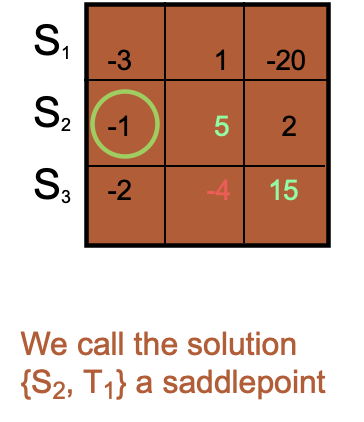

# Mixed Strategy

为何要策略模糊？

- 随机行动：在利益对立的博弈中（e.g. 零和博弈），需要主动隐藏行动
- 出于谨慎：在非零和博弈中，局中人关于对手的行动存在判断（belief）上的不确定性
    - 颤抖手均衡
- 认知模糊：局中人对于对手的类型（type）存在不确定性判断

与演化博弈的关系：对于一个群体，混合策略中的概率可以看作不同种类的个体的比例

## 零和博弈与最小最大定理

双人零和博弈，在纯策略下有 NE 的充要条件：存在唯一的最大最小、最小最大的 outcome 组合

(security) value ：所有局中人采取谨慎策略时的期望效用

对手做任意改变只会使 value 不变或增加

Max-min Strategy: maximize the minimum payoff of playing each strategy

Saddlepoint: A set of Maximin Strategy (one for each player)

## 混合策略均衡

混合策略：有些博弈不存在纯策略 NE ；混合策略扩大了局中人的策略集合（从离散而有限的变为连续的），从而存在 NE 。

混合策略中的最佳应对：在各自概率策略的选择下，双方的收益期望互为最大（任何单方面的改变不会增加期望收益）

混合策略均衡：互为最佳应对

纳什的贡献：有限参与者和有限纯策略集的博弈一定存在纳什均衡

如果存在两个纯战略纳什均衡，那么一定存在第三个混合战略纳什均衡。

无差异原理：混合策略均衡 $\Leftrightarrow$ 相互使对方在不同纯策略上的期望回报无差异

- 好的概率策略就是使对方不知道用哪个策略更好的策略
