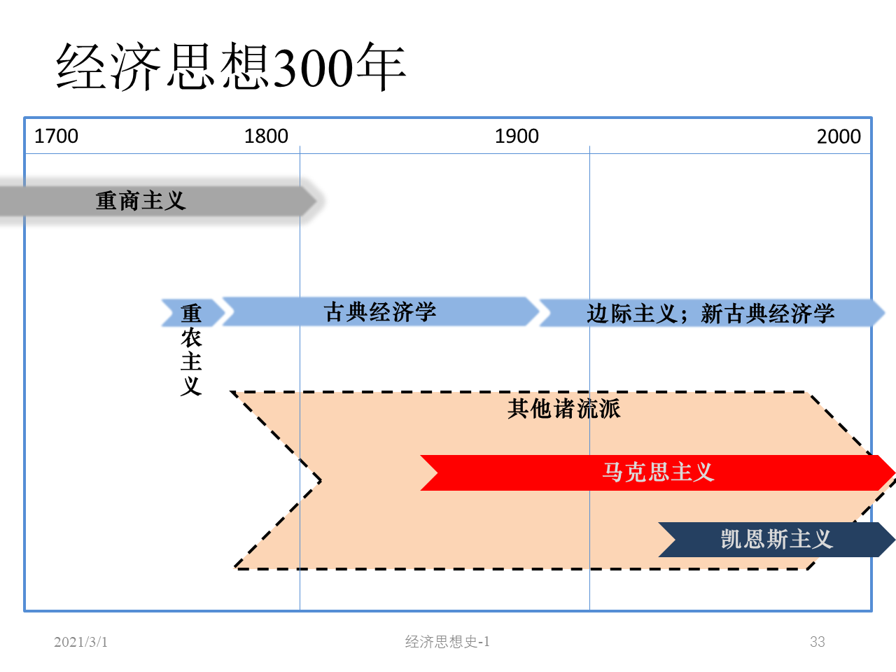
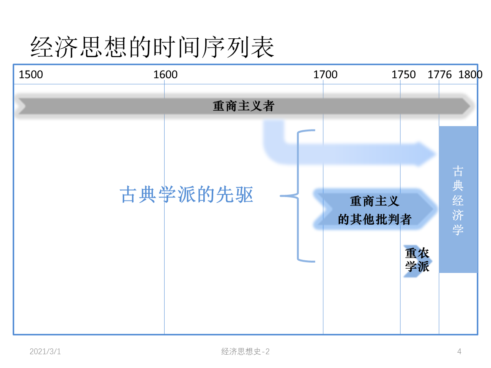
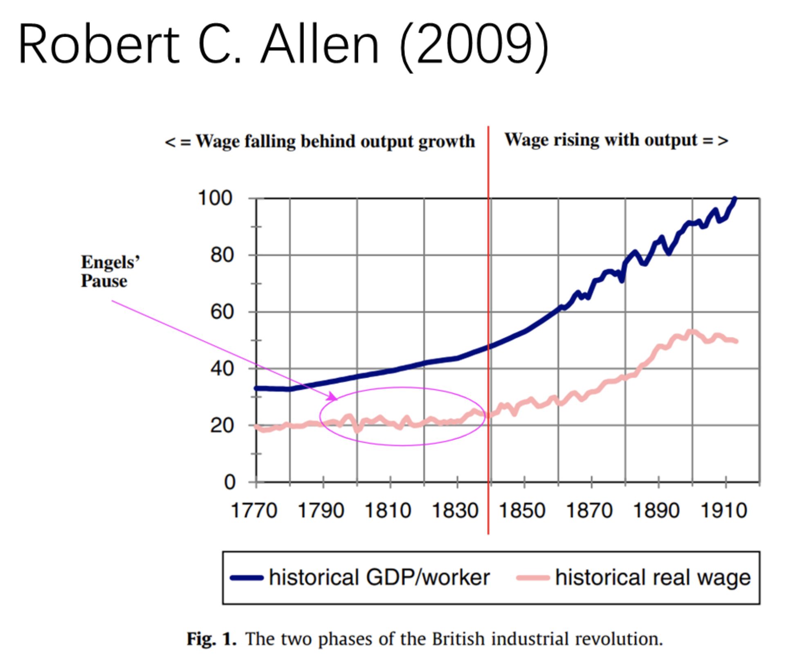
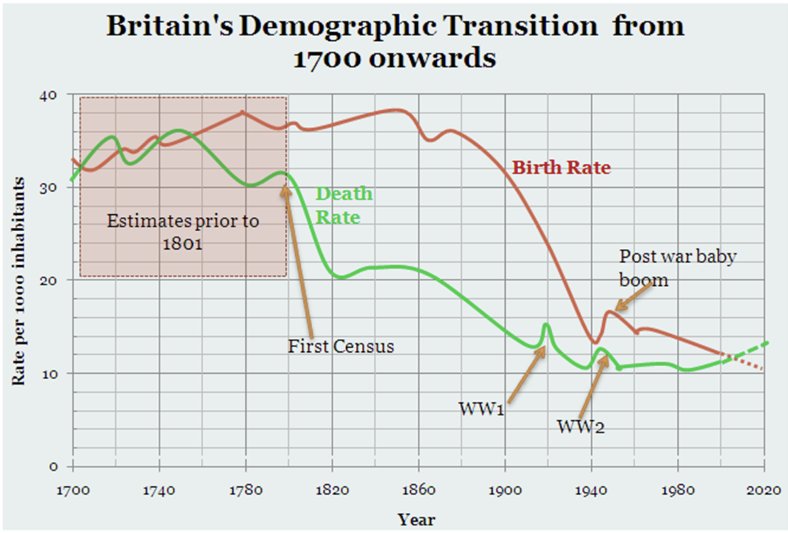

# Classical

|  |  |
| ----------------------------------------------------------- | ----------------------------------------------------------- |

Turgot 杜尔阁

- 古典学派先驱，常常被归类为重农主义学派

- 曾任法国财政大臣

- 法国大革命的直接先导之一

- 土地收益递减规律：投在土地上的资本和劳动能带来的土地总产出是非线性的

- 工资铁律： The iron law of wages: 长期中劳动工资处于生存水平（subsistence level）

    - 假设劳动市场上有很多工人在竞争

    - 隐含假设：劳动市场中雇主处于优势地位（买方市场）

        - 为何这样假设？因为存在这样一种现象：如果一开始工人少，工人工资水平高，生活水平高，生育率就会上涨，因此之后劳动力供给就会增加，导致工资下降
        - 隐含假设：**劳动阶级的生育行为**：生活水平的提高会带来生育率的上涨；在条件允许的前提下尽可能多地生育

    - 19 th 中叶以前基本符合事实

        

    - 19 th 中期之后发生变化

        

William Petty 威廉·配第

- 价值尺度：
    - 土地是财富之父，劳动是财富之母
    - 如何统计国民财富？「日计劳动」：成年人一天的口粮
- 货币流通速度 velocity of money
- 土地价格如何计算？地租的资本化：
    - 资本化：将一笔定期的收入视作一个货币资本的利息
    - 从利息倒推资本有多大，从而给土地（或者其它有定期收入的对象）定价
- 剩余 surplus ：地租是一种 surplus

Cantillon 康蒂隆

- 1755 《商业性质概论》（完整的经济学著作）；有人认为其贡献与《国富论》相当

- 企业家：收入不固定的人 -> 承担风险的人

    对比：受雇者、土地所有者

- 价格与供求

- 价值理论：区分内在价值（intrinsic value）和市场价格（时期内人们的共识）

    价值尺度：劳动者一天劳动的价值 = 2 倍他所消费的土地之产出（考虑家庭？）

- Cantillon Effect: 持货币非中性观点

    货币增加的原因不同，结果也会不同

    - 货币中性：货币量增加对经济没有实质性影响，只会带来价格水平的变化
    - 货币非中性：货币量增加会影响相对价格、资源配置、总产出

- 

