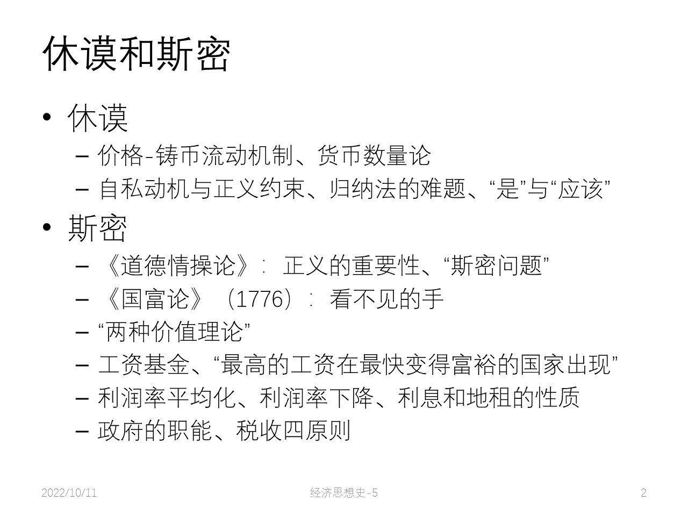

# Classical

|  |  |
| ----------------------------------------------------------- | ----------------------------------------------------------- |

## Turgot 杜尔阁

- 古典学派先驱，常常被归类为重农主义学派

- 曾任法国财政大臣

- 法国大革命的直接先导之一

- 土地收益递减规律：投在土地上的资本和劳动能带来的土地总产出是非线性的

- 工资铁律： The iron law of wages: 长期中劳动工资处于生存水平（subsistence level）

    - 假设劳动市场上有很多工人在竞争

    - 隐含假设：劳动市场中雇主处于优势地位（买方市场）

        - 为何这样假设？因为存在这样一种现象：如果一开始工人少，工人工资水平高，生活水平高，生育率就会上涨，因此之后劳动力供给就会增加，导致工资下降
        - 隐含假设：**劳动阶级的生育行为**：生活水平的提高会带来生育率的上涨；在条件允许的前提下尽可能多地生育

    - 19 th 中叶以前基本符合事实

        

    - 19 th 中期之后发生变化

        

## William Petty 威廉·配第

- 价值尺度：
    - 土地是财富之父，劳动是财富之母
    - 如何统计国民财富？「日计劳动」：成年人一天的口粮
- 货币流通速度 velocity of money
- 土地价格如何计算？地租的资本化：
    - 资本化：将一笔定期的收入视作一个货币资本的利息
    - 从利息倒推资本有多大，从而给土地（或者其它有定期收入的对象）定价
- 剩余 surplus ：地租是一种 surplus

## Cantillon 康蒂隆

- 1755 《商业性质概论》（完整的经济学著作）；有人认为其贡献与《国富论》相当

- 企业家：收入不固定的人 -> 承担风险的人

    对比：受雇者、土地所有者

- 价格与供求

- 价值理论：区分内在价值（intrinsic value）和市场价格（时期内人们的共识）

    价值尺度：劳动者一天劳动的价值 = 2 倍他所消费的土地之产出（考虑家庭？）

- Cantillon Effect: 持货币非中性观点

    货币增加的原因不同，结果也会不同

    - 货币中性：货币量增加对经济没有实质性影响，只会带来价格水平的变化
    - 货币非中性：货币量增加会影响相对价格、资源配置、总产出

## David Hume 大卫·休谟

经济观点：

- 价格铸币流动机制：在金本位制下，国际收支自动趋向均衡
    - 贸易顺差 -> 货币流通量增加 -> 物价普遍上涨 -> 本国产品在国外失去竞争力 -> 出口减少，进口增加
    - 贸易逆差 -> 货币流通量减少 -> 物价普遍下跌 -> 进口减少，出口增加
- 古典货币数量论
    - 商品的价格与货币的数量成比例

哲学观点：

- 经验主义：知识只能或应基本来源自感官经验（归纳法）（对应：唯理主义、演绎法）

- 《人性论》：人的感知与事实之间存在距离，所以研究一切科学之前应该研究人自己

- 经济伦理思想：

    - 经济活动的动机是自私

    - 但出于自私的经济活动需要受到正义的约束

    - 正义：由于无限私欲与有限资源的冲突、资源的稀缺性，人类社会需要「正义」来约束；「正义」来源于资源稀缺性；正义的内容：私有权、信用。

        稀缺性成为了当代主流经济学研究的出发点。

- 难题：

    - Problem of induction 归纳法的难题: 归纳法面临着未来新观察的威胁，随时可能崩溃

        因此，正统经济学（派）坚持演绎法。

    - Is-ought problem 「是」与「应该」难题: 「是」无法推导出「应该」

        因此，正统经济学（派）主要关注「是怎样」。

        但是，社科中难以划清二者： Robert Solow: 对研究主题的选择，暗含了价值判断

## Adam Smith 亚当·斯密

- 出生于苏格兰🏴󠁧󠁢󠁳󠁣󠁴󠁿；教授过文学、逻辑学、道德哲学

    1759, The Theory of Moral Sentiments

    1764, 陪同贵族孩子游历欧洲大陆，会见重农主义者

    1776, The Wealth of Nations

- 身处环境：工业革命前夕，技术和基础设施的飞速发展；启蒙运动，思想活跃

- The Theory of Moral Sentiments 道德情操论

    - 对人性的看法： self-love 利己与 sympathy 利他的混合
    - 基本上是利己的人为何会有利他的「美德」
        - Francis Hutcheson, 道德的标准不在于上帝而在于每个人；功利主义：最正确的行为是将效益达到最大
        - 但社会的道德标准是如何达成的呢？Smith: 「公正的旁观者」
    - 正义的重要性：社会存在的基础

- 斯密难题：

    - 道德情操论：利他的美德使得社会运转

    - 国富论：利己行为

    - 二者是否矛盾？经济思想与伦理思想是否矛盾？

        [斯密问题](https://wiki.mbalib.com/wiki/%E4%BA%9A%E5%BD%93%C2%B7%E6%96%AF%E5%AF%86%E9%97%AE%E9%A2%98)

- The Wealth of Nations

    
    
    - 定义国民财富：一国国民每年消费的一切生活用品与消费者人数的比例（这里其实漏掉了生产资料）
    
    - 国民财富取决于：
        - 国民劳动的熟练度
        - 从事有用劳动与无用劳动的人的分配
    
    - 第一卷
        - 分工
            - 促进生产效率
            - 分工程度受到了市场范围的限制
            - 资本积累是劳动分工的前提
            - 自发秩序：分工不是人类智慧的结果，是人类倾向缓慢逐渐造成的结果
    
        - 货币
            - 起源于流通手段
            - 货币不是财富（与重商主义相反）； the great wheel of circulation 流通的大轮毂
            - 支持货币的自由发行
    
        - 价值/价格理论：
    
            - 初期野蛮社会：资本累积和土地私有尚未发生之前：劳动量；劳动价值论
    
                后续：李嘉图
    
            - 资本积聚之后：三种生产费用：工资、利润、地租
    
            - 价值尺度：劳动工资
    
            - 市场价格与自然价格：
    
                - 市场价格：实际价格，受供求影响不断波动
                - 自然价格：价值，由自然地租率、工资率、利润率决定的价格，稳定
                - 市场价格围绕自然价格上下波动，调节资源配置和产品供给
    
        - 分配理论：
    
            - 工资：满足维持生活、赡养家室
    
                - 工资基金：全体资本家在生产开始之前预留出的准备支付工资的资金
    
                    
    
                - 最高的劳动工资不在最富的国家出现，却在最繁荣及增长最快的国家出现
    
            - 利润：利润的多少与资本的大小恰成比例，受所投资本的价值的支配；而不是「特种劳动工资」（比如监督指挥）
    
                - 利润率平均化规律：长期大范围来看，利润率趋于平均（一般利润率，平均利润率，每年生产的剩余价值总额同资本家预付社会总资本的比率），因为资本家为了追逐利润，总是把资本从利润率低的部门转移到利润率高的部门。
                - 利润率下降规律：一般利润率下降；资本不能一直赚钱
    
            - 地租：一种「垄断价格」，而不是用来改良土地的合理利润
    
            - 三大阶级：各自的利益与社会一般利益是否相关、是否一致
    
    - 第二卷：资本向何处投放？生产性领域：农民、制造业工人
    
        - 劳动划分
    
            - 生产性劳动：农民、制造业工人的劳动；劳动贮存到物品中
            - 非生产性劳动：家仆、官吏、律师等；这些劳动无法贮存
    
        - 利息：利息是利润的一部分
    
            （对比现在的理论：货币的价值）
    
            - 大于 0 ，小于利润率
    
        - 资本增加：节俭
    
        - 国际贸易：
    
            - 贸易是正和博弈
            - 自由贸易好
    
        - 产业政策：自由
    
        - 政府职责：
    
        - 税收：四原则：公平、确定、便利、最小损耗
    
        - 国债：批判英国发大量国债，认为最后无法偿还
    
    - 总结：
    
        - Smith 的风格
            - 温和的乐观主义
        - 经济自由主义
            - 市场活动的基本动机：自利心
            - 自由竞争的市场活动能够达到社会和谐
            - 采取自由放任政策的政府是好政府
    

## Thomas Robert Malthus 马尔萨斯

社会背景：

- Poor Law, 1601, 救济老弱病残，强迫有劳动能力的人工作
- Settlement Law, 1662, 有居住权才能接受救济；遣返跨区流动的贫民。
- 1795 Speenhamland Act 济贫法
    - 背景：人口迅速增加；失业日益普遍；出现在业贫困
    - 措施：规定最低收入线，非全国强制
        - 批评：加大教区财政负担；摧毁工人自立精神；实际上扩大了评论
    - 反思评价：防止经济和社会崩溃；蕴含了福利国家原则；阻碍了劳动力市场花
- 1834 新济贫法，取消院外救济
- 1815 Corn Law 谷物法
    - 限制进口，维持高价
    - 反对浪潮； 1845 爱尔兰灾荒
    - 1846 废除
- 1832 Reform Act 改革法案
    - 资产阶级政治权利；重新分配议席，修改选民资格

知识背景：

- Godwin 戈得温：
    - 极端个人主义，无政府主义
    - 相信个人自愿的亲善与正义感
    - 乐观主义：通过向更高理性、更大福利迈进，人类是可以完善的。因为人的性格取决于社会环境；好的社会创造好的人类
    - 人口问题：人口增长不是问题；人口达到极限后，人们不会进一步繁衍
- Condorcet 孔多塞
    - 追求平等；平等、普遍福利，可以使社会趋于完善
    - **这正是 Malthus 要反对的观点**：困扰社会的罪恶和苦难不源于罪恶的人类制度，而源于人类极强的生育能力。

### 人口理论

- 两个公理：
    - 人要吃饭：食物为人类所必需
    - 食色性也：两性间的情欲是必然的，且几乎会保持现状
- 一个假定：人口在无所妨碍时，以几何级数增加；而生活资料只会以算术级数增加
- 平衡法则（自然法则）：预防性抑制、积极抑制
- 人类的宿命：贫困与罪恶

如何应对贫困问题？取消「济贫法」

struggle for existence 生存斗争：启发了生物进化论

Spencer 斯宾塞：社会达尔文主义； survival of the fittest

### 市场供给过剩论

非生产性消费的必要性

扩大有效需求

Keynes 主义的先声

## David Ricardo 李嘉图

### 货币问题

The Bullionist Controversy 金块论战

### 地租理论

### 劳动价值论

