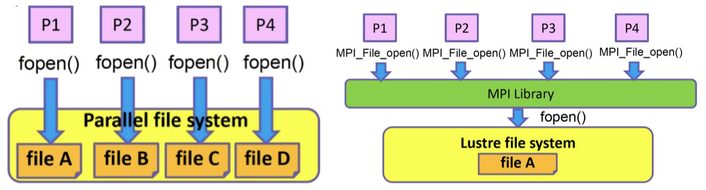

# MPI Design

SPMD: Single Program Multi. Data

## P2P Communication

### Blocking

`MPI_Send` will not return until **the send buffer is usable for new data again**.

`MPI_Recv` will not return until **the receive buffer is available for reading**.

System buffer???

### Non-Blocking

Wait or Test:

```c++
MPI_Request request;
MPI_Status status;
MPI_Isend(start, count, datatype, dest, tag, comm, &request);
MPI_Irecv(start, count, datatype, dest, tag, comm, &request); MPI_Wait(&request, &status);
MPI_Wait(&request, &status);
MPI_Test(&request, &flag, &status);
```

### Dead lock

Unsafe pattern below!!!


- System buffer has a limited size.
- Before Receiving, system buffer is used for storing data to send
- When size of data to send > size of system buffer, the receiver has to provide space

Solution:

- re-order; potential risk: sequential! waste bandwidth

    ```cpp
    // process 0
    Send(1);
    Recv(1);
    // Process 1
    Recv(0);
    Send(1);
    ```

- Sendrecv

    ```cpp
    // process 0
    SendRecv(1);
    // Process 1
    SendRecv(0);
    ```

    `SendRecv` allows simultaneous sending and receiving.

    It provides receive buffer when sending.

- Bsend: self-provide buffer for sending.

    ```cpp
    // process 0
    Bsend(1);
    Recv(1);
    // Process 1
    Bsend(0);
    Recv(0);
    ```

- partially Async; potential risk: sequential! waste bandwidth

- (Recommended) Isend + Irecv + Waitall for both process

e.g. Mesh exchange

-> Principle and Lessons Learned: Delay Sync Operations

### P2P Protocols

Eager Protocol

- **send to buffer directly** ; no confirmation required -> reduce sync delay
- local copy needed
- enough space required; small message

Rendezvous Protocol

- send envelop first for confirmation -> need time to sync
- no local data copy
- big data

## Process Mapping

Map processes to physical devices reasonably

- Different communication needs in different processes
- Different performance (bandwidth, delay) of different nodes in a cluster

Problem Abstraction: Graph Mapping


- NP-Complete Problem
- Heuristic algorithm

Two simple mapping ways:


Why???

- Block
- Cyclic

Process Binding

- reduce cost of switching, cache miss, and cross NUMA access

## Collective Communication

### Bcast and Reduce

Broadcast A from P1 to all of the processes. (1-to-all)


Flat Tree

- (P - 1) sendings
- Bandwidth waste

Binomial Tree

Van De Geijn: Bcast + Allgather


Reduce data from all of the processes to P2 with sum op. (all-to-1)


### Scatter and Gather

Scatter: Distribute different data to different processes. (1-to-all)

- The root node has all of the data at the beginning.
- The root node sends different parts of the data to different processes.


Gather: The root node gathers data from all of the processes. (all-to-1)


### All-X

#### Allgather

Allgather = Gather + Bcast


Ring

- (P - 1) steps
- No bandwidth waste

Bruck

- 

Recursive Doubling

- 


#### Allreduce

Reduce + Bcast


Ring: Reduce-Scatter + Allgather


#### Alltoall

Irecv-Isend

Pairwise

**Alltoall**: Each process gathers different data from all of the processes. (n ✖️ Gather)


## Communicator and Group

`MPI::COMM_WORLD` : Pre-defined communicator for all of the processes

- Group: within which processes can communicate to each other
- Communicator: each one binds to a group; to provide communication functions


## MPI-IO

POSIX (Portable Operating System Interface) v.s. MPI:



MPI-IO can:

- Open the file only once
- R/W simultaneously

Independent IO (traditional?)

- Each process has a request
- Serial when the same file is requested by different processes

Collective IO

- Shared R/W buffer: combine many queries into a single one -> reduce IO request
- sync needed


## Performance

### Performance Model

- **alpha-beta model**: Time = **alpha (latency)** + n * **beta (cost per byte)** = latency + n / bandwidth

    - For most cases, **alpha >> beta >> cost per FLOP**

        **Cost of a big data < Cost of many small data** , e.g.

        alpha + n * beta < n * (alpha + 1 * beta)

    - **Computing to Communication Ratio should be large enough**, as cost per FLOP is small

- **LogP Model**: Latency / overhead / gap / Proc

### Profiling

PMPI

mpiP


OSU Benchmark


https://panthema.net/2013/pmbw/index.html#downloads


