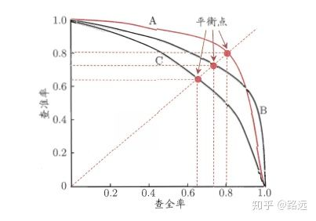

# Notes for ML

Ref:

[Machine Learning Interview Questions](https://github.com/andrewekhalel/MLQuestions)


**Bias and Variance for ML models**

ref: [机器学习中的Bias和Variance](https://zhuanlan.zhihu.com/p/45213397)

Bias 是模型预测值和真实值之间***差距的期望***，代表模型的***拟合能力***。通过在不同数据子集上评测此误差值可以近似期望。

Variance 是用不同数据子集训练同一个模型，这些参数各异的模型在某一点上***预测值的方差***，代表算法的***鲁棒性***。


Bias Variance Decomposition ([Ref](https://www.youtube.com/watch?v=FUCftGplkuk)):
$$
\begin{aligned}
& \mathbb{E}_{D, y}[ (y - \hat{f}_D(x) )^2 ] \\
=~ & ( f(x) - \overline{f}(x) )^2 + \mathbb{E}_D [ (\overline{f}(x) - \hat{f}_D(x) )^2 ] + \mathbb{E}_\epsilon[\epsilon^2(x)] \\
=~ & \text{Bias}^2 + \text{Variance} + \text{Error} \\
\text{where} ~ & \overline{f}(x) = \mathbb{E}_{D}[ \hat{f}_D(x) ]
\end{aligned}
$$
Bagging 算法：从训练集 D 中抽取子集进行训练，共进行 n 轮，训出 n 个预测模型。最终结果是 n 个预测模型给出结果的均值。该方法降低了 Variance 。每个模型是强模型（ Bias 低， Variance 高）。

Boosting 算法：针对弱模型（ Bias 高， Variance 低），减小 Bias 。从弱学习算法出发，反复学习，得到一系列弱分类器，然后加权组合弱分类器，得到一个强分类器。在学习过程中要改变训练数据的权值分布，提高分错的样本的权值。


**Gradient Descent**

大致原理用一阶 Taylor Series 推导即可：


**Over- and under- fitting**

根据 training set 和 testing set 上的表现走决策树（By Hongyi Li）


 

**Regularization**

A technique that *discourages learning a more complex or flexible model*, so as to avoid the risk of *overfitting*. (控制模型复杂度；e.g. 所有参数的权重做 L2-norm)


**Why is ReLU better and more often used than Sigmoid in Neural Networks?**

- 运算速度高
- sigmoid （和 tanh） 饱和区非常平缓，梯度接近 0 ，收敛变慢。
- ReLU 会使一部分神经元输出为 0 （随机初始化，一半都是 0），使网络变得稀疏，缓解 overfitting

非线性层（activation layer）的本质（ from [Vector Neurons: A General Framework for SO(3)-Equivariant Networks](https://github.com/FlyingGiraffe/vnn) ）: As evident from recent literature, especially useful are ***functions that split the input domain into two half spaces and map them differently***.


**Given stride S and kernel sizes for each layer of a CNN, create a function to compute the receptive field of a particular node in the network.**

[src](https://www.cnblogs.com/shine-lee/p/12069176.html)


**Why conv. rather than just FC?**

- conv 利用图像的空间信息
- translation in-variance 平移不变性：卷积+池化；这对于图像有利
- 参数共享，稀疏连接：防止过拟合


**Why Pooling?**

- feature invariant: 是否存在某些特征，而不关心特征的位置
- 降维
- 防止过拟合


**ResNet**

```
---> BN -> Actv -> Linear -> BN -> Actv -> Linear --->
 \_________________________________________________/
```

可能的原理:

- 并非梯度消失/爆炸：二者已被 normalized initialization and intermediate normalization layers 解决
- Motivation: 深层网络的表现不如浅层网络（training set 和 test set 上 error 都更大）
- 加上 Identity Mapping 后， $Out(x) = F(x) + x \Rightarrow F(x) = Out(x) - x$ ，学习的是残差值。深层网络只需学到 $F(x) = 0$ 就不致使网络退化。与之相比，直接学习恒等映射比较难。


**BatchNorm 与 LayerNorm**

- BN 是对 feature 的某一维度，用 batch 中的各个样本计算这一维度的均值和方差，然后 norm batch 中这一维度的所有数值。

- LN 用于 NLP ，是对 seq 中 token 的 feature 做 norm ，根据此 feature 各个维度的值算出均值和方差，然后 norm 这个 feature 。体现在代码中， `mean` 和 `std` 都是沿着 `input_tensor` 的最后一个 dim 做的。

- 为什么 Transformer 用 LayerNorm ？

    - [ref](https://www.zhihu.com/question/395811291/answer/1257894378) 前向传播的输入数据分布更稳定；同时，后向传播时的梯度更稳定。（反向传播时排除 mean 和 var 的梯度，效果会变差。）
    - [ref](https://www.zhihu.com/question/395811291/answer/1257223002) a [paper](https://arxiv.org/pdf/2003.07845.pdf) shows that, comparing NLP and CV, we show evidence that the batch statistics in transformers on NLP tasks have larger variations.
    - 一部分人认为， NLP task 中 seq 长度各异导致 BN 不太合理。但有人反驳这一点，认为 seq 长度其实可以很接近，这不是主要原因。


**How to deal with unbalanced dataset?**

- ***Oversampling or undersampling.*** Use a non-uniform distribution to sample from the dataset, so the model sees a more balanced dataset.
- ***Data augmentation.*** 给少的类别做数据增强。（e.g. 图像翻转，旋转，裁剪，添加噪声）
- ***Using appropriate metrics.*** precision, recall, F-score, ...


**Precision, Recall, F-score, etc.**


- Precision (精确率，查准率): 预测为正的样本中，有多少实际为正 ${TP} \over TP + FP$

    与 Accuracy 不同， Precision 反映预测为正的样本中的预测准确程度。

- Recall (召回率，查全率): 实际为正的样本中，有多少被预测为正 ${TP} \over TP + FN$

    「宁可都为正，也不预测为负」，这会使 Recall 变高。

- Accuracy (准确率): ${TP + TN} \over {TP + TN + FN + FP}$

- F-score: 调和平均的结构下， $\beta$ 作用在 $R$ 上。
  
    $$
    (1 + \beta^2) {1 \over { {1 \over {R / \beta^2}} + {1 \over P} } }
        = {(1 + \beta^2) PR \over \beta^2 P + R}
    $$
    
    $\beta = 1$ 时， P 、 R 权重相同，为 F1-score 。
    
    $\beta < 1$ 时， P 更重要； $\beta > 1$ 时， R 更重要。

- 对于二分类器，设定一个阈值以进行分类。遍历所有阈值，得到的 P R 对绘制为曲线，为 PR 曲线。
    
    
- 解决 unbalanced dataset ：在实际为正和实际为负的两个子集上分别评价：

    ${TPR} = {TP \over TP + FN}$

    ${FPR} = {FP \over FP + TN}$

    ROC (Receiver Operating Characteristic) 曲线越陡，模型性能越好。

    

- Average Precision: [ref](https://zhuanlan.zhihu.com/p/99657976)

    （按得分排序。）把阈值设在每个实际为正的样本的得分之下，每次计算一个 Precision ，最后取平均。

    
    
    阈值减小， P 减小。 AP 是这个变化过程中的 P 求和，最后除以总数得到的。如果有无限多个阈值， AP 就是 PR 曲线与坐标轴围城的面积。


**Why stochastic gradient descent?**

- Full batch learning: 每次用所有样本更新参数。幅度大。对于凸优化问题肯定能达到全局最优。但速度慢。
- Stochastic gradient descent: 每次只用一个样本来更新参数。相当于用一个样本估计总体的梯度。
- mini-batch learning: 每次用 b 个样本更新。


**Why dropout?**

随机让一部分神经元失活，减缓 overfitting 。


**RNN and LSTM**

RNN: $s_i = \sigma (U x_i + W s_{i-1} + b)$

Long Short Term Memory: cell state (highway) + hidden state


**Why Cross-Entropy?**

Entropy:
$$
H(X) = - \sum_{i=1}^n p_i \log p_i
$$
X 的取值分布越分散，熵越大

Cross-entropy:
$$
C(y, \hat{y}) = - (y \log \hat{y} + (1-y) \log (1- \hat{y}))
$$
相比于 MSE 的好处：不会因为 sigmoid 在梯度平缓区而更新太慢
$$
{\partial C \over \partial w_j} = {1 \over n} \sum_x x_j (\sigma(z) - y)
$$
MSE:
$$
{\partial C \over \partial w} = (\hat{y} - y) \sigma'(z)x
$$


**Transformer**

