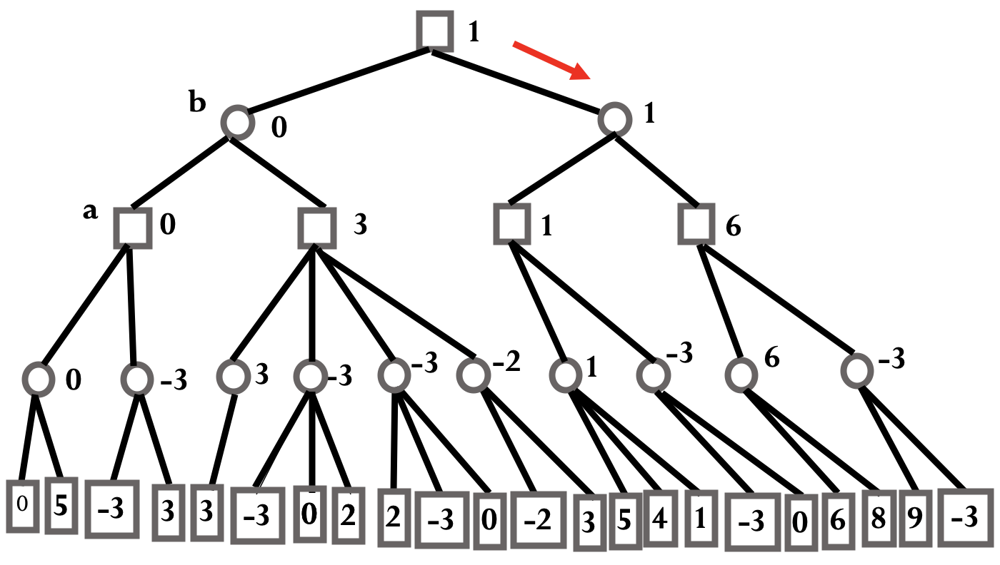
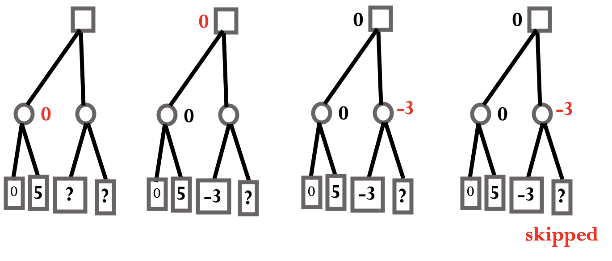
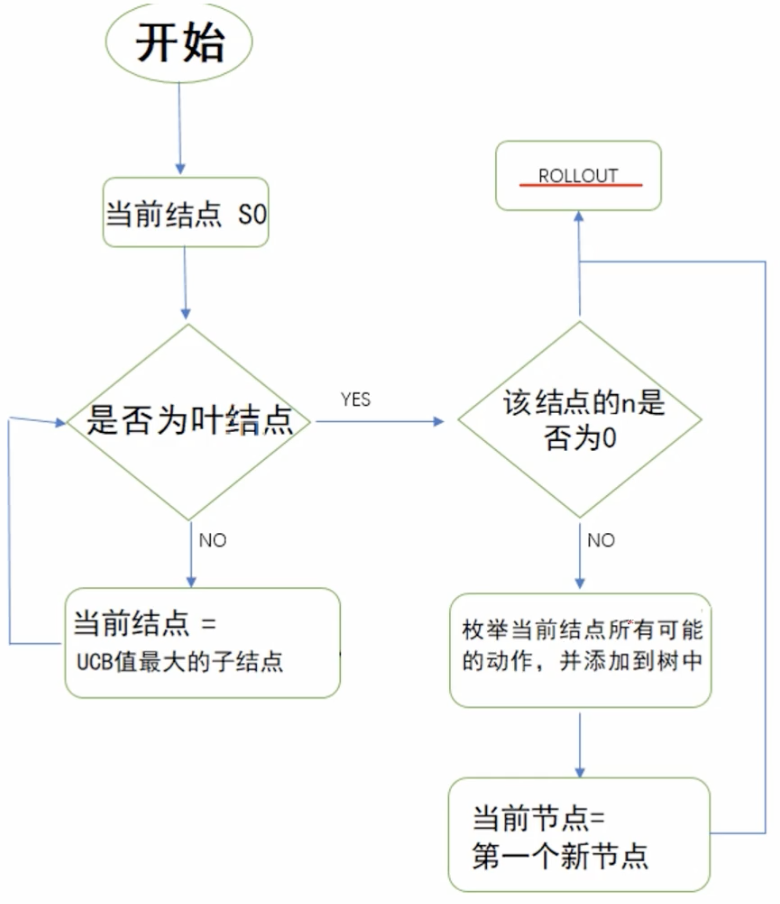

# Adversarial Search

考虑一种博弈问题：双人；一人一步；双方信息完备；零和。

有的问题可以穷举，有的不行。

## Min-max



从图中最后一层每个叶节点的价值估计值，由下至上可以找出最佳决策。

完全搜索：

```pseudocode
def get_value(node):
{
    if node.evaluation is not None:
        return node.evaluation
    lv = get_value(node.left_child)
    rv = get_value(node.right_child)
    if node.type == 'min':
        node.evaluation = min(lv, rv)
    else: /*if node.type == 'max'*/
        node.evaluation = max(lv, rv)
    return node.evaluation
}

v = get_value(root)
if v == get_value(root.left_child):
    print('Go left.')
else
    print('Go right.')
```

## Alpha–beta Pruning

搜索的时候记录一些信息，对搜索树剪枝。

e.g. 



因为第一层节点从子节点中选最大的，因此当搜索第三层第三个节点知道它是 -3 以后，就知道第二层第二个（ min 节点）≤ -3 ，那么第三层第四个节点就不必搜索，因为其对第一层节点已经没有影响。

剪枝原则：

- 对 min 节点维护极大值 $\beta$ ，对 max 节点维护极小值 $\alpha$ 。
- 在 min 节点处，发现极大值 $\beta$ ≤ 祖先节点的极小值 $\alpha$ ，剪枝。（该节点其余子树不必搜索，因为其祖先节点不会再减小了。）
- 在 max 节点处，发现极小值 $\alpha$ ≥ 祖先节点的极大值 $\beta$ ，剪枝。（该节点其余子树不必搜索，因为其祖先节点不会再增大了。）
- P.S. 上述“祖先”节点指的是该节点上面所有的祖先节点，包括但不限于直接父节点。

简记：

- 极小 ≤ 极大， $\beta$ 剪枝；
- 极大 ≥ 极小， $\alpha$ 剪枝。

算法：向下搜索时，将用于剪枝的约束性区间 $[\alpha, \beta]$ 向下传递。

```pseudocode
def dfs(cur_node, alpha, beta):
{
    if cur_node.is_leaf is True:
        return cur_node.value
    
    l_val = dfs(cur_node.left_child, alpha, beta)
    cur_node.value = l_val
    if cur_node.type == 'min':
    {
        if alpha >= cur_node.value:
            return cur_node.value  /* pruning */
        beta = min(beta, cur_node.value)
    }
    else
    {
        if beta <= cur_node.value:
            return cur_node.value  /* pruning */
        alpha = max(alpha, cur_node.value)
    }
    
    r_val = dfs(cur_node.right_child, alpha, beta)
    if cur_node.type == 'min':
        cur_node.value = min(cur_node.value, r_val)
    else
        cur_node.value = max(cur_node.value, r_val)
    
    return cur_node.val
}
```

## Monte Carlo

UCB：

$$
\begin{align}
UCB(v) = {w \over n} + c \sqrt{\ln N \over n}
\end{align}
$$

- $v$ 为一个搜索树中代表某种状态的节点
- $w$ 为该节点上的回报值
- $n$ 为该节点的访问次数
- $N$ 为节点 $v$ 的父节点的访问次数（即在父节点上进行决策的总次数）
- $c$ 是一个需要调节的常数。



注意：

- 如果每次扩展节点时没有一次性加入其所有的子节点，那么下一次访问到它时，需要优先拓展其潜在的子节点，而不是转移到已有的子节点。
- 如果每次都选择 UCB 值最大的，那么 rollout 的结果反向传播时需要交替加减。 

