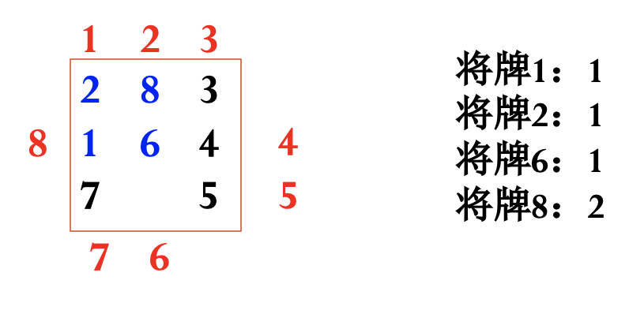

# Heuristically Search

除了盲目搜索（DFS，BFS）之外，还有启发式搜索。

Intuition ： BFS 优先拓展搜索树上深度最小的， Dijkstra 优先拓展距离源点最近的。那么还可以设计一种新的优先指标 f ，它是离源点的距离 + 离终点距离的的估计值。

## A Algorithm

### Intro.

$g^*(n)$ ：源 s 到 n 的**最短**路径的耗散值。

$h^*(n)$ ： n 到终 g 的**最短**路径的耗散值。

$f^*(n) = g^*(n) + h^*(n)$ ：源 s 经过 n 到终 g 的最短路径的耗散值。

$g(n), h(n), f(n)$ 是它们的估计值。

<u>优先拓展 $f(n)$ 值最小的（叶）节点，直到 $f(g)$ （终点）（在所有叶节点中）最小。</u>

e.g.


### Algorithm


OPEN 中是待拓展节点， CLOSED 中是已拓展节点。

```pseudocode
A_Algorithm(Source Node):
{
    # init
    OPEN = {s}, CLOSED = {}, f(s) = g(s) + h(s)
    # start!
    while OPEN is not empty:
    {   # n is the current node
        n = OPEN.first # the 1st has the min f value
        if n is GOAL:
            break
        OPEN.remove(n), CLOSED.add(n)
        for m in n.neighbours:
        {
            f(n, m) = g(n, m) + h(m)
            if m not in OPEN and not in CLOSED:
            {   # 之前没被拓展
                f(m) = f(n, m)
                OPEN.add(m)
                m.pre = n
            }
            else if m in OPEN and not in CLOSED:
            {   # 之前被拓展，但是无拓展的子节点
                # 更新 f 值为从 n 来的
                f(m) = f(n, m)
                m.pre = n
            }
            else if m in CLOSED:
            {   # 之前被拓展，且有拓展的子节点
                # 更新 f 值为从 n 来的
                f(m) = f(n, m)
                m.pre = n
                # 将其加入待拓展节点，省去更新其所有子节点的麻烦
                OPEN.add(m)
            } 
        }
        OPEN.sort # by f, increase
    } # end while
}
```

### Design F Function

$f(n) = g(n) + h(n)$ ；如何定义“耗散值”（代价）？如何定义评估方法？

一些例子：

#### 八数码


$g(n)$ 为初始节点到当前节点转移的步数（次数）。

$h(n)$ 为当前节点「不在位」的数字的个数。（用以估计离终点的距离。）

（ Intuition ：至少需要这么多步转移才可能到最终的正确情况。）

## A\* Algorithm

Optimal Search

### Def.

A Algorithm 中，若有 $h(n) \le h^*(n)$ ，则其成为 A\* Algorithm 。

（i.e. 对当前节点到终点的距离的估计 ≤ 真实值。）

### Design h Function

让 $h(n)$ 尽可能接近真实值，即在小于真实值的情况下尽可能大。

#### 八数码

$h(n)$ 为当前所有将牌距离其正确位置的曼哈顿距离的和。



#### 传教士与野人问题

一条河，两岸。一条船初始时在左边， 5 个传教士 M ， 5 个野人 C ，在任何一岸传教士的人数不能少于野人（或者只有野人）。船上最多 3 人。如何摆渡过去？

状态表示：三元组 $(M, C, b)$ （**左岸**的传教士数、野人数、船的位置 L (1) / R(0) ）。

现在要设计 $h(n)$ ，估计从此状态到终态（都摆渡过去）需要的摆渡次数。

由于 $h(n) \le h^*(n)$ ，i.e. 此估计值需要 ≤ 真实值；也就是，真实中**<u>至少</u>**需要多少次才能摆渡过去。考虑“至少”时，可以<u>放宽一些限制条件</u>。

假如不考虑“任何一岸传教士的人数不能少于野人（或者只有野人）”，估计摆渡次数：

**考虑船在左边的状态**： $(M, C, L) = (M, C, 1)$ ：

- 船上最多 3 人，船从左至右；如果左岸还有人，得有一人回左岸接人。那么，<u>除了最后一次，每一个往返能摆渡过去 2 人</u>。
- 最后一次能过去 3 人。

于是有：

- 除了最后一次需要摆渡的人数： $M+C-3$ 。
- 除了最后一次需要摆渡的来回数： $\lceil {M+C-3 \over 2} \rceil$ 。
- 总的需要摆渡的次数（最后一次的来回数 + 最后一次）：  $2 \lceil {M+C-3 \over 2} \rceil + 1$ 。
- “至少”可以放缩成：  $2 \lceil {M+C-3 \over 2} \rceil + 1 \ge M+C-2$ 。

**考虑船在右边的状态**： $(M, C, R) = (M, C, 0)$ ：

- 用转移到“船在左边的状态”的方法考虑问题。
- 让船回到左边：  $(M, C, 0) \rightarrow (M+1, C, 1) ~ \text{or} ~  (M, C+1, 1)$ ；然后这时至少需要的摆渡次数： $M + C + 1 - 2$ 。
- 船从右到左摆渡了一次，因此 $(M, C, 0)$ 状态下至少需要的摆渡次数： $M+C+1-2+1 = M+C$ 。

综合上述左右两种情况有： $M+C-2b$ ，以此作为 $h$ 。

### Property

#### Admissibility 可采纳性定理

若存在从 s 到 t 的路径，则 A\* 算法必能以最佳解结束。

（对比 A 算法：若存在从 s 到 t 的路径，则 A 算法必能结束。）

#### 比较定理

对同一问题定义两个 A\* 算法： $A_1, A_2$ 。

$A_2$ 比 $A_1$ 有更多的启发信息，i.e. $h_2(n) > h_1(n)$ 。

则 $A_1$ 拓展的节点数 ≥ $A_2$ 拓展的节点数，且 $A_2$ 拓展的节点必定由 $A_1$ 拓展。

（注意：是拓展的节点数，而不是拓展节点的次数；重复拓展的节点只算一次。）

### 评价 $h$

用**平均分叉数** $b^*$ 评价 $h$ 。 $N$ 为搜索过程中搜索的节点的总数， $d$ 为扩展的节点的层数。
$$
N = {(1 - {b^*}^{(d+1)}) \over (1 - b^*)}
$$
$b^*$ 越小，说明 $h$ 效果越好。

（实验表明， $b^*$ 是一个比较稳定的常数，同一问题基本不随问题规模而变化。）

## Modified A\*

### $h$ 单调

A\* 算法中，有的节点会被重复拓展，这使得算法效率下降。

那么改进思路为：让节点只被拓展一次。

定义 $h$ 的单调性：

$$
\begin{align}
&h(n_i) \le c(n_i, n_j) + h(n_j) \\
\text{and}~~ &h(t) = 0
\end{align}
$$


Thm. 在 $h$ 单调时， A\* 拓展了节点 n 之后，就一定找到了从源 s 到达 n 的最佳路径，i.e. $g(n) = g^*(n)$ 。

!!! tip "证明"
    
    考虑相邻节点 a ， b ；
    
    如果有重复拓展的现象，比如先拓展了 a ，其被加入了 CLOSED ；
    
    （能先拓展 a 说明当时在 CLOSED 队列中 a 在 b 前面，i.e. $f(a) \le f(b)$ 。）
    
    之后拓展 b 时，得到了经过 b 的更好的 $f(a)$ ；那么有：
    
    $$
    \begin{align}
    & f(a) = g(a) + h(a) \le g(b) + h(b) = f(b) \\
    & g(b) + c(b, a) + h(a) < f(a) = g(a) + h(a) \\
    \Rightarrow & c(a, b) + h(a) < h(b)
    \end{align}
    $$
    
    因此，为避免重复，即让这种情况不发生，对 $h$ 做单调性约束：
    
    $$
    \begin{align}
    c(a, b) + h(a) \ge h(b)
    \end{align}
    $$

结论：单调的 $h$ 一定满足 A\* 条件。

### NEST 改进

基于以下结论：

- OPEN 上任一 $f(n) < f^*(s)$ 的节点一定会被拓展。
- A\* 拓展的节点一定有 $f(n) \le f^*(s)$ 。
- $h(n) \equiv 0$ 时， $h$ 单调。

在选择拓展节点处进行改进。

- 维护一个 $f_m$ 值。
- 将排序后的 OPEN 中的前面一部分元素划分到 NEST 中。
- 优先从 NEST 中选取 $g$ 最小（而不是 $f$ 最小的节点）。


（后面一样，略。）

## 其它的搜索算法

爬山法：与 A 不同，是局部搜索算法。

随机搜索法。

DP ：若 $\forall n, h(n) = 0$ ， A\* 就成为了动态规划算法。

