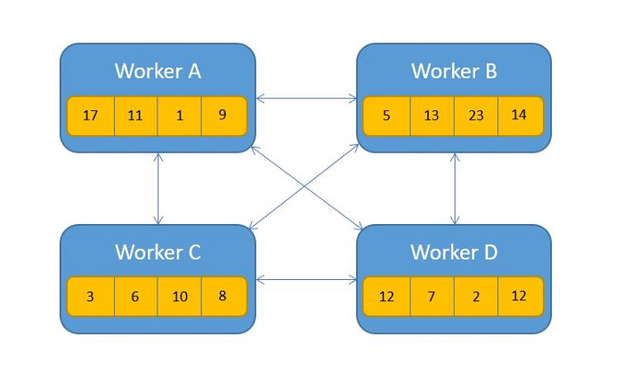
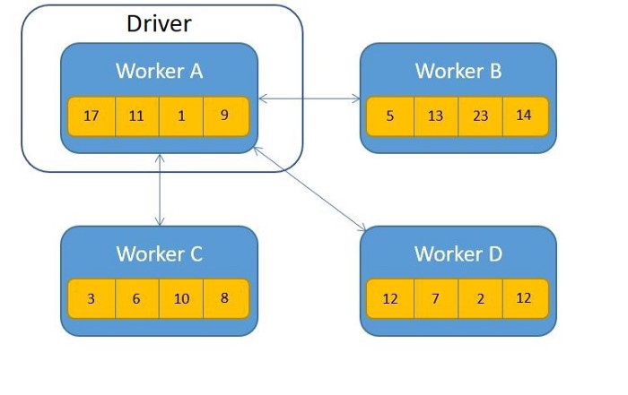
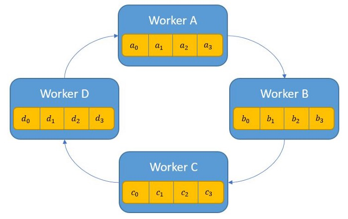
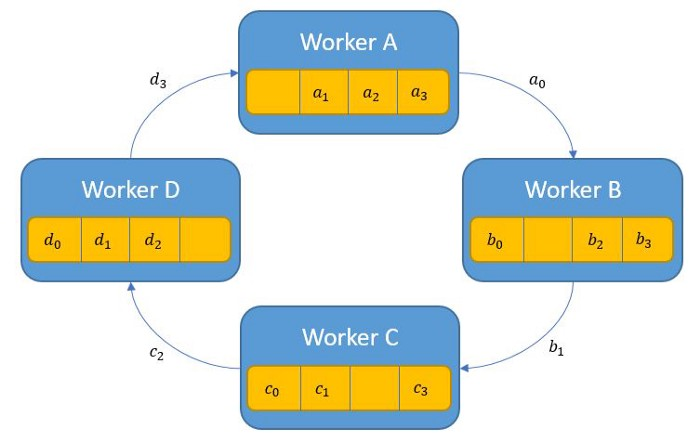
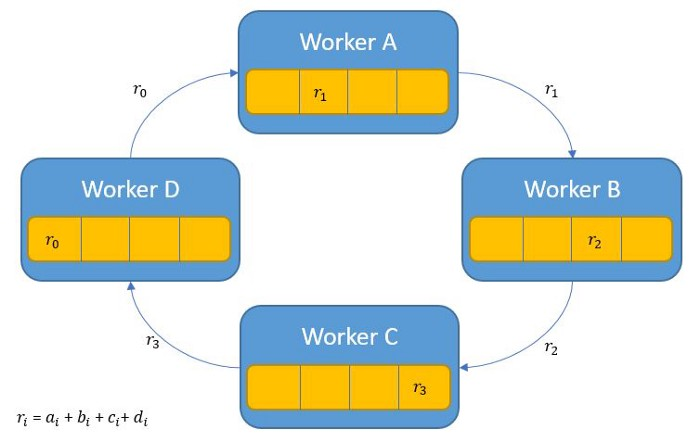

# Introduction to Deep Learning Systems

[CMU 15-849](https://www.cs.cmu.edu/~zhihaoj2/15-849/schedule.html)

## Recap: Automatic Differentiation

Automatically construct *backward computation graph*

## Graph-Level Optimizations

input computation graph -> potential transformations -> optimized graph

**Rule-based** graph optimization:

- e.g. fusing conv & BN, conv & relu, multi. convs
- Robustness: Experts’ heuristics do not apply to all models/***hardware***
- Scalability: new rules for new operators
- Performance: Miss **subtle** optimizations for specific models/hardware
- *Infeasible to manually design graph optimizations for all cases*

-> Automated *Generation* and *Verification* of Graph Optimizations

## Parallelize ML training

Comparison:

???

### Data Parallelism

- Compute the gradients of each batch on a GPU
- **Aggregate gradients** across GPUs

Problems: need centralized *parameter server*

Solution: **AllReduce** perform element-wise reduction ***across multiple devices*** to achieve **gradients aggregation**

#### AllReduce

[Visual intuition on ring-Allreduce for distributed Deep Learning](https://towardsdatascience.com/visual-intuition-on-ring-allreduce-for-distributed-deep-learning-d1f34b4911da)

Comparison:

???

##### Naïve

##### Driver

##### Ring

Construct a ring of N workers, divide M parameters into N slices

2 steps:

- Aggregation: each worker send one slice (M/N parameters) to the next worker; repeat N times

    

    

- Broadcast: each worker send one slice of aggregated parameters to the next worker; repeat N times

Overall communication: $2MN$ parameters

- Aggregation: $MN$ parameters
- Broadcast: $MN$ parameters

##### Tree

???

##### Butterfly

???

### Model Parallelism

Device placement optimization with reinforcement learning

???

### Pipeline Parallelism

Scaling Giant Models with Conditional Computation and Automatic Sharding

Model + Pipeline Parallelism

???

## Code Optimization

Goal: find performant programs for each operator

Existing Approach: Engineer Optimized Tensor Programs ???

Issues: new operators; suboptimal

Solution: Automated Code Generation

## Memory Efficient Training

### Tensor Rematerialization

???

### Zero Redundancy

Idea: ???

Balancing Computation/Memory/Communication Cost in DNN Trainings
