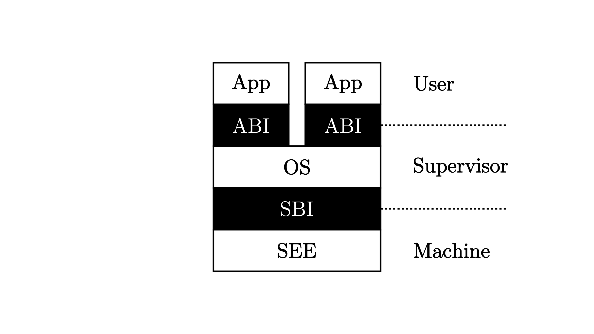

# Intro.

## OS 演变

单用户系统：

- 手动连线/纸带传输进行输入；利用率低
- 装载器 + 程序库

批处理系统：

- 磁盘传输进行输入；利用率提高
- 装载器 + 程序控制器 + 输出处理器
- 程序打包传入；一个结束之后，计算机自动加载下一个执行

多道程序系统：

- 多个程序驻留在 Mem.
- 多个程序**轮流**使用 CPU （一个执行完之后执行下一个）
- 装载器 + **程序调度** + **内存管理** + 输出管理

分时系统

- 多个程序驻留在 Mem.
- 多个程序**分时**使用 CPU 
- 装载器 + **程序调度** + **内存管理** + **中断处理** + 输出管理
- 与外界交互延时缩短（因为分时与中断）

分布式系统

AIoT: The Artificial Intelligence of Things

## 操作系统结构

简单结构：应用 + OS 混合在一起

- MS-DOS
- 没有拆分模块

宏内核/单体分层结构 Monolithic OS

- 分层：每层只使用低一层的功能和服务；最底层为硬件驱动；最上层为用户界面
- Linux
- 相比微内核， OS 的所有模块（进程调度、内存管理、文件系统等）都运行在内核态

微内核结构：尽可能把内核功能（系统服务进程）移到用户空间，内核很简单

- 文件系统、设备驱动，都在内核外？
- 内核简单 -> 可靠安全
- 所有进程在不同的地址空间进行，无法直接函数调用？
- 用户模块间的通信（Inter-Process Communication）使用消息传递 -> 慢

外核结构：内核分配物理资源给多个应用程序，让每个程序决定如何处理资源？

虚拟机结构：

## Linux

```c
ssize_t read(int fd, void *buf, size_t count);
// read up to count bytes from file descriptor fd
// into the buffer starting at buf
// Ret:
// Success: number of bytes read is returned, and the file position is advanced by this number
// Error: -1 is returned

int open(const char *path, int oflag, ...);
// If successful, open() returns a non-negative integer, termed a file descriptor.
// It returns -1 on failure.

pid_t fork(void);
// fork() causes creation of a new process.
// The new process (child process) is an exact copy of the calling process (parent process) except for the following:
// - a unique process ID
// - different parent process ID
// - own copy of the parent's descriptors; These descriptors reference the same underlying objects (shared pointer)
// returns a value of 0 to the child process and returns the process ID of the child process to the parent process.
```

## Execution Environment

Interrupt 中断：外部设备引起；异步

Exception 异常：CPU 执行指令时检测到内部非法时间

Trap 陷入：程序中有意请求 OS 的服务（系统调用）（RISC-V 手册中， ecall 「属于」 Exception）

RISC-V 中，硬件通过 `mcause/scause` 等判断中断 or 异常种类

bare-metal 裸机平台：无 std 标准库，无底层 OS 支持，只能直接访问硬件

## Boot with QEMU

QEMU 启动流程：

1. Qemu PC 从 `0x1000` 开始，跳转到 `0x800000000` ，此处有 Bootloader ，如 `rustsbi-qemu.bin` 。
2. Bootloader 将 PC 引至某个约定好的地址，此处为 OS Kernel 。
3. OS Kernel 启动！

真实计算机： CPU 通电后从 ROM 起始地址开始 -> Bootloader -> OS

rCore 实验中：

- 修改 Linker Script ，使得 Kernel 应该被执行的第一条指令处于和 Bootloader 约定好的位置。
- `entry.asm` 调用 `rust_main` ；结尾是一个在 `.bss.stack` 中的 Boot Stack 
- SBI 为 OS Kernel 提供服务；通过 `ecall` 指令调用 RustSBI ，因为 Kernel 没有和 RustSBI 链接到一起，因此不能「函数调用」。

## Privileges



OS 在 S-Mode

Bootloader （RustSBI）在 M-Mode


