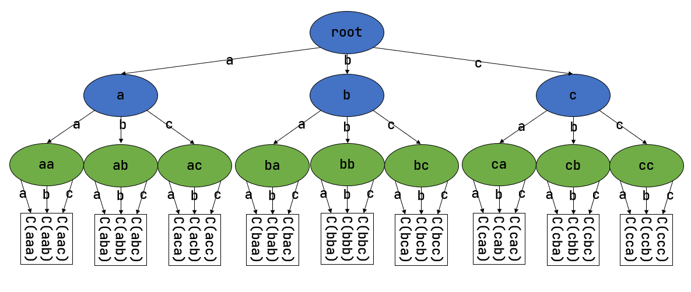

# Address

Why?

- user app 的起始地址不统一，编程麻烦
- user app 的访存行为没有限制
- user app 无法拥有动态的可用空间

逻辑地址 --(段式内存管理转换)--> 线性地址（虚拟地址） --(页式内存管理转换)--> 物理地址

## Memory Allocation

静态分配： global, static, code

`.bss` 需要初始化为 0

`.data` 不需要初始化？

动态分配

- stack 编译器管理
- heap 人工管理

连续内存分配

- 动态分区分配： OS 分配给进程一段分区（VA 连续）

    - First Fit

    - Best Fit ：释放时，检查是否可与临近的空闲分区合并

    - Worst Fit ：释放时，检查是否可与临近的空闲分区合并

- Buddy System: 针对以 $2^U$ 大小为单位申请/归还**连续内存**块做优化

非连续内存分配

- segmentation
    - CPU 拿到地址（段号+段内偏移），查段表（两项：段基址+段长度），通过基址 + offset 得到物理地址
- Paging
    - Frame 物理地址空间划分出的基本分配单位
    - Page 虚拟地址……
    - 单级页表相当于一个很大的数组；解决方法：
        - 多级页表
        - 反置页表： Hash(pid, vpn)
        - 段页式

## Virtual Address

Why?

- 内存不够用 -> 用外存来补

How?

- Overlay 函数覆盖：以函数/模块为单位**手动**换入换出

    - programmer 自己控制程序中的各个模块

    - 程序段：程序中功能独立的段

    - 覆盖段：无需同时装入内存的一些程序段组成一组

    - 

        （最优划分方式？）

    - Drawbacks

        - 编程困难
        - 增加执行时间（从外存装入覆盖模块？）

- Swapping 程序交换：以程序为单位**自动**换入换出

    - swap in/out 将一个程序的整个地址空间读入到内存/保存至外存
    - 只有 mem 不够（或可能不够）时 swap out
    - swap 区大小：存放所有用户进程到所有 mem image 的 copy
    - swap out 后 swap in 不一定在原处！某种机制保证寻址正确性

- Virtual Storage 虚拟存储：以页为单位**自动**换入换出

    - 结构：内存 + 外存
    - 不常用：暂存到外存； CPU 要访问：装入内存
    - 基本特征：
        - 不连续
        - 大用户空间：给用户的虚拟内存 > 实际物理内存
        - 部分交换
    - 实现
        - Hardware (MMU/TLB/PageTable): 地址转换、硬件异常
        - OS: mem 中建立 page table ；管理换入/换出

Processing Page Fault

注： PageTable Entry 中的 Present Bit 指示该地址是在内存中还是在磁盘中。

PTE 中可以存储扇区地址引导 OS 寻找 disk 上的页。

性能衡量： effective memory access time, EAT

## Page Replacement Algorithm

Why?

- Page Fault 而 mem 已满，需要置换 page

Goal

- 减少 Miss rate ， swap in/out 次数

When?

- max/min threshold of free mem.

Who?

- NOT locked pages: frame locking: OS 的关键部分，常驻内存； PTE 中 lock bit

How?

- 局部置换：仅限于当前进程占用的物理页面
- 全局置换：所有可换出的物理页面

### 局部置换

Belady 现象

- 有： FIFO 、 Clock （包括改进的）、 不恢复计数的 LFU
- 无： LRU 、 恢复计数的 LFU

FIFO 、 Clock （包括改进的）出现 Belady 现象的例子： 123412512345

#### Optimal

思路：置换在未来最长时间不访问的页面

实现：
- Page Fault 时，计算当前 Mem. 中每个页面的下一次访问时间
- 置换下次访问时间距离现在最远的页

性质：最理想情况；无法实现（除非先模拟一遍）

#### FIFO

思路：选择在 Mem. 中驻留时间最长的页置换

实现：维护 Linked List ， front 是驻留时间最长的， end 是最短的； front pop ， end push ；只有置换时才修改 List

性质：性能较差；调出的页面可能经常访问（驻留时间长，但可能访问频率很高）

**Belady 现象**：分配的物理页面数增加，缺页并不一定减少

#### LRU

Least Recently Used

思路：选最长时间没被访问的页面置换

实现：

- 记录内存中每个页面的上一次访问时间；将上次访问到当前时间最长的置换

- List： front 为最近刚使用的； end 为最久未使用的；

    访存时将该页从链表中某一个位置移到 front ；置换 end

特征：开销大；近似 Opt ？

#### Clock

特征：

- 访问时不修改 list 中页面的顺序，仅做标记（FIFO）
- 缺页时修改 list （LRU）
- 未访问的页面，和 LRU 一样好
- 对于访问过的，不像 LRU 一样记录了访问顺序

#### LFU

思路：置换访问次数最少的页面

实现：每个页面设置一个访问计数

特征：

- 开销大
- 一开始频繁使用，之后不使用的页很难被替换 -> 解决策略：计数定期右移

### 全局置换

Why?

- 局部置换算法没有考虑不同进程的访存差异

How?

- 为进程分配可变数目的物理页面
- 在不同阶段有所变化

工作集：当前时间往前大小为 $\tau$ 的窗口内，逻辑页面的集合

工作集置换算法

思路：置换（刷）出不在工作集中的页

实现：访存链表（队列）；删去队头时如果整个链表中都没有这个元素，则从 Mem. 中 flush out 。

缺页率置换算法

思路：频繁缺页时，增大驻留集；缺页不频繁时，减小驻留集

实现：

- 访存时，给页设置引用位标志
- 缺页发生，计算到上次缺页的时间间隔
    - 时间间隔 > T ，说明很久才缺页，因此置换出所有 $[t_\text{last}, t_\text{current}]$ 时间内没有被引用的页。
    - 时间间隔 <= T ，说明缺页刚刚发生不久，缺页较频繁，因此增加这个缺失页到工作集中，而不把任何页置换出去。

Thrashing 抖动

- 进程物理页面太少，不能包含工作集，造成大量缺页与置换
- 进程数目增加，分给每个进程的物理页面数不断减少
- Trade-off 并发效率和缺页率

## rCore Implementation

主要工作：

- user app 的起始地址均为 `0x10000` 

- heap allocator

- 页表项；多级页表的起始 Physical Frame ；记录占用的 Physical Frame

- Kernel Virtual Address Space: Identical Mapping ；

    User App VAS: 用 MemorySet 进行管理；解析 ELF 为 User app 创建空间

- 页表切换；分别处理来自 U/S 态的异常/中断：跳板

- Kernel 读写 User app 中的数据：先查 User app 页表，得到物理地址，然后转换为 Kernel 中的虚地址

### 动态内存分配

Kernel 需要实现动态内存分配来实现灵活的空间管理（否则所有变量都静态分配在内存）；管理的方式是通过维护一个 Heap

- 初始时提供一块大空间 Heap 
- 提供释放、分配接口
- 实现有连续内存分配算法

只要通过一个 allocator （从外部引入的 `buddy_system_allocator::LockedHeap` ）实现了 `alloc` 中的接口， Kernel 就可以使用基于动态内存分配的数据结构（如 `Vec` ）。

最开始，将一块静态声明的大数组给 global allocator ，让其管理这段空间。这段空间是给 Kernel 内部的 rust 实现中的各种数据结构提供的，如 `MemorySet` ，与用于存页表和被页表映射的地址的空间不是一块空间。

### SV39

#### Hardware

`PPN` ：根页表所在的物理页号。

SV39 模式规定，前 25 bits 必须和第 38 个 bit 相同。

SV39 三级页表相当于一颗字典树 Trie 。

Address Translation:

#### Software

##### 物理页帧管理

整块内存包括：

- Kernel 自身运行需要的空间，包括 heap allocator 所管理的；
- Kernel 给 user app 提供的空间，包括存放页表的空间，页表叶子项对应的物理页帧。

因此，在 heap allocator 管理的空间之外，剩余的主要空间以物理页帧的形式的管理，管理者为 frame allocator 。

##### 多级页表管理

打开分页模式后， U-Mode 和 S-Mode 下访存均需要通过页表。

Kernel 要给 user app 分配/释放空间（ map/unmap ），需要操作页表；这需要能在给定一个 PA 的条件下修改其中的值。但是访存是通过 VA 查页表计算 PA ，因此内核可以提前维护一个 identical 的映射。

#### 两个地址空间

`MapArea` 为一个逻辑段，描述并管理一段连续的 VA 。

- 管理的最小单位为 Page ，因此用 BTreeMap 维护每个 VPN 到 Physical Frame 的映射。

- 其 `map_one` 会创建一个给定 VPN 到 Frame 的映射（同时创建了 Frame ）；

    结束之前调用 PageTable 的 `map` ，为该 VPN 在 PageTable 中创建必要的节点和最后的 PTE ，实现页表的维护。

`MemorySet` 为一些「有关联的」（e.g. 都属于同一个运行的程序）逻辑段的集合，称为地址空间。其中有两个成员：

- `Vec<MapArea>` ，存放一些 MapArea ，自然也存放/管理了它们对应的 Physical Frame 。
- `PageTable` ，这段地址空间所使用的页表；本质上是页表这样一个类似 Trie 的 DS ，存放了各个节点所在的 Physical Frame 。

##### Kernel Address Space

VA Space for Kernel 的布局

- 高 256GB 的布局：
    - Trampoline 在最顶端（PA Space 中并不如此；非 identical mapping ）
    - 下面为各个 user app 使用的 Kernel stack
- 低 256GB 的布局：
    - 四个内核的逻辑段（ identical mapping ）
    - 内核数据段之外的，可用物理页帧的逻辑段（ identical mapping ）

全局只有这一个 Kernel Address Space 。

##### User Program Address Space

VA Space for **Each** User Program 的布局

- 高 256GB 的布局：
    - Trampoline 在最顶端（映射到与 Kernel Space 中的 Trampoline 相同的 PA ）
    - 下面为该应用的 TrapContext
- 低 256GB 的布局：
    - User app 的四个逻辑段（ framed mapping ）
    - 带有保护的 User stack（ framed mapping ）； Guard Page 部分是没有 map 过的，访问其会出错。

每个 User app 有一个这样的 Space 。

### Time Sharing

内核初始化

- 初始化 heap allocator
- 初始化 frame allocator
- 启用 Kernel Space 
    - 这一步修改了 `satp` ：启用 SV39 并且将 root node 的 PA 写入
    - Kernel Space 是 `MemorySet::new_kernel()` 出来的，其中创建了 Kernel 所需的恒等映射（页表）
- `sfence.vma` 清空 TLB

Trap 实现：

!!! tips "为什么不将 TrapContext 像之前一样存在 Kernel stack （位于 Kernel Space ）中？"
    
    如果存放在 Kernel space 中的 kernel stack ，那么需要在保存它之前，需要完成两件事
    1）取得 Kernel Space 的 token （根页表基址）并写入 satp ；
    2）取得该 User app 对应的 Kernel stack 的 sp ，以其为基址保存 TrapContext 。
    完成上述两个操作时不能修改 Universal Registers 。之前只有2）需要完成，可以用 `sscratch` 进行中转；现在需要两个，但是却没有两个这样的 register 来做中转。
    因此只能将 TrapContext 保存在 User Space 。

- 拓展 TrapContext ，使其保存 Kernel satp 、 Kernel stack sp ，和 trap_handler 的地址。
- Trap 后， CPU 会跳转到 `stvec` 所设置的 Trap 处理入口地址（ `__alltraps` ）。
- 首先交换 `sp` 和 `sscratch` ，前者为 TrapContext 的地址，后者为 User stack 的地址。
- 保存信息至 TrapContext 。
- 修改 `sp` 为该应用的 Kernel stack 。（每 new 一个 User App 时会向 Kernel stack 中 push 一个初始化好的 TrapContext）。
- 修改 `satp` 为 Kernel Space 的 token ，实现 Address Space 的切换。
- `jr` 到 `TrapContext` 中保存的 `trap_handler` 处。不能用 call ，因为 assembler 和 linker 会实现成 PC 进行 `.text` 段中对应的相对地址跳转。但是 `__alltraps` 已经被映射成了 VA 中的最高地址，和这里计算出来的是不同的。

 `__alltraps` 存放在 trampoline 处！ Trap 发生时向这个固定的 trampoline 跳转。

通过 Trampoline 可以获取 `__alltraps` 和 `__restore` 的 VA 。

注意，此时 U -> S ， S -> S 的 Trap 处理不一样，需要 U ->S 后将 `stvec` 设置为处理 S -> S 的入口地址，再 S -> U 之前改回来。

S -> U 不能直接到 `__restore` ，而是先去 `trap_return` ，传两个参数： User Space 中 TrapContext 的 VA ；即将要运行的 User app 的 Root Page Table 的 token 。

 `__restore` 的工作：

- 修改 satp ，将页表切换为即将要运行的 User app 的 Page Table 
- 将 User Space 中 TrapContext 的 VA 存入 `sscratch`
- 

