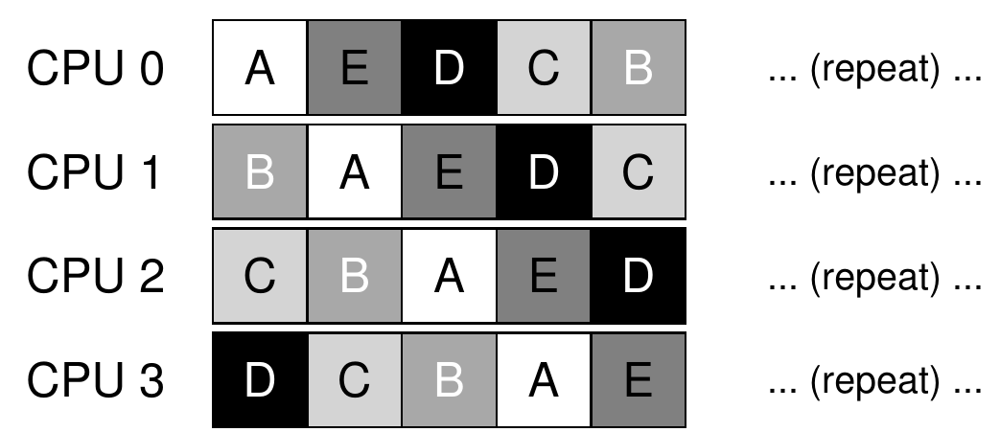
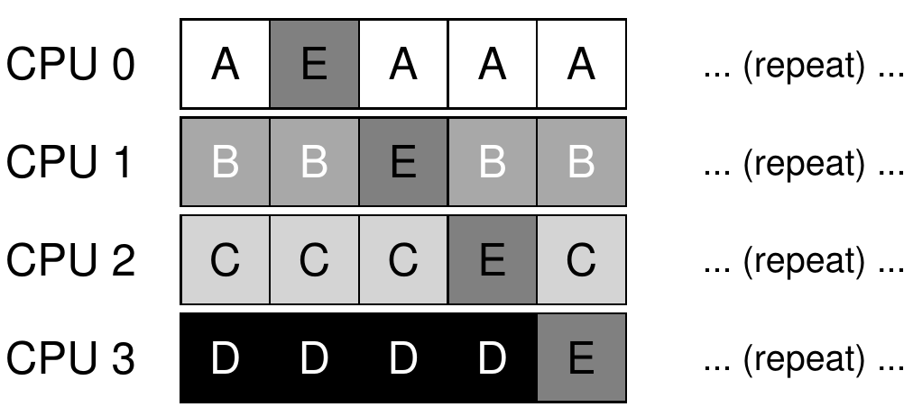
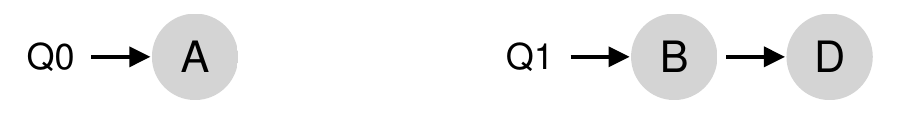
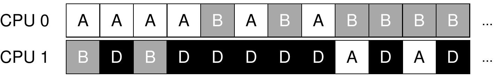
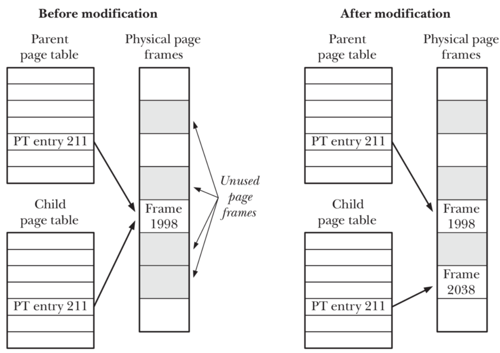

# Process

如何让用户控制程序的执行？交互？

任务与进程的区别：

- 进程可以在运行时创建子进程、用新的程序内容覆盖旧的。
- 进程执行时作为动态申请各种资源的载体。

三个系统调用；两个特殊的用户态程序

相关数据结构：拆分任务管理与 CPU 当前状态的管理；存储进程的一些信息； PID 索引；资源回收

进程管理：创建；切换；调度；生成；资源回收； I/O

| 系统调用名                            | 含义                                                    |
| ------------------------------------- | ------------------------------------------------------- |
| ``int fork()``                        | 创建一个进程，返回子进程的PID。                         |
| ``int exec(char *file)``              | 加载文件并执行；仅当出错时返回。                        |
| ``int exit(int status)``              | 终止自身；报告`status`给执行waitpid()系统调用的父进程。 |
| ``int waitpid(int pid, int *status)`` | 等待`pid`子进程退出，得到其 ``*status``退出状态。       |
| ``int getpid()``                      | 获得当前进程的PID。                                     |

## Concepts

fork

- 内核初始化完毕后，以硬编码方式创建唯一一个进程 Initial Process （用户初始进程）；其它所有进程通过 fork 来创建。
- A fork 出 B ，二者建立父子关系：
    - 相同的：代码段等数据（但在两个独立的 Address Space 中）、 Universal Reg （PC, SP）
    - 不同的：返回值 a0 （A 为 B 的 PID ， B 为 0 ）

waitpid

- Why? 一个进程调用 exit 退出后，它所占用的资源不能立即全部回收，比如 kernel stack 还在被用来做 syscall 。
- How?
    - 进程退出时， kernel 立即回收一部分资源，标记 Zombie Process ；
    - 之后，父进程通过 waitpid `pub fn sys_waitpid(pid: isize, exit_code: *mut i32) -> isize;` 收集返回状态，回收全部资源。
    - 若一个进程先于其子进程结束，
        - 它的所有子进程成为进程树的 root
        - 这些子进程成为 ***Initial Process*** 的子进程；后者为前者的父进程

exec `pub fn sys_exec(path: &str) -> isize;`

- 清空当前进程的 address space ，加载特定的可执行文件，返回用户态后开始执行
- exec 与 fork 结合，实现创建指定可执行文件的进程（ Unix 的做法）

Kernel 初始化 ➡️ 加载并执行 initproc ➡️ initproc 中 fork 并 exec 来运行 user shell

## Related Data Structures and Implementation of Process Management

PidAllocator ：简单栈式分配策略

进程对应的 KernelStack ：根据 PID 固定了一块 Virtual Address 连续的空间

push_on_top？？？

Process Control Block ： Kernel 管理 Process 的单位（由 TaskControlBlock 发展而来）

Processor 维护 CPU 状态

- 当前正在执行的进程
- idle 控制流：尝试从 Task Manager 中选出一个任务放到 CPU 上执行
    - 与 schedule 结合，实现任务的切换与调度

base_size？？？

创建进程：

- 解析 ELF ，得到应用地址空间、用户栈、入口点
- 分配 PID 以及 Kernel stack
- 创建 TCB ，最后会返回之
- 创建 Trap Context

调度进程：

- 主动 yield 或者时钟中断时
- 通过 suspend_current_and_run_next 实现

生成进程：

- `fork/exec` 相结合来实现
- fork
    - `MapArea::from_another` 复制一个 MapArea （VA Space 、映射方式、权限控制均相同的逻辑段），但是逻辑段没有被真正 map 到 Physical Frame 上（之后通过 MemorySet 中的 push 调用 MapArea 中的 map 来实现）。
    - `MemorySet::from_existed_user` 复制一个 MemorySet ，对应一个完全相同的 Address Space 。
    - `TaskControlBlock::fork` 类似 `new` ，但是地址空间是复制的（不是解析 ELF 得到的）、需要维护父子关系。
    - 修改子进程 TrapContext 中寄存器 a0 使其 fork 的返回值为 0 ；对于父进程， a0 设置为子进程的 PID 。
    - 父进程从 fork 返回前要将子进程加入到 Task Manager 中。
- exec ：用 ELF 中的内容替换现有的
    - 解析 ELF ，生成新的 Address Space ，替换原来的；
    - 修改新的空间中的 Trap Context 。
    - 外层的 `sys_exec` ：通过应用名的起始地址，手动查页表，获得完整名称，进而获取应用数据。
    - exec 之后原来的 TrapContext 失效，需要重新获取 `cx` 。

user shell 的输入：

- 调用 SBI 提供的 `console_getchar` ；
- 如果有输入字符，每次只读取 1 个；
- 将读到的字符写入 User Space （通过手动查页表得到 buffer ）

进程资源回收

- `sys_exit` 退出：

    - 修改状态为 Zombie ；向 TCB 中写入退出码；

    - 将当前进程的 children 挂在 `initproc` 下面；

    - 资源的早期回收：将 MemorySet 中的 areas 清空， i.e. User Space 被回收；

        但存放页表的 Physical Frames 还未被回收；

    - 通过 `schedule` 实现调度与切换；

- `sys_waitpid` 父进程回收；

    - 对于满足条件的 PID ，检查要被回收的子进程的 PCB 的引用计数，确保 RAII 释放其资源的正确性。
    - 写入 exit code ，返回 PID 。

## Scheduling

### 衡量调度策略的指标

- CPU使用率 : CPU处于忙状态的时间百分比
- 吞吐量：单位时间内完成的进程数量
- 周转时间：进程从初始化到结束(包括等待)的总时间
- 就绪等待时间：就绪进程在就绪队列中的总时间
- 响应时间：从提交请求到产生响应所花费的总时间
- 公平：进程占用相同的资源：CPU时间等

hungry 饥饿：进程等待时间无上街，长时间等待

### 单处理机进程调度算法

#### FCFS

- 平均等待时间可能很差

#### Shortest Job First

- SJF 的平均等待时间最小
- （对于进程会主动 yield 的场景）需较为精确地预估其下一次执行所需的时间
    - $\tau_{n+1} = \alpha t_n + (1- \alpha) \tau_{n-1}$ （最近+历史） 
- 不许抢占
- 执行时间长的任务<u>可能 hungry</u>

#### Shortest Remaining Time

SRT ，最短剩余时间

- 抢占式 SJF ：有新的进程就绪，且其服务时间 < 当前进程的剩余时间
- 执行时间长的任务<u>可能 hungry</u>

#### Highest Response Ratio Next

HRRN ，最高响应比优先

- 响应比 R = (w + s) / s （w: waiting time, s: service time）
- 在 SJF 上改进，防止进程等待太久 hungry ，也考虑了运行时间 s
- 不许抢占

#### Time Slide

- 公平
- 上下文切换有开销
- 时间片长度 q
    - 太大：等待时间过长，向 FCFS 退化
    - 太小：大量 context switching 影响系统 throughput
    - 合适：context switching 开销 1% 以内

#### MultiQueue

多级队列

- waiting queue 由多个 queue 组成，每个队列代表一种优先级
- 每个队列调度策略不同，例如：前后台分开
    - 前台： Time Slide RR 调度
    - 后台：大时间片 RR / FCFS
- 队列之间调度：
    - RR ：每个队列分配了固定的 CPU 时间占比
    - 固定优先级：先处理优先级高的队列中的任务

#### Multi-Level Feedback Queue

MLFQ ：动态调整进程的优先级，平衡「周转时间」和「响应时间」

- 调度规则
    - 如果A的优先级 > B的优先级，运行A（不运行B）
       - 如果A的优先级 = B的优先级，轮转/FIFO运行A和B
       - 工作进入系统时，放在最高优先级（最上层队列）
       - 一旦工作用完了其在某一层中的时间配额（无论中间主动放弃了多少次CPU），就降低其优先级（移入低一级队列）
         - 这是对「如进程在当前的时间片没有完成，则降到下一个优先级」、「如果工作在其时间片以内主动释放CPU，则优先级不变」这种 MLFQ 的改进：
         - 防止恶意进程会想办法留在高优先级（用完 99% 的 time slide 后 yield ）
         - 防止 I/O 密集型任务一直在高优先级，而 CPU 密集型任务很快下降至低优先级
       - 经过一段时间S，就将系统中所有工作重新加入最高优先级队列
         - 防止 CPU 密集型任务 hungry

#### Fair Share Scheduling

- 公平：对于进程不公平，但是对于用户公平，给各个用户均分资源

### 多处理器调度

#### Single Queue Multiprocessor Scheduling

SQMS

问题： bad cache affinity

改进：牺牲一些进程的 affinity ，保持另一些的 affinity

### Multi-Queue Multiprocessor Scheduling

MQMS, 每个 CPU 一个调度队列

问题：有的 CPU 任务还没执行完，其它的已经在围观了

改进： work stealing

- 进程量较少的 (源) 队列不定期地“偷看”其他 (目标) 队列是不是比自己的进程多；
- 如果目标队列比源队列 (显著地) 更满，就从目标队列“窃取”一个或多个进程，实现负载均衡。
- stealing 的间隔需要合适：开销和均衡之间的 trade-off

## Others

### vfork

fork 要复制整个地址空间，开销大，但是很多时候 fork 复制的地址空间被 exec 覆盖

，没必要复制。

vfork()

- 创建进程时，不再创建一个同样的内存映像

- 使用 Copy on Write  (COW) 技术

    

### nice

优先级控制：指定进程初始优先级

