# File System

目的：数据的持久存储；方法： App 只需要对「文件」这一抽象进行 R/W 即可。

文件系统的层次：

- 虚拟文件系统（Virtual File System，VFS），定义了一组所有文件系统都支持的数据结构和标准接口。
- 磁盘的文件系统，它是直接把数据存储在磁盘中，比如 Ext 2/3/4、XFS。
- 内存的文件系统，内存辅助数据结构 - 例如目录项。

任务：在内核中添加文件系统：一级目录、 `open, read, write, close` 。

1. 实现能操作文件的应用

2. easyfs ：自下而上 5 层：

- 磁盘块设备接口层：以块为单位，在内存 buffer 与块设备之间交换数据（ `read_block, write_block` ）

- block 缓存层：磁盘块数据缓存，位于 Mem ：

    - `BlockCache` 自动地管理 Mem 中的 block buffer ，包括： block data ， block id
    - `BlockManager` 管理有限个 `BlockCache`

- 磁盘数据结构层：表示磁盘文件系统的数据结构

    - easyfs 放在磁盘上的（持久）数据
        - Super Block ：管理这个 FS
        - 索引节点位图区、数据块位图区：管理空闲磁盘块
        - 索引节点区：管理文件
        - 数据块区：放置文件数据

- 磁盘块管理器层：管理磁盘文件系统 `EasyFileSystem` （合并了上述数据结构和磁盘布局）

    - 创建 FS 、打开 FS 、分配 inode 、分配数据块、回收数据块

- 索引节点层：管理 / R/W 单个文件 `Inode`

    - 创建 inode 、查找 inode by filename 、创建文件、

        根据 inode 找到文件数据所在的磁盘数据块，从磁盘读到内存/从内存写入磁盘

3. easyfs 加入内核

- 为 QEMU 模拟的 `virtio` 块设备实现 driver
    - 实现 driver 所需的内存申请/释放、虚实地址转换
- 将「文件」纳入进程的管理；通过 open/close/read/write 系统调用，实现进程互斥/共享地访问文件

- 进程看到的文件是 `Inode` ；

    File Trait 的 read /write ：数据与应用缓冲区抽象 `UserBuffer` 之间读/写

- 拓展「文件描述符表」：使进程管理多个文件；通过文件描述符读写文件 `OSInode`

    `TaskControlBlock` 中加入 `fd_table` （存储多个 `OSInode` ）：在 new 、 fork 等操作中需要对此进行维护

- Kernel 的系统调用操作 `OSInode` ，从而建立了它与 App 所见的「文件」的对应关系

## FS Interface

Kernel 将所有文件无差别地看作字节序列。

用 `stat <file>` 获取文件的信息。

常规文件

- 文件以块为单位进行存储。
- Inode 为 FS 中文件的编号； FS 不通过文件名索引文件，而是通过这个编号。
- Links 为硬连接的数量：同一 FS 中两个「文件」 Inode 相同，则它们具有硬连接关系。
- 长度为 10 的 Access ： `-*********` 第一位表示 Regular File ；后面： owner/group/others 的权限

目录

- Access 含义不同（ [Ref](https://unix.stackexchange.com/a/21263) 可以把目录理解成 a list of names ）：

    - `r` ：获取该目录下有哪些文件和子目录
    - `w` ：在该目录下创建/删除文件和子目录
    - `x` ：「通过」该目录：包括 `cd` ， access 内部的文件等

- 目录也通过几（e.g. 8）个块进行存储，有 Inode 编号。

    保存了一些 Dirent, Directory Entry ，一组映射：文件名/子目录名 -> Inode 编号。

- FS 将：路径 --转化--> Inode 编号；从根目录出发，层层转换。

链接

- hard link 硬链接：类似于引用计数
- soft/symbolic link 软链接：存储文件名以指向另一文件

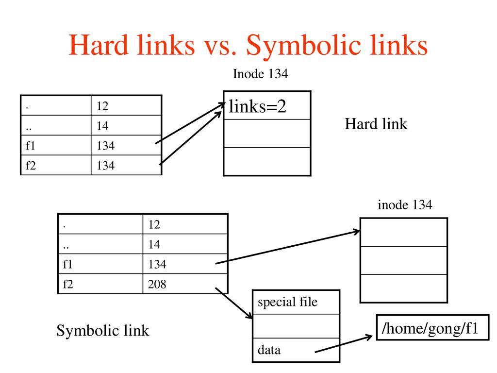

FS

- Virtual FS ：在一个 OS 中，可能有多个不同 FS 的持久存储设备；为了统一管理，通过 VFS 规定每种 FS 必须实现的抽象借口，再加上 Mount ，即可用统一的逻辑目录树结构一并管理。

System Calls

- `sys_open` ：以 flag 指示的方式打开文件，让文件在进程的 fd table 中占据一项，返回这一项在 fd table 中的索引值。

- `sys_close` ：传入 fd （索引值），回收 fd ，进程释放这个文件占用的内核资源，关闭文件。

- `sys_read/sys_write` ：顺序读/写，维护了 offset 。 `sys_lseek` 可以调整 offset 。

    `read` 返回读出的长度；如果读取的文件大小超过 buffer size ，则需要多次读取直到返回值为 0 。

## Lab: EasyFS

磁盘布局：在磁盘各扇区上

解析布局得到的逻辑目录树：在 Mem 上

### BlockDevice 块设备接口层

- EasyFS 的 BlockCache 调用具体设备的 BlockDevice 中的接口，实现以块为单位的读写。

### BlockCache 块缓存层

- sync 方法： 如果 modified 需要写回磁盘。
- `BlockCacheManager` 管理有限个 BlockCache ；可以根据 id 和 device 获取 BlockCache

### 磁盘布局与磁盘数据结构

将逻辑上的文件目录树映射到磁盘（上的块）

Block ID 从小到大，有 5 个区域：

- Super Block ：Magic Number 做合法性检查；定位其它连续区域的位置
- Index Node Bitmap ：
- (Disk) Index Nodes ：存储 meta data 、对应数据块的索引信息
    - 直接索引数组：每个元素指向一个数据块
    - 一级间接索引：直接索引装满后，指向一个数据块，这个块相当于一个直接索引数组，每个元素指向一个包含文件数据的数据块
    - 二级间接索引：直接和一级间接索引装满后，指向一个数据块，这个块是一个一级间接索引的数组
- Data Block Bitmap
- Data Blocks
    - 目录项：文件名、文件所在的 DiskInode 编号

### 磁盘块管理器 `EasyFileSystem`

- 整合上述数据结构，进行管理
- 创建、初始化文件系统
- 从 device 上打开文件系统
- DiskInode/data block 的分配/回收

### Inode 索引节点

Mem 中记录文件索引节点信息的数据结构；为 FS 的使用者提供常用操作

- 根目录 `root_inode` 是编号为 0 的 FS 分配的第一个 Inode
- root inode
    - find (children) inode by name
    - create file and return inode
- clear file data
- r/w file data

### 在用户态测试 easy-fs 的功能

easy-fs 的使用步骤

- 打开块设备

- 打开 FS

- 获取 root Inode

- 通过 root Inode 进行： create/ls/find

    通过 root Inode 获取到其下的一个文件 Inode ，可以 clear, read, write_at

### 将应用打包为 EasyFS 镜像

将应用程序的 ELF 读入，写入 EasyFS 镜像。

## Lab: Kernel 接入 EasyFS

OS Kernel 中对接 EasyFS 的各种结构；从下到上：

### 块设备驱动层

`virtio_blk::VirtIOBlock` 是已经实现好的块设备；加一层 `Arc` 成为全局静态的 `BLOCK_DEVICE` 。

QEMU 启动命令：

- `-drive file=$(FS_IMG),if=none,format=raw,id=x0` 

    添加虚拟硬盘，指定内容为打包了应用程序的 EasyFS 镜像，命名为 `x0` 

- `-device virtio-blk-device,drive=x0,bus=virtio-mmio-bus.0` 

    硬盘 `x0` 作为 VirtIO 总线中的一个「块设备」接入虚拟机；

     `virtio-mmio-bus.0` ： VirtIO 总线通过 Memory- Mapped I/O 进行控制，且在总线中编号为 0 

MMIO ：让 Kernel 以内存地址的方式访问外设寄存器组

Kernel 初始化时，为 VirtIO 外设的寄存器组做 MMIO 需要的内存映射：在页表中建立恒等映射

VirtIO 需要占用一些内存，维护一个 VirtQueue 环形队列：

- CPU 可以向此队列中添加 VirtIO 请求、取得请求结果
- 维护 VirtQueue 涉及 Mem 的分配和回收，需要 Kernel 实现 VirtIO driver 规定的几个接口

### 内核索引节点层

OS 中的索引节点 OSInode ：EasyFS 的 Inode 加上文件中与进程紧密结合的属性，封装而来

- OSInode 表示<u>进程中</u>被打开的文件/目录
- 权限标识
- 用于 read/write 的 offset

### 文件描述符层

为 OSInode 实现 read/write

在 TaskControlBlockInner 中维护一个 `fd_table`

### 访问文件的内核机制实现

利用全局静态的 `ROOT_INODE` ，可以进行 ls, open, close

实现 `sys_open`

- 获取当前 task
- 通过页表翻译得到文件名字符串的实际 PA ，从而读取到字符串内容
- 根据文件名得到 OSInode
- task 中分配一个 fd ，存入 fd_table ；表项的内容就是 OSInode

实现 `sys_open`

- 获取当前 task
- task 的 fd_table 中移除关闭的文件的 fd

基于文件加载、执行 app

- 通过页表读取文件名
- 通过 open_file 得到 app 文件的 OSInode
- 通过 app_inode (OSInode) 读取应用程序的全部数据
- 调用 `task.exec` 执行 app 的「数据」

## FS Design

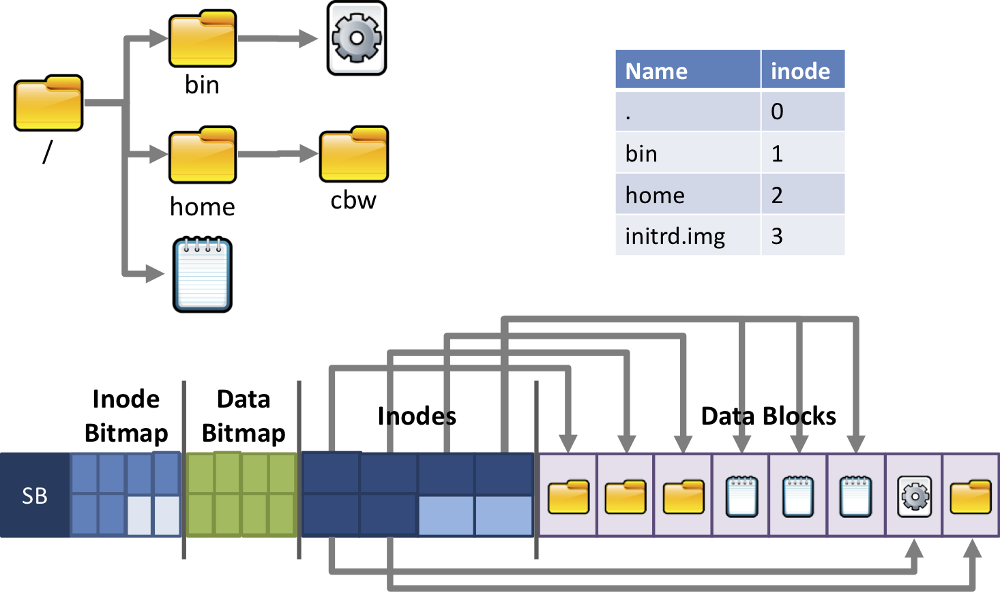

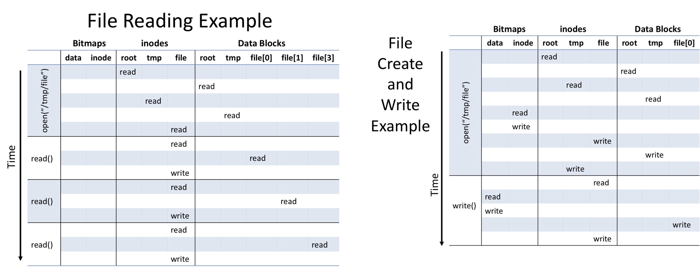

### 文件分配

#### 连续分配

- 文件头指定起始块和长度，分配连续一段块
- 分配策略（分配哪一连续块？）：最先匹配、最佳匹配……
- 优点：顺序/随机读高效
- 缺点：磁盘碎片多；增加文件内容开销大

#### 链式分配

- 优点: 创建、增大、缩小很容易；几乎没有碎片

- 缺点：

    - 随机访问效率低；可靠性差；
    - 破坏一个链，后面的数据块就丢了

- 链表的实现

    - 显示连接：每个块最后存储指向下一个块的指针

    - 隐式连接：每个磁盘拥有一个 File Allocation Table 常驻内存，存储每个块的下一个块，随机读写快

        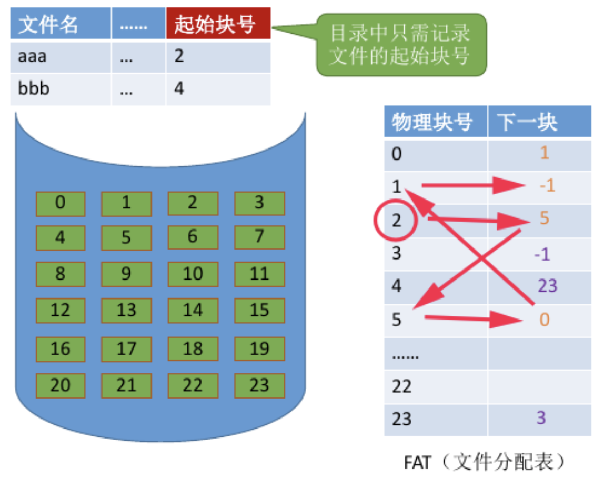

- 优点：外存利用率高，无碎片；增加文件内容容易。

#### 索引分配

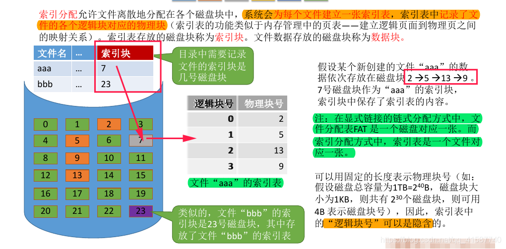

- 目录中存储索引表所在的磁盘块号。

- 优点：随机访问、增加文件内容高效。

- 问题：文件太大，需要索引的块太多，一个磁盘块存不下太多索引项

    - 索引块链接：必须按序读取索引块

    - 多层索引：类似于多层页表

        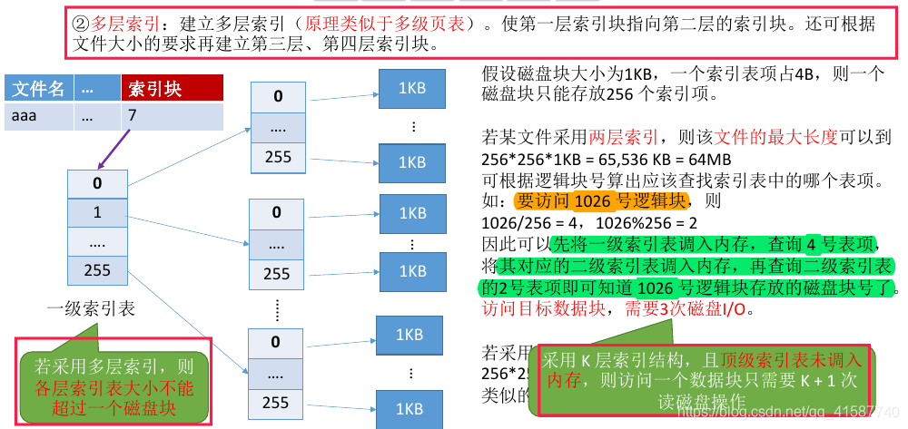

    - 混合索引：平衡小文件与大文件所需的磁盘 I/O 次数

        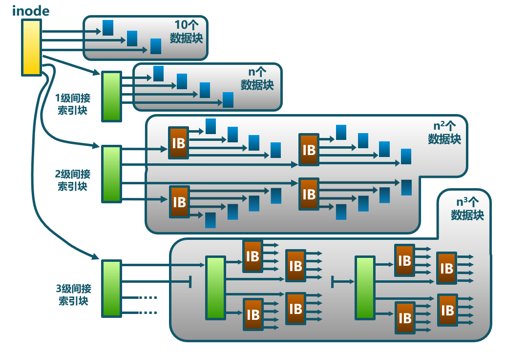

### 分区

多数磁盘划分为一个或多个分区，每个分区有一个独立的文件系统。

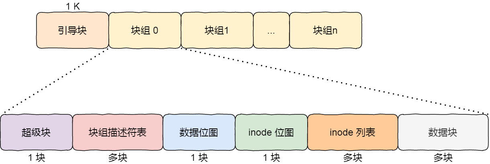

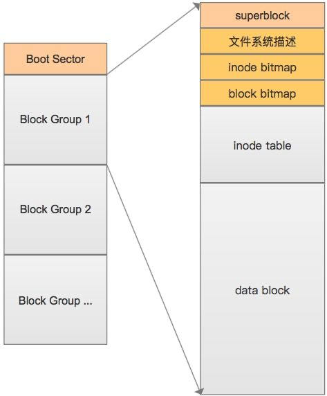

### 崩溃一致性

#### fsck

对整个磁盘做扫描，检查合理性

#### journaling

write ahead logging ：所有数据先写入日志，再写入磁盘

两种方式：

- data journaling

    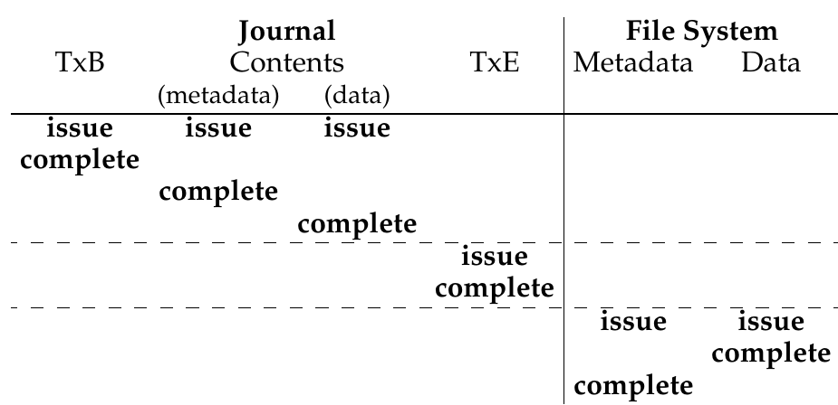

    - 步骤：
        - TxB, metadata, data 都落盘后写入 TxE (commit)
        - data 和 metadata 都 log 
        - journal 写完之后再写数据块
    - 优点：可以完全恢复

- metadata journaling

    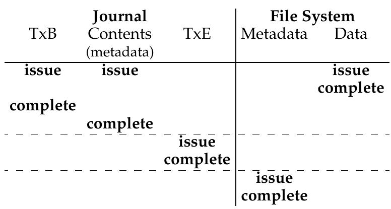

    - 

- 

