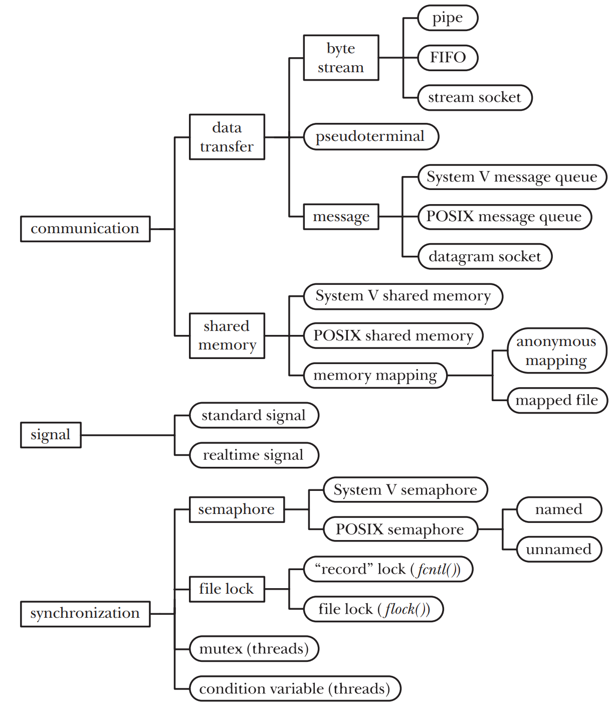

# IPC & I/O

核心目标： **让不同应用通过进程间通信的方式组合在一起运行** 。

Lab 主要内容：

- 支持 stdin (0) / stdout (1)
- 支持 pipe
- 支持 app 的命令行参数解析、传递
- Standard I/O redirect

## Basis

UNIX 中典型的 IPC 机制：



管道

消息队列

共享内存

### 信号

发送方：

- 进程通过内核发出： shell 通过 kernel 发送 kill
- kernel 直接发出： kernel 发送 sigpipe 提示读管道出错

流程：

- sys_sigaction 进程向 kernel 注册信号处理函数
- kernel 分发信号到进程的信号处理函数
- 进程执行信号处理函数
- 信号处理函数返回前执行 sigreturn ，清除栈帧，恢复到被打断处继续执行

shell 中通过 `kill` 向进程发送信号。

signal 实现

- 当 `pid` 进程进入内核后，直到从内核返回用户态前的执行过程：
    ```
    执行APP --> __alltraps 
             --> trap_handler 
                --> handle_signals 
                    --> check_pending_signals 
                        --> call_kernel_signal_handler
                        --> call_user_signal_handler
                           -->  // backup trap Context
                                // modify trap Context
                                trap_ctx.sepc = handler; //设置回到中断处理例程的入口
                                trap_ctx.x[10] = sig;   //把信号值放到Reg[10]
                --> trap_return //找到并跳转到位于跳板页的`__restore`汇编函数
           -->  __restore //恢复被修改过的trap Context，执行sret
    执行APP的signal_handler函数
    ```

- 当进程号为pid的进程执行完signal_handler函数主体后，会发出`sys_sigreturn`系统调用返回 kernel ：
    ```rust
    fn sys_sigreturn() -> isize {
      ...
      // 恢复之前备份的trap上下文
      let trap_ctx = inner.get_trap_cx();
      *trap_ctx = inner.trap_ctx_backup.unwrap();
      ...
    执行APP --> __alltraps 
           --> trap_handler 
                --> 处理 sys_sigreturn系统调用
                --> trap_return //找到并跳转到位于跳板页的`__restore`汇编函数
        -->  __restore //恢复被修改过的trap Context，执行sret
    执行APP被打断的地方
    ```


## Standard I/O

文件描述符分配规则：进程打开一个文件时， Kernel 总是将该文件分配到 fd table 中最小的空闲位置。

一个进程创建时，默认已经分配了 0, 1, 2 (stderr) 。

fork 时：子进程完全继承父进程的 fd table ，和父进程共享所有文件。

- 因此只需为 `initproc` 打开 stdin/stdout ，所有进程就都能访问它们。

## Pipe

What

- 进程间通信机制，将不同进程的输入输出对接起来。
- 一个有限的队列 buffer ：读写两端；队头读取，队尾写入。

How to use

- 父进程通过 `sys_pipe` 打开（创建）管道，获得两个 fd 。
- fork 创建子进程，**子进程继承了所有 fd** 。
- 父子进程一边读，一边写，完成单向通信。

Implementation

-  `Pipe` 是 read/write **end** ；每个 end 对应一个 fd ；其中包含了一个 `PipeRingBuffer` 的强引用智能指针，为真正的包含 buffer 的 pipe 。
-  `PipeRingBuffer` 中维护一个循环队列。
-  `make_pipe` 创建一个 buffer ，然后创建关联到这个 buffer 的 R/W end ，返回二者。
-  `sys_pipe` 通过 `make_pipe` 获得两个 end ，申请两个 fd ，绑定上去，将 fd 写入传入的数组。
-  `PipeRingBuffer` 中维护了一个 write end 的 weak ptr ：
    - 如果所有绑定到该 buffer 的所有 write end 都已经关闭了，则它的引用计数为 0 。如果尝试将此 weak ptr upgrade 成 strong ptr 失败，则说明所有 write end 已经关闭。这意味着该 buffer 的内容不会增加（无法写入）；如果剩余的内容也被读取完毕，则该 buffer 可以销毁。

Shell 下 `mkfifo` 创建有名管道：命名管道是阻塞式的单向通信管道，任意一方都可以读、写，但是只有读、写端同时打开了命名管道时，数据才会写入并被读取。

## CLI Arg Passing 

拓展 `sys_exec` ： `pub fn sys_exec(path: &str, args: &[*const u8]) -> isize;`

- 不仅传入待执行程序的名称，还传入一个数组，每个元素是一个命令行参数字符串的起始地址。

- shell 接收到输入的一行命令后，用空格对 line 进行分割。

-  `TaskControlBlock::exec(&self, elf_data: &[u8], args: Vec<String>) ` 中，将 args 按照如下格式压入用户栈，使得 user app 可以读取传入的参数。

    

- 压栈之后，需要修改 register a0 （命令行参数个数；不包括待执行 app 的名字） , a1 ：`argv_base` 蓝色区域（参数字符串的起始地址的数组）的起始地址。

    二者会成为 user app `main` 函数的两个参数： `argc` ， `argv` 。

## I/O Redirecting

`user_shell` 在用空格分割命令行参数后，检查重定向操作符，获得重定向到的文件名。

在 `fork` 后，对于 `user_shell` 本身，等待 user app 返回给出返回值。对于 fork 出的子进程：

- 打开重定向到的文件获得 fd
- 关闭 stdin/stdout 
- 将 fd duplicate 到 0/1
- 关闭 fd

从而实现 standard I/O 重定向。

## Signal

「软件中断」；异步相应外界信号

UNIX 采用整数对信号进行编号。


