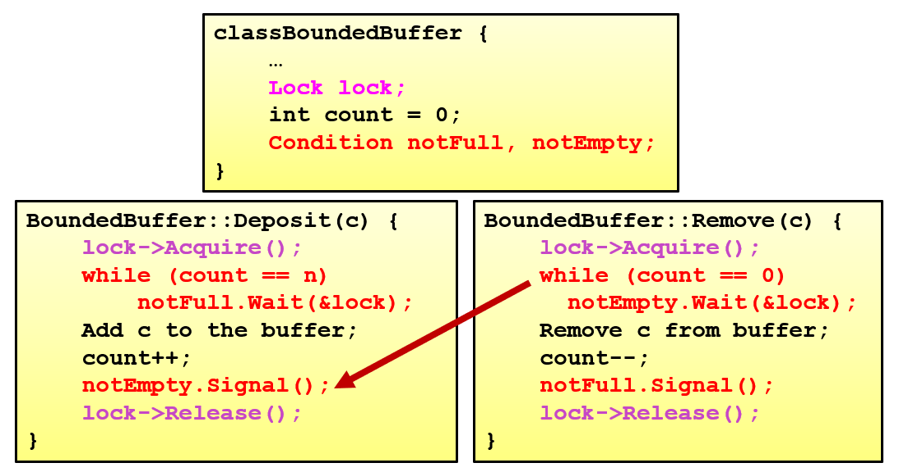
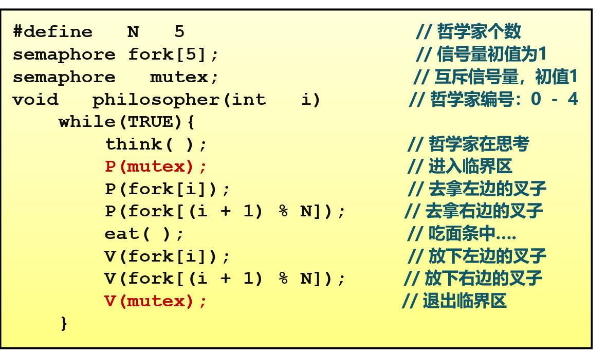
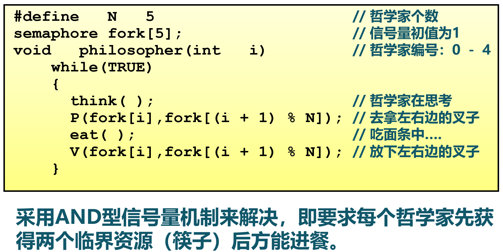

# Concurrency

线程的几种实现方式 

- 用户态管理且用户态运行的线程（内核不可见的用户线程）
    - Thread managed&running in User-Mode
- 内核态管理且用户态运行的线程（内核可见的用户线程）
    - Thread managed in Kernel-Mode&running in User-Mode
- 内核态管理且内核态运行的线程（内核线程）
    - Thread managed&running in Kernel-Mode
- 混合管理且运行的线程（轻量级进程，混合线程）
    - Thread managed&running in Mixed-Mode
    - 编程人员可以决定有多少个内核级线程和多少个用户级线程彼此多路复用
    - 用户级线程由用户线程管理库管理
    - 内核只识别内核级线程，并对其进行调度
    - 内核与用户态线程管理库交互
    - 具有最大灵活度和实现复杂性
    - 

## 用户态的线程管理

线程的结构：

- 线程 ID
- 执行状态： Available (空闲：可被分配任务) / Running / Ready (就绪：可恢复执行)
- PC
- GPR 集合
- stack ：保存 function call stack 、 local variable 等；代码段、全局数据段、堆：共享。

## 内核态的线程管理

用户态的线程管理：无法强制线程交出 CPU 使用权，不方便调度。

因此可以引入内核态时钟中断。

### 系统调用

创建进程中的线程 `sys_thread_create(entry: usize, arg: usize)`

- 线程可以访问进程的代码段、堆、其它数据段
- 线程有一个专有的用户态栈（和专有的内核栈）
- 每个线程有一个独立的 TRAMPOLINE 跳板页（实现用户态到内核态到地址空间平滑转换）

等待**子线程**并回收其在内核中的资源 `sys_waittid(tid: usize) -> isize`

- 线程结束时调用 `exit` 退出，此时 kernel 回收用户态中的资源（栈、跳板页等）
- 进程/主线程调用 `waittid` 回收剩余资源（内核栈、 TCB 等）
- 如果进程/主线程先调用了 `exit` ，则父进程通过 `waitpid` 回收子进程没有回收的资源
- 返回值 `-2` ：线程存在，但是尚未退出

【修改】进程相关的系统调用

- `fork` 创建进程：单独建立一个主线程，并创建 TCB 控制块 vec

### 数据结构

`TaskControlBlock` 对应一个线程

`ProcessControlBlock` 对应一个进程

### 线程管理机制


## Lock 锁

### 三种属性

- Mutual exclusion 互斥性：阻止多个线程进入 critical section
-  Fairness 公平性：竞争的线程是否有公平的机会获得锁
- Performance 使用锁的性能

### 实现方式

#### 用户态软件级方法

##### Peterson 算法

```rust
static mut flag : [i32;2] = [0,0]; // 哪个线程想拿到锁？
static mut turn : i32 = 0;         // 排号：轮到哪个线程? (线程 0 or 1?)

fn lock() {
    flag[self] = 1;             // 设置自己想取锁 self: 线程 ID
    turn = 1 - self;            // 设置另外一个线程先排号
    while ((flag[1-self] == 1) && (turn == 1 - self)); // 忙等
  	// assert flag[1 - self] == 0 && flag[self] == 0 && turn == self
}

fn unlock() {
    flag[self] = 0;             // 设置自己放弃锁
}
```

#### 屏蔽中断

应用程序在临界区屏蔽中断

- 缺点：OS 不能打断应用程序；不适用多核处理器（关闭中断仅对执行它的处理器有效）

#### 原子指令：

- CAS: Compare-And-Swap: 返回旧值；如果旧值符合期待，就设置为新值，否则不变。

    （简化版本：如果旧值符合期待，设为新值，返回 true ；否则什么也不做，返回 false 。）

    ```pseudocode
    function CAS(ptr, expected, new_val):
    	old_val = Mem[ptr]
    	if (old_val == expected)
    		Mem[ptr] = new_val
    	return old_val
    ```

    基于此可以实现锁：

    ```pseudocode
    function lock(mutex_ptr):
    	while (CAS(mutex_ptr, 0, 1)) {/* wait */}
    function unlock(mutex_ptr):
    	Mem[mutex_ptr] = 0
    ```

    CAS 有 ABA Problem

    - 解决方法：变量加上版本号

    

- TAS: Test-And-Set: 返回旧值，设成新值

    ```pseudocode
    function TAS(old_ptr, new_val):
    	old_val = Mem[old_ptr]
    	Mem[old_ptr] = new_val
    	return old_val
    ```

    基于此可以实现锁：

    ```pseudocode
    function lock(mutex_ptr):
    	while (TAS(mutex_ptr, 1) == 1) {/* wait until mutex_ptr is 0 */}
    function unlock(mutex_ptr):
    	Mem[mutex_ptr] = 0
    ```

    

- Load Reserved & Store Conditional : store 时检查给定内存空间在 load 后是否被修改；如果没有， store 成功；否则，标记失败。

    基于此可以实现锁：

    ```assembly
    # RISC-V sequence for implementing a TAS  at (s1)
        li t2, 1                 # t2 <-- 1
        Try: lr  t1, s1          # t1 <-- mem[s1]  (load reserved)
             bne t1, x0, Try     # if t1 != 0, goto Try:
             sc  t0, s1, t2      # mem[s1] <-- t2  (store conditional)
             bne t0, x0, Try     # if t0 !=0 ('sc' Instr failed), goto Try:
        Locked:
             ...                 # critical section
        Unlock:
             sw x0,0(s1)         # mem[s1] <-- 0
    ```

基于硬件的方式某些场景下效率低：一个线程获取锁时发现被占用，于是忙等，足足耗尽一个 time slide 之后才切出去。这里产生了大量空转。

解决方式：锁无法获取时主动 yield 

仍然存在问题：持有锁的线程被抢占（切出去），其它线程尝试 lock 发现失败，纷纷 yield ；这里产生了很多不必要的线程切换。简单地 sleep （线程休眠一段时间）也不能解决，因为不好同步释放锁和唤醒的时间。

解决方式：轻量的可睡眠锁

- 等待锁的线程睡眠
- 持有锁的线程在释放锁时唤醒睡眠的等待中的线程
    - 释放全部线程，一起竞争
    - 只释放最早等待的


### Mutex 系统调用实现

`ProcessControlBlockInner` 存储 `mutex_list` ，其中为这个进程中的所有的 Mutex 资源。

`MutexBlockingInner` 中存储 `wait_queue: VecDeque<Arc<TaskControlBlock>>` ，其中为等待获取这个锁的线程。

## Semaphore 信号量

Why? 锁的局限性

- 如何实现允许最多 N 个进程访问临界资源
- 让某个线程等待另一个线程执行完毕后再继续执行

How? 拓展 Lock 的 0/1 计数，计数器的值为 0 \~ n ，表示还有多少线程可以进入临界区

- Proberen （尝试）；计数器 ––
- Verhogen （增加）：计数器 ++

Counting Semaphore / General Semaphore

Lock 是 Binary Semaphore

用途： synchronization

- 线程 A 执行 P ，阻塞睡眠
- 线程 B 执行 V ，释放了 A

实现类似 Lock 。

实例： Producer-Consumer Model

- 一个锁：对 buffer 的互斥访问
- 两个信号量：
    - empty ：空位的数量；初值为 N ；有空位时放行 producer ；
    - full ：非空的数量；初值为 0 ；大于 0 时放行 consumer ；
- 

## Monitor & Condition Variable 管程与条件变量

Why? 如何让某个线程等待某个条件？

How? 条件变量

- 互斥：在函数首尾加锁实现「管程」
- 唤醒：借助条件变量 wait 或 signal

约束：

- 任一时刻最多只有一个线程执行管程代码
- 正在管程中的线程可临时放弃管程的互斥访问， 等待事件出现时恢复

组成：

- 一个锁：控制管程代码的互斥访问
- 0 个或者多个条件变量

三个队列：

- 入口等待队列：里面的线程竞争进入管程入口
- 条件等待队列：里面的线程等待某个条件变量，等待 signal 被唤醒
- 紧急等待队列：里面的线程为刚刚 signal ，把控制权给了另一个线程，等待其结束后继续执行的

分类：

- Hoare: T1 等待资源； T2 signal ； T2 暂停， T1 继续； T1 结束， T2 继续； T2 结束
- Hansen: T1 等待资源； T2 在退出的同时 signal ； T1 继续； T1 结束
- Mesa: T1 等待资源； T2 signal ； T2 继续， T1 加入公平竞争； T2 结束，所有线程竞争； T1 竞争成功，继续； T1 结束


例子： Producer - Consumer




## coroutine


协程与线程相比：

- 无线程切换开销（当然，分为有栈 or 无栈）
- 不需要锁
- 适合大量 I/O 场景

## 并发实例

### 哲学家就餐

1. 锁上拿叉子、吃饭、放叉子，即同一时间只有一个人能做这三件事

    

2. 分奇偶，只用叉子对应的信号量，不上锁

    

3. AND 型信号量，同时获取多个资源

    

4. 只锁拿叉子/放叉子，用一个数组 `state` 跟踪每一个哲学家的状态

    

5. 

    

### Reader-Writer Problem


- 读者优先策略

    - 只要有读者正在读状态，<u>后来的读者都能直接进入</u>
    - 如读者持续不断进入，则写者就处于饥饿
    - 

 - 写者优先策略

    - 只要有写者就绪，写者应尽快执行写操作

    - 如写者持续不断就绪，则读者就处于饥饿

    - 

        


## Problems 并发中的常见问题

互斥缺陷

同步缺陷

死锁缺陷

### deadlock

资源

- Reusable Resource
    - 可能 deadlock ：每个进程占用一部分资源并请求其它资源
- Consumable Resource
    - 可能 deadlock ：进程间相互等待接收对方的消息

资源分配图：

- 进程 P → 资源 R ： P 请求 R
- 资源 R → 进程 P ： R 分配给了 P

产生 deadlock 的四个必要条件

- 互斥：
- 持有并等待：
- 非抢占：资源只能在进程使用之后自愿释放
- 循环等待：资源分配图上存在环路

#### Prevention 死锁预防

确保系统永远不进入死锁状态。


#### Avoidance 死锁避免

利用额外的先验信息，在分配资源时判断是否会出现死锁，只在不会死锁时分配资源。

避免死锁就是确保系统不会进入不安全状态。（不安全状态不一定导致死锁。）


Banker's Algorithm


#### Detection & Recovery 检测和恢复

检测到死锁后如何恢复？

- 终止所有死锁进程
- 依次终止单个进程直到死锁消除
- 选择被抢占的进程进行资源抢占
- 进程回退：重启进程到安全状态


