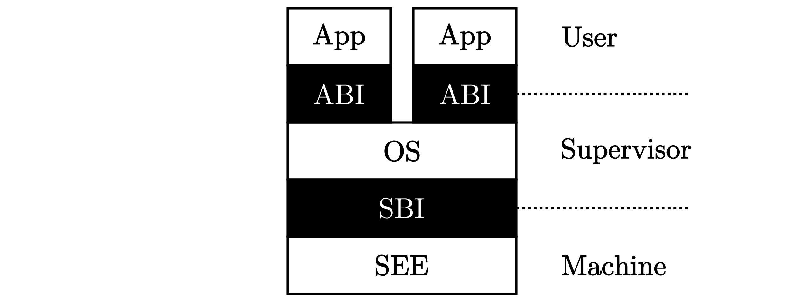

# Basis of rCore

Target triplet: CPU arch, OS, standard runtime lib

bare-metal: a computer executing instructions directly on logic hardware without an intervening operating system.

elf: [Executable and Linkable Format](https://en.wikipedia.org/wiki/Executable_and_Linkable_Format)

lsb: [Linux Standard Base](https://en.wikipedia.org/wiki/Linux_Standard_Base)

BIOS: Basic Input/Output System

SBI: Supervisor Binary Interface:

- an interface between the Supervisor Execution Environment (SEE) and the supervisor.
- The SBI allows supervisor-mode (S-mode or VS-mode) software to be portable across all RISC-V implementations by defining an abstraction for platform (or hypervisor) specific functionality.
- Provide services for the OS kernel?

QEMU (Quick Emulator): Booting procedure:

1. Asm within QEMU -> jump to `0x80000000`
2. Bootloader: e.g. `rustsbi-qemu.bin` ; jump to kernel image
3. Kernel execution

Booting procedure of real computer:

1. ROM: load bootloader from disk to mem
2. Bootloader: load OS from disk to mem
3. OS

Execution Environment Stack:

SEE, Supervisor Execution Environment: running on M mode; e.g. Bootloader - RustSBI

questions:

pointer

`#[panic_handler]`

`#[no_mangle]`

我们尝试将其放置到全局数据 `.data` 段中但最后未能成功，因此才决定将其放置到 `.bss` 段中。

