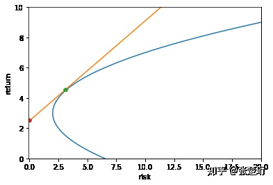

# Basis

[人工智能与量化投资](https://www.zhihu.com/column/intro-to-quant)

## Market and Exchange

一级市场：Venture Capital ， Private Equity

二级市场：Initial Public Offering

### 股票交易

竞价交易：

- 限价委托簿 limit order book ；盘口
- 限价单：想以什么价格购买该股票；价格大于等于卖家报价，成交
- 市价单：系统查询市价，下“卖一”价的限价单
- 连续竞价
- 集合竞价：
    - 开盘前十、收盘前三
    - 交易所只接受限价单的申报，结束后集中撮合成交
    - 交易所找到这样一个能够促成尽可能多交易的价格

蜡烛图

- 细线：最高、最低成交价
- 柱：上边缘、下边缘根据涨/跌颜色对应开盘/收盘价

涨停、跌停：限制卖家挂单价格在上一个交易日收盘价的上下 10% 以内

停复牌、借壳上市

除息：除息后参考价 = 前收盘价 - 每股现金红利

除权：

- 送股、转股、配股
- 除权后参考价 = 前收盘价 / (1 + 每股送股比例 + 每股转股比例)

综合除息除权：
$$
\text{除权息参考价} = {\text{前收盘价} - \text{每股现金红利} + 配股价格 \times 每股配股比例 \over 1 + 每股送股比例 + 每股转股比例 + 每股配股比例}
$$
除权除息导致股票价格不连续：

- 后复权：把之后的数据接到之前的上
- 前复权：把之前的数据更新接到之后的上；难维护；但<u>能够准确反映最近一段时间的真实价格和价格变动</u>

## Investment

量化投资=数据+模型，包括：

- 量化择时和选股
- 套利
- 资产组合与风险管理
- 算法交易

被动投资：跟随市场平均水平

主动投资：希望投资组合的收益能够超过市场表现

efficient-market hypothesis 有效市场假说：市场的定价一直处于一个有效的状态下，市场定价已经综合反映了各方面的信息，想再根据这些信息和历史规律来试图找到一个更为有效的定价是徒劳的

市场有效的程度：

- weak form efficiency ：无法从**历史**？的价量中找到帮助盈利的规律
- semi-strong form efficiency ：从**公开渠道**获得的所有信息都无助于找到有用规律
- strong form efficiency ：从任何渠道获得的信息都无法帮助盈利

fundamental analysis 基本面分析：依靠：

- 公司财务数据：总资产、总负债、每股收益
- 宏观经济数据： GDP 增速、国家外汇、货币供应量、黄金储备
- 新闻、公告、舆情

technical analysis 技术面分析，依靠：

- 历史交易价格、成交量

## Models

### MPT

modern <u>portfolio</u> theory 现代<u>资产组合</u>理论

风险的衡量：（收益率的）方差

portfolio ：

- n 个可投资标的？ 每个的权重表示为 n 维向量，和为 1

- 收益：加权和

- 风险：两两相乘的权重乘上对应协方差的总和
  
    $$
    \begin{aligned}
    r_p &= \sum_{i=1}^n w_i r_i \\
    \text{var}(r_p) &= \sum_{i=1}^n \sum_{j=1}^n w_i w_j \cdot \text{cov}(r_i, r_j)
    \end{aligned}
    $$

> **Covariance**: the expected value of the ***product*** of their deviations from their individual expected values
>
> $$
> \begin{aligned}
> \text{cov}(X,Y) &= \mathbb{E}( (X - \mathbb{E}(X)) (Y - \mathbb{E}(Y)) ) \\
> &= \mathbb{E}(XY) - \mathbb{E}(X) \mathbb{E}(Y)
> \end{aligned}
> $$
>
> ***协方差***为正，两个随机变量是同向变化；为负，反向变化。
>
> 再除以二者标准差之积，消除变化幅度影响，则为***相关系数 $\rho$*** ；描述了二者变化的相似程度。

目标：达到期望收益的情况下，最小化风险：

$$
\begin{aligned}
\mathbf{w} = \arg\min_{} \text{var}(r_p) \text{ , s.t. } \mathbb{E}(r_p) \ge \mu
\end{aligned}
$$

Return 收益 - Risk 风险曲线（efficient frontier, Markowitz bullet）

- **NOTE**: Risk 是标准差 $\sigma$ ，不是方差！

- 红点：无风险利率 $r_f$

- 绿点： **Market Portfolio 市场组合**：不包括无风险资产

    $\text{Sharpe} = {\mathbb{E}(r_p) - r_f \over \sigma(r_p)}$ 最高；

    Sharpe Ratio ：比无风险投资的多的收益 over 承受的风险，

    衡量「收益-风险比」， i.e. 投资效率；

- Efficient Frontier （蓝）上的点：给定 Return 下 Risk 最小的组合；在诸多有风险资产上配置能达到的最佳情况； Market Portfolio 是效率最高的

- Capital Market Line （橙）资本市场线：通过加入无风险资产之后能配置出来的

### CAPM

Capital Asset Pricing Model ，资本资产定价模型

$$
\begin{aligned}
\mathbb{E}(r_s) &= r_f + \beta_s (\mathbb{E}(r_M) - r_f) \\
\text{where } \beta_s &= {\text{cov}(r_s, r_M) \over \text{var}(r_M)} = \rho_{s,M} {\sigma_s \over \sigma_M} \\
\text{cov}(r_s, r_M) &= \sum_{i=1}^n w_i \text{cov}(r_s, r_i)
\end{aligned}
$$

- $r_s$ ：风险资产的收益率
- $r_f$ ：无风险资产的收益率
- $r_M$ ：Market Portfolio 市场组合（点处）的收益率
- $\beta_s$ ：风险资产相对于市场的“敏感度”，描述其与“市场组合”的相对变化
    - $\beta_s$ 作用于市场组合相对于无风险资产的超额收益
    - 大于 1 时，风险更大，在牛市 $r_s$ 将比市场组合获得更大收益
    - 小于 1 时，风险较小，在熊市 $r_s$ 将比市场组合有着更小的损失
    - 小于 1 时，在熊市赚钱（空头？）
    - 分母需要计算 $n^2$ 个协方差，运算量太大（因子模型可以解决此问题）

### Factor Model

#### One Factor Model

将宏观经济对风险资产收益的影响剥离开：
$$
r_{i,t} = \alpha_i + \beta_i F_t + \epsilon_{i,t}
$$

- $r_{i,t}$ : 风险资产 $i$ 在 $t$ 时刻的收益
- $\alpha_{i}$ : 风险资产 $i$ 在持有初期的期望收益
- $F_{t}$ : 某宏观经济影响因素
- $\beta_{i}$ : 风险资产 $i$ 对于宏观经济影响因素的敏感程度
- $\epsilon_{i,t}$ : 噪声/残差，期望为 0

由上式可得风险：
$$
\sigma_A^2 = \beta_A^2 \sigma_F^2 + \sigma_\epsilon^2
$$

- $\alpha_{i}$ 视作常数
- $\sigma^2(aX) = a^2 \sigma^2(X)$
- 噪声与 $F_t$ 独立

#### Multifactor Model

风险资产受到多个互不相关的宏观因素的影响，即因子模型中的因子为宏观经济相关的内容：

$$
r_{i,t} = \alpha_i + \sum_k \beta_i^{(k)} F_t^{(k)} + \epsilon_{i,t}
$$

- 集中了特质，分解了外部因素
- $\beta$ ：因子暴露
- $F$ ：因子收益
- 时间序列回归：
    - 对于某股票（$i$ 固定）
    - 已知：收益率时间序列 $r_{t}$ 、诸多宏观经济时间序列 $F_t^{(K)}$
    - 多元线性回归得到： $\alpha$ ， $\beta^{(k)}$

当因子为与特定股票相关的基本面或者技术面特征（如近期趋势、市值大小、相对估值等）时，每天这些因子对于每只股票都会有一个数值：
$$
r_{i,t} = \beta_t + \sum_k X_{i,t}^{(k)} f_t^{(k)} + \epsilon_{i,t}
$$

- 集中了外部系统风险，分解了股票特质性的收益
- $X_{i,t}^{(k)}$ ： $t$ 时刻在某种风险上的**暴露**
- $f_t^{(k)}$ : 收益因子；和 $i$ 无关？？？
- 横截面回归：
    - 时间参数 $t$ 固定
    - 已知：不同股票的收益率 $r_i$ 、每只股票此时的因子暴露 $X_i^{(k)}$ 
    - 多元线性回归得到： $\alpha$ ， $f^{(k)}$

#### Application

$\alpha$ ：特质性收益

$\beta$ ：系统性收益

相比 CAPM 的优势：计算量小了很多

### Arbitrage Pricing Theory

理想市场条件下各个证券的定价应满足：
$$
r_{i} = \alpha_i + \sum_k \beta_i^{(k)} F^{(k)} + \epsilon_{i}
$$
若一个资产组合满足以下 3 点，则为 **Arbitrage Portfolio** （套利组合）：

1. 初始投资为 0 ：$P = (w_1, \dots, w_N), ~ \sum_i w_i = 0$
2. 投资组合的风险为 0 ：
    - 系统性风险： $\forall k, ~ \sum_i \beta_i^{(k)} w_i = 0$ （对于某个因子暴露 $\beta^{(k)}$ ，每个股票对其敏感程度与这支股票在投资组合中的占比之积求和为 0）
    - 非系统性风险： $\sum_i w_i \epsilon_i = 0$ （投资的种类足够多和分散）
3. 总收益为正： $\sum_i w_i r_i > 0 \Rightarrow \sum_i w_i \alpha_i > 0$

当市场上存在套利组合的时，称这个市场上存在**套利机会**。

如果构建出 Arbitrage Portfolio ，我们便可在无系统性风险的情况下获得收益。

### Summary

上述模型将资产收益率和其它因素建立线性关系，历史上很有效。

随着线性模型带给我们收益的一步步枯竭，非线性模型可能会成为之后量化模型的探索方向。

