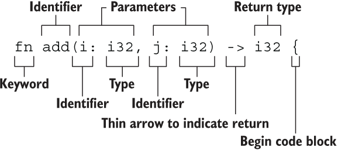

# Basis

Ref: [Rust语言圣经](https://course.rs)

## Hello, World!

- `println!` is a macro defined in `std::fmt`.

```rust
fn greet_world() {
     let southern_germany = "Grüß Gott!";
     let chinese = "世界，你好";
     let english = "World, hello";
     let regions = [southern_germany, chinese, english];
     for region in regions.iter() {
             println!("{}", &region);
     }
 }
 
 fn main() {
     greet_world();
 }
```

## Variables

### bindings

- declare variable *bindings* and initialize them

- immutable by default; declare `mut` for mutable ones

    differs from `const`: can be initialized later; type annotation is not necessary

- shadowing: re-declare bindings

```rust
fn main() {
    let (a, mut b): (bool,bool) = (true, false);
    // a = true,不可变; b = false，可变
    println!("a = {:?}, b = {:?}", a, b);
    b = true;
    assert_eq!(a, b);
}
```

```rust
fn main() {
    let mut x = 5_i32;
  	let mut x: i32 = x + 1;
    let y;
    
    x *= 2;
    y = x.pow(2);

    println!("x is {}, y is {}", x, y);

    const Z_NUM: i32 = 1000;
    println!("z^2 is {}", Z_NUM.pow(2));
}
```

### Types

#### Tips

- NO implicit conversion!

    `i32` for integers by default

- overflow/nan checking:

    ```rust
    // pub fn overflowing_add_signed(self, rhs: i32) -> (u32, bool)
    assert_eq!((u32::MAX - 2).overflowing_add_signed(4), (1, true));
    
    let x = (-42.0_f32).sqrt();
    if x.is_nan() {
        println!("Error!")
    }
    ```

- Comparing by *traits* : `std::cmp::PartialEq` ; operators can be used to trigger them.

    `eq` assumes: symmetry, transitivity and reflexivity

    ```rust
    #![allow(unused)]
    fn main() {
    enum BookFormat {
        Paperback,
        Hardback,
        Ebook,
    }
    
    struct Book {
        isbn: i32,
        format: BookFormat,
    }
    
    impl PartialEq for Book {
        fn eq(&self, other: &Self) -> bool {
            self.isbn == other.isbn
        }
    }
    
    let b1 = Book { isbn: 3, format: BookFormat::Paperback };
    let b2 = Book { isbn: 3, format: BookFormat::Ebook };
    let b3 = Book { isbn: 10, format: BookFormat::Paperback };
    
    assert!(b1 == b2);
    assert!(b1 != b3);
    }
    ```

- range: `1..5` , `1..=5`

    ```rust
    for i in 1..=5 {
        println!("{}",i);
    }
    ```

- use `num` lib:

    ```toml
    # in Cargo.toml
    [dependencies]
    num = "0.4.0"
    num-bigint = "0.4"
    ```

    ```rust
    use num::{complex::Complex, traits::Pow};
    use num_bigint::{BigInt, ToBigInt};
    
    fn main() {
        let a = Complex { re: 2.1, im: -1.2 };
        let b = Complex::new(11.1, 22.2);
        let result = a + b;
        println!("{} + {}i", result.re, result.im);
        
        // explicit type annotation needed for calling impls
        let x = 0x7fffffff_i32.to_bigint().unwrap();
        let y = 0x7fffffff_i32.to_bigint().unwrap();
        let z: BigInt = x + y + 2;
        println!("{}", z.pow(4_u32));
    }
    ```

- Unicode supported

    ```rust
    let x: char = '我';
    println!("{}", std::mem::size_of_val(x)); // 4
    ```

- unit type `()` as a placeholder

- `&str` is immutable; use `String` for mutable strings:

    ```rust
    fn main() {
        let mut s = String::from("hello");
        s.push_str(", world!");
        println!("{}", s); // hello, world!
    }
    ```

- `enum` can have data:

    ```rust
    enum Message {
        Quit,
        Move { x: i32, y: i32 },
        Write(String),
        ChangeColor(i32, i32, i32),
    }
    ```

-  `None` in `Option<T>` and `match`

    ```rust
    enum Option<T> {
        Some(T),
        None,
    }
    ```

    ```rust
    fn plus_one(x: Option<i32>) -> Option<i32> {
        match x {
            None => None,
            Some(i) => Some(i + 1), // i takes the value inside Some!
        }
    }
    ```

- array

    ```rust
    let a: [i32; 5] = [1, 2, 3, 4, 5];
    let b = [3; 5]; // [3,3,3,3,3]
    ```

- 

## Statement

Statements and expressions are not the same!

- statements have no value
- expressions have values; they cannot contain `;`

## Function



- must annotate types for each argument

- "no return value" is equivalent to returning `()`

- functions that NEVER return "return" a `!`

    ```rust
    fn dead_end() -> ! {
        panic!("你已经到了穷途末路，崩溃吧！");
    }
    ```

## Ownership

### Basis

- every value has only one owner
- a value will be freed when its owner is not in opening scopes
- C++ behavior `std::move` by default! including assign, pass args or return values

Transferring ownership is analog to `std::move` (e.g. `String` is stored in `heap`; it doesn't has `copy` trait!):

```rust
fn main() {
    let s1 = String::from("hello");
    let s2 = s1; // s1 is invalid after this
    println!("{}, world!", s1); // illegal!
  
    let x = String::from("abc");
    let y = x.clone(); // deep copy
    println!("{}, {}", x, y); // legal
}
```

### Borrowing

- ***Only one mutable*** reference or **any number of immutable** references can be valid at the same time.

- References are valid until they are not be used.

    The compiler will compute the ***smallest*** range for it.

    DIFFERENT from variable bindings!

```rust
fn main() {
    let mut s = String::from("hello");
    change(&mut s);
    println!("{}", cal_len(&s));
}

fn change(some_string: &mut String) {
    // deref traits enables direct using of a reference when calling a method of the object
    some_string.push_str(", world");
}

fn cal_len(s: &String) -> usize {
    s.len()
}
```

**Non-Lexical Lifetimes (NLL)**

```rust
fn main() {
    let mut s = String::from("hello");
 
    let r1 = &s; 
    let r2 = &s; 
    println!("{} and {}", r1, r2);
    // r1, r2 are invalid at this point
 
    let r3 = &mut s; 
    println!("{}", r3);
    // r3 is not invalid at this point
}
```

## Flow Control

### for

| 使用方法                      | 等价使用方式                                      | 所有权                                  |
| ----------------------------- | ------------------------------------------------- | --------------------------------------- |
| `for item in collection`      | `for item in IntoIterator::into_iter(collection)` | **转移**所有权至 `for` （后续无法使用） |
| `for item in &collection`     | `for item in collection.iter()`                   | 不可变借用                              |
| `for item in &mut collection` | `for item in collection.iter_mut()`               | 可变借用（元素可以被修改）              |

Iterate index and value simultaneously:

```rust
let a = [ 1, 2, 3 ];
for (i, v) in a.iter().enumerate() {
  continue;
}
```

`for item in &collection` is more efficient than visit elements in a collection by index, because the later one always needs bounds checking.

### loop

Returning from loop:

```rust
fn main() {
    let mut counter = 0;
    let result = loop {
        counter += 1;

        if counter == 10 {
            break counter * 2; // return by break
        }
    };
    assert_eq!(result, 20);
}
```

## Patterns and Matching

### match arms

```rust
match some_u8_value {
    1 | 2 => println!("one or two"),
    3..5 => println!("three to four"),
    _ => (),
}
```

**Shadowing inside `match`**:

```rust
fn main() {
   let age = Some(30);
   println!("在匹配前，age是{:?}",age);
   if let Some(age) = age {
       // here age is i32 but not Some(i32)
       println!("匹配出来的age是{}",age);
   }

   println!("在匹配后，age是{:?}",age);
}
```

### if let

**Actually, `let` is a keyword for "pattern binding".**

`if` makes it possible that except the written case, other cases can be ignored.

Only match one case:

```rust
if let Some(3) = v {
    println!("three");
}

let mut count = 0;
if let Coin::Quarter(state) = coin {
    println!("State quarter from {:?}!", state);
} else {
    count += 1;
}
```

`if let` can be used together with `else if`:

```rust
if let Some(color) = favorite_color {
    println!("Using your favorite color, {}, as the background", color);
} else if is_tuesday {
    println!("Tuesday is green day!");
} else if let Ok(age) = age {
    if age > 30 {
        println!("Using purple as the background color");
    } else {
        println!("Using orange as the background color");
    }
} else {
    println!("Using blue as the background color");
}
```

### matches! (macro)

`matches!` returns `true` or `false`:

```rust
let bar = Some(4);
assert!(matches!(bar, Some(x) if x > 2));
```

### while let

```rust
let mut stack = Vec::new();

stack.push(1);
stack.push(2);
stack.push(3);

// pop returns Option<T>
// loop break when it returns a None, which causes fail matching
while let Some(top) = stack.pop() {
    println!("{}", top);
}
```

### deconstruction and matching

```rust
struct Point {
    x: i32,
    y: i32,
}

fn main() {
    let p = Point { x: 0, y: 7 };
		
    let Point { x: a, y: b } = p;
    assert_eq!(0, a);
    assert_eq!(7, b);
    // less verbose
    let Point { x, y } = p;
    assert_eq!(0, x);
    assert_eq!(7, y);
    
    match p {
        Point { x, y: 0 } => println!("On the x axis at {}", x),
        Point { x: 0, y } => println!("On the y axis at {}", y),
        Point { x, y } => println!("On neither axis: ({}, {})", x, y),
    }
}
```

Use `..` to skip some values:

```rust
let numbers = (2, 4, 8, 16, 32);
match numbers {
    (first, .., last) => {
        println!("Some numbers: {}, {}", first, last);
    },
}
```

### match guard

`if` condition after match arms:

```rust
let x = 4;
let y = false;

match x {
    4 | 5 | 6 if y => println!("yes"),
    _ => println!("no"), // the matched one due to y is false
}
```

### @ binding

`var @ pattern`: bind the value matching the pattern to `var` for later use.

```rust
enum Message {
    Hello { id: i32 },
}

let msg = Message::Hello { id: 5 };

match msg {
    Message::Hello { id: id_variable @ 3..=7 } => {
        println!("Found an id in range: {}", id_variable)
    }
    Message::Hello { id: 10..=12 } => {
        println!("Found an id in another range")
    }
    // parenthese outside the pattern are required!
    hello @ (Message::Hello { id: 10..=12 } | Message::Hello { id: 13..=15 }) => {
        println!("Found an id in another range when hello is {:?}", hello)
    }
    Message::Hello { id } => {
        println!("Found some other id: {}", id)
    }
}
```

## Method

```rust
pub struct Rectangle {
    width: u32,
    height: u32,
}

impl Rectangle {
    fn new(w: u32, h: u32) -> Rectangle {
        Rectangle { width: w, height: h }
    }
    // getter
    pub fn width(&self) -> u32 {
        return self.width;
    }
    fn can_hold(&self, other: &Rectangle) -> bool {
        self.width > other.width && self.height > other.height
    }
}
```

## Generics

e.g.

```rust
enum Result<T, E> {
    Ok(T),
    Err(E),
}
```

Restricting type parameter `T` to what can be added by `+` is needed:

```rust
fn add<T: std::ops::Add<Output = T>>(a:T, b:T) -> T {
    a + b
}
```

e.g.

```rust
struct Point<T, U> {
    x: T,
    y: U,
}

impl<T, U> Point<T, U> {
    fn mixup<V, W>(self, other: Point<V, W>) -> Point<T, W> {
        Point {
            x: self.x,
            y: other.y,
        }
    }
}
```

"Changeable reference":

```rust
fn largest<T: PartialOrd>(list: &[T]) -> &T {
    let mut largest = &list[0];
    
    for item in list.iter() {
        if item > largest {
            largest = item;
        }
    }
    largest
}
```


