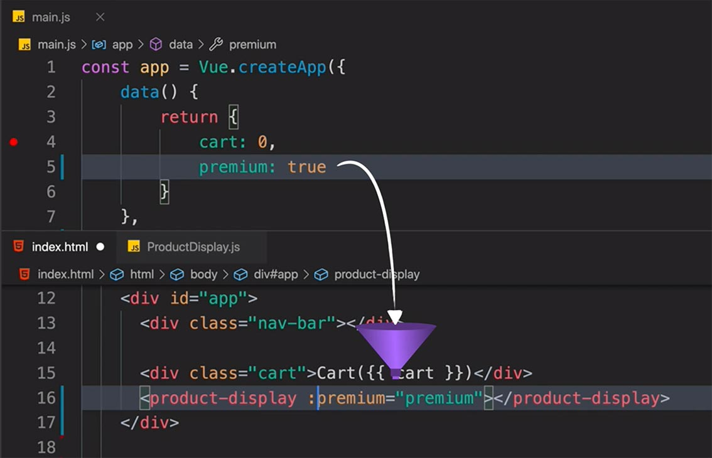

# Vue

## Basis

Ref: https://www.vuemastery.com/courses/intro-to-vue-3

### `index.html`

Import Vue.js in head tag via a CDN link to use Vue.

Import `main.js` in body tag to import Vue app.

Mount the app into DOM by a method `mount` that requires a DOM selector as an argument: 

```html
<script>
  const mountedApp = app.mount('#app')
</script>
```

Display the data by use div with specific id:

```html
<div id="app">
  <h1>{{ product }}</h1>
</div>
```

### `main.js`

Create a Vue app:

```js
const app = Vue.createApp({
    data() {
        return {
            product: 'Socks'
        }
    },
  	methods: {
      	update(id) {
          	this.cartList.push(id)
        }
    }
})
```

### Computed Properties

```js
data() {
  computed: {
    image() {
      return this.variants[this.selectedVariant].image
    }
  }
}
```

```html

```

### Components

#### Define

`components/ProductDisplay.js`

```js
app.component('product-display', {
	props: {
		premium: {
      type: Boolean,
      required: true
    }
	},
	
	template:
	/*html*/
	`
	<!-- ... -->
	`,
	
	data() {
		return {
			
		}
	},
	
	methods: {
		
	},
	
	computed: {
	
	}
	
})
```

#### Import

```html
<!-- Import Components -->
<script src="./components/ProductDisplay.js"></script>
```

#### Use

```html
<div id="app">
  <div class="nav-bar"></div>

  <div class="cart">Cart({{ cart }})</div>
  <product-display></product-display>	<!-- Use the component! -->
  <product-display></product-display>	<!-- Use again! -->
</div>
```

#### Prop

`product-display` component needs access to data `premium` in `main.js`.

In other words, it needs a custom attribute (a funnel) that we can feed this data into.

So, we add custom attribute onto the `product-display` component where we’re using it.

```html
<product-display :premium="premium"></product-display>
```

**Notice** how we’re using the shorthand for `v-bind` so we can reactively receive the new value of `premium` if it updates (from `true` to `false`).



#### Emitting and Listening

Something happened in one component, and we need to inform other components by emitting an event.

```js
methods: {
  addToCart() {
    this.$emit('add-to-cart')
  },
  // ...
 }
```

```html
<product-display :premium="premium" @add-to-cart="updateCart"></product-display>
```

### v-bind

Dynamically bind an attribute to an expression.

```html
 <! -- src attribute bound to the image data -->
 <! abbr./shorthand -->
```

### v-if / v-show

```html
<p v-if="inStock">In Stock</p>
<p v-else>Out of Stock</p>

<p v-show="inStock">In Stock</p>

<p v-if="inventory > 10">In Stock</p>
<p v-else-if="inventory <= 10 && inventory > 0">Almost sold out!</p>
<p v-else>Out of Stock</p>
```

### v-for

In `main.js` we have:

```js
const app = Vue.createApp({
    data() {
        return {
            ...
            details: ['50% cotton', '30% wool', '20% polyester']
        }
    }
})
```

Then,

```html
<ul>
  <li v-for="detail in details">{{ detail }}</li>
</ul>
```

#### key attribute

Bind each DOM element to corresponding list item.

```js
data() {
  return {
    ...
    variants: [
      { id: 2234, color: 'green' },
      { id: 2235, color: 'blue' }
    ]
  }
}
```

```html
<div v-for="variant in variants" :key="variant.id">{{ variant.color }}</div>
```

By saying `:key="variant.id"`, we’re using the shorthand for `v-bind` to bind the variant’s `id` to the `key` attribute.

### Event

#### Click

```html
<button class="button" v-on:click="logic to run">Add to Cart</button>

<button class="button" v-on:click="cart += 1">Add to Cart</button>

<button class="button" v-on:click="addToCart">Add to Cart</button>
```

```js
const app = Vue.createApp({
  data() {
    return {
      cart: 0,
      ...
    }
  },
  methods: {
    addToCart() {
      this.cart += 1
    }
  }
})
```

#### Mouseover

```html
<div v-for="variant in variants" :key="variant.id" @mouseover="updateImage(variant.image)">{{ variant.color }}</div>
```

### Style

Use `v-bind` to bind parameters of styles to variables:

```html
<div 
  v-for="variant in variants" 
  :key="variant.id" 
  @mouseover="updateImage(variant.image)" 
  class="color-circle" 
  :style="{ backgroundColor: variant.color }">
</div>
```

**Camel vs Kebab**

In JavaScript, `-` would have been interpreted by as a minus sign, so we can't use it as a variable's name.

```html
<div :style="{ backgroundColor: variant.color }></div>
<div :style="{ 'background-color': variant.color }></div>
```

Bind a style to an entire style object.

```html
<div> :style="styles"</div>
```

```js
data() {
	return {
		styles: {
			color: 'red'
		}
	}
}
```

### Class

```html
<button 
  class="button" 
  :class="{ disabledButton: !inStock }" 
  :disabled="!inStock" 
  @click="addToCart">
  Add to Cart
</button>
```

If `inStock == false`, then this element will have double classes, "button" and "disabledButton".

**Note**: The class that is defined later in CSS file can **override** the class that is defined before it when both of them are the classes of a single element.

Ref: https://www.zhihu.com/question/28976590

#### Ternary Operators (inline)

```html
<div> :class="[isActive ? activeClass : '']"</div>
```

(The second class is empty, no class.)

### v-model

When using a form, we need to bind from the template to the data. It is the reverse of `v-bind`.

We want to bind these input fields to their respective data properties so that when the user fills out the form, we store their data locally.

In `ReviewForm.js`, add the `v-model` directive:

```js
app.component('review-form', {
  template:
  /*html*/
  `<form class="review-form" @submit.prevent="onSubmit">
    <h3>Leave a review</h3>
    <label for="name">Name:</label>
    <input id="name" v-model="name">

    <label for="review">Review:</label>      
    <textarea id="review" v-model="review"></textarea>

    <label for="rating">Rating:</label>
    <select id="rating" v-model.number="rating">
      <option>5</option>
      <option>4</option>
      <option>3</option>
      <option>2</option>
      <option>1</option>
    </select>

    <input class="button" type="submit" value="Submit">  
  </form>`,
  data() {
    return {
      name: '',
      review: '',
      rating: null
  },
  methods: {
   onSubmit() {
     let productReview = {
       name: this.name,
       review: this.review,
       rating: this.rating,
     }
     this.$emit('review-submitted', productReview)

     this.name = ''
     this.review = ''
     this.rating = null
   }
 }
})
```

(Remember to import it.)

`ProductDisplay.js`

```js
template: 
  /*html*/
  `<div class="product-display">
    <div class="product-container">
     ...
    </div>
    <review-form @review-submitted="addReview"></review-form>
  </div>`
}),
data() {
  return {
    ...
    reviews: []
   }
 },
methods: {
  ...
  addReview(review) {
    this.reviews.push(review)
  }
},
```

**Validation**:

`ReviewForm.js`

```js
methods: {
    onSubmit() {
      if (this.name === '' || this.review === '' || this.rating === null || this.recommend === null) {
        alert('Review is incomplete. Please fill out every field.')
        return
      }

      let productReview = {
        name: this.name,
        review: this.review,
        rating: this.rating,
        recommend: this.recommend // solution

      }
      this.$emit('review-submitted', productReview)

      this.name = ''
      this.review = ''
      this.rating = null
      this.recommend = null // solution

    }
  }
```

