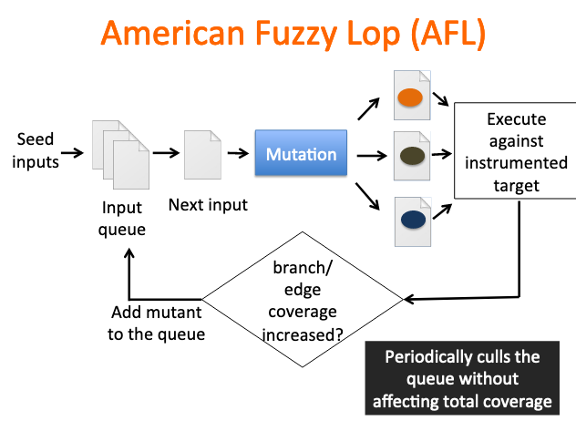

# Fuzzing

Blackbox fuzzing

- feed random inputs to programs
- see whether it exhibits incorrect behavior
- Easy but inefficient

Fuzzing

- ???

Problem detection

- Own dynamic checker: valgrind skins ???

Regression testing

- To confirm that a recent program or code change has not adversely affected existing features
- Re-run some test cases to ensure existing functionalities work fine

Mutation-based fuzzing

Generation-based fuzzing

Coverage-guided gray-box fuzzing

- Special type of mutation-based fuzzing

- Run mutated inputs on **instrumented** (插桩) program and <u>measure code coverage</u>

- Search for mutants that result in coverage increase

    1) try random mutations on test corpus
    2) only add mutants to the corpus <u>if coverage increases</u>

- Examples: American Fuzzy Lop (cut off branches) (AFL), libfuzzer

    

Data-flow-guided fuzzing

- Intercept the data flow, analyze the inputs of comparisons ???
- Modify the test inputs, observe the effect on comparisons

Differential testing/fuzzing

- Provide the same input to a series of similar applications,  and observe differences in their execution
- 

How much fuzzing is enough?

- Code coverage: how much code has been executed
    - Line coverage
    - Branch coverage
    - Path coverage
    - NOTE: do not guarantee finding the bug (e.g. input sensitive)
- 

Common Vulnerabilities and Exposures (CVE)

- **flaws in information security systems** that could be used to **harm** an organization or personal computer systems

